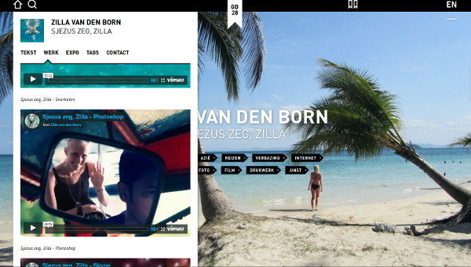
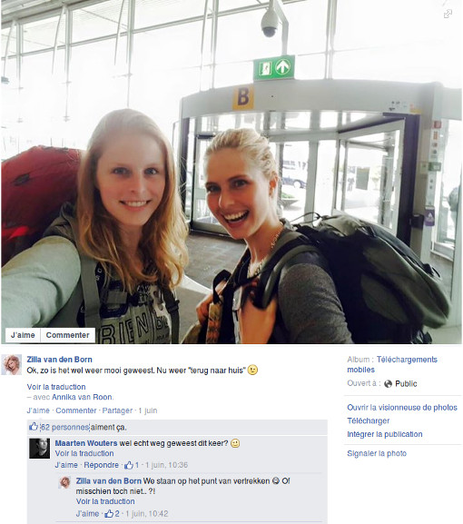

Autant vous le dire tout de suite pour éviter toute confusion, je ne suis pas parti en Asie et je ne vais donc pas vous parler de mes vacances[^1]. Je vais vous parler des vacances de Zilla van den Born, graphiste-designeuse d'Amsterdam. Ces vacances en Asie, ce sont les siennes.

L'année dernière, **Zilla** terminait son cursus de graphisme à l'école d'art d'Utrecht (*Hogeschool voor de Kunsten Utrecht*) plus connue sous le nom d'HKU. Son projet de fin d'année se devait de montrer sa créativité et sa connaissance en matière d'édition d'images, de production video, de documents imprimés etc. Le coté créatif de son projet l'a rendu célèbre ce qui est très bon quand on se lance dans cette activité et comme elle sort de l'école quoi de mieux qu'une blague de potache. **Elle a fait croire à ses amis et famille qu'elle était partie en vacances en Asie du sud-est alors qu'elle est resté cinq semaines dans sa chambre à Amsterdam**. Son projet de fin d'année est exposé sur le site de l'école sur la page **Sjezus zeg Zilla**. *Sjezus zeg Zilla* (Oh mon Dieu Zilla) est la réaction de ses proches quand ils ont découvert la supercherie.

[{.center}](http://eindwerk.hku.nl/nl/student/zilla-van-den-born/sjezus-zeg-zilla/)

Pour berner son monde, Zilla a simplement alimenté sa page facebook, son twitter et son compte vimeo avec des messages des photos et des vidéos de ses soit-disant vacances, messages, photos et vidéos qu'elle peaufinait depuis sa chambre Amstelodamoise. Pour les photos de *food porn*[^2], elle est simplement allée diner dans un des nombreux restaurants asiat' de la capitale mais pour les [photos de plongée](http://www.hln.be/hln/nl/922/Nieuws/article/detail/1893655/2014/05/21/Studente-misleidt-vrienden-met-tropische-schijnreis.dhtml) ou de voyage en tuk-tuk, elle s'est assuré la complicité dans copain photographe qui manie la retouche d'image à merveille comme tout bon photographe. Le plus déroutant vient peut-être les [sessions skype](https://www.facebook.com/zillavandenborn/photos/pb.642212742560589.-2207520000.1435751650./642237942558069/) qu'elle avait avec ses proches, soit-disant depuis son hôtel alors qu'elle était toujours dans sa chambre à Amsterdam, après s'être offert un coup de soleil dans un solarium de la ville.

<!-- HTML -->

<iframe src="https://player.vimeo.com/video/68079152" width="500" height="375" frameborder="0" webkitallowfullscreen mozallowfullscreen allowfullscreen></iframe>

<!-- / HTML -->

Une autre vidéo de la blagueuse montre ses famille et amis devant l'annonce de la supercherie. Surprise, étonnement, incrédulité et colère se lisent sur les visages. Si certains ont trouvé ça rigolo, d'autres n'ont pas du tout apprécié que leur petite Zilla (Sjesus zeg Zilla) leur mente.

<!-- HTML -->

<iframe src="https://player.vimeo.com/video/69182140" width="500" height="375" frameborder="0" webkitallowfullscreen mozallowfullscreen allowfullscreen></iframe>

<!-- / HTML -->

## Une nouvelle approche des médias sociaux ?

Pourtant, on peut dire que tout le monde le sait, les média sociaux ne sont pas le miroir de la vérité. Il véhicule plutôt une image que chacun se sculpte plus ou moins consciencieusement, plus ou moins consciemment. Zilla a expliqué à la publication de son projet que « tous le monde sait que les images des mannequins sont trafiquées mais nous oublions souvent que nous trafiquons aussi la réalité avec nos propres vies ». Au delà des images, c'est notre vie entière que nous passons sous le filtre des média sociaux et l'expérience de Zilla montre jusqu'à quel point cela peut aller[^3].

Si la blague de Zilla est un gros mensonge assumé, combien d'entre nous archivent une image mensongère de leur propre vie sur les réseaux sociaux sans vraiment l'assumer ? La question reste ouverte mais cela nous rappelle qu'il est préférable de prendre les messages que nous recevons en ligne avec parfois plus de pincette que nous ne le faisons habituellement.

## Les vacances

Ce premier juin, Zilla a posté une photo de son départ en vacances sur son compte facebook... Devinez quelle est la première réaction ?

{.center}
---
[^1]: Pour ceux qui veulent en savoir plus sur mes vacances en Asie, je vous invite à [relire ce billet](/millions-de-neerlandais) avec une photo de la rivière Tembeling en Malaisie.
[^2]: Vous savez, ces gens qui postent une photo de ce qu'ils ont dans leur assiette...
[^3]: C'est un sujet d'étude qui continuera à être exploré je pense, [ici Zilla est citée](https://www.youtube.com/watch?v=ObFgW2xhcQg) dans une convention de communication en Allemagne !
<!-- post notes:
http://eindwerk.hku.nl/nl/student/zilla-van-den-born/sjezus-zeg-zilla/ 
http://vimeo.com/zvdborn
https://www.facebook.com/z.vandenborn
https://twitter.com/zillala <- bof 
http://www.zillavandenborn.nl/ 
http://www.ad.nl/ad/nl/5595/Digitaal/article/detail/3658459/2014/05/21/Amsterdamse-misleidt-vrienden-met-tropische-schijnreis.dhtml
http://news.distractify.com/people/zilla-van-den-born-sjezus-seg-zilla/
http://www.bustle.com/articles/38979-dutch-woman-zilla-van-den-borns-fake-vacation-examines-how-social-media-filters-reality
http://www.lindanieuws.nl/nieuws/zilla-25-loog-en-bedroog-via-facebook/
--->
