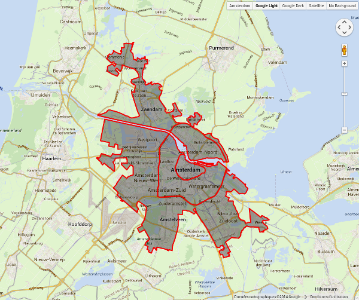
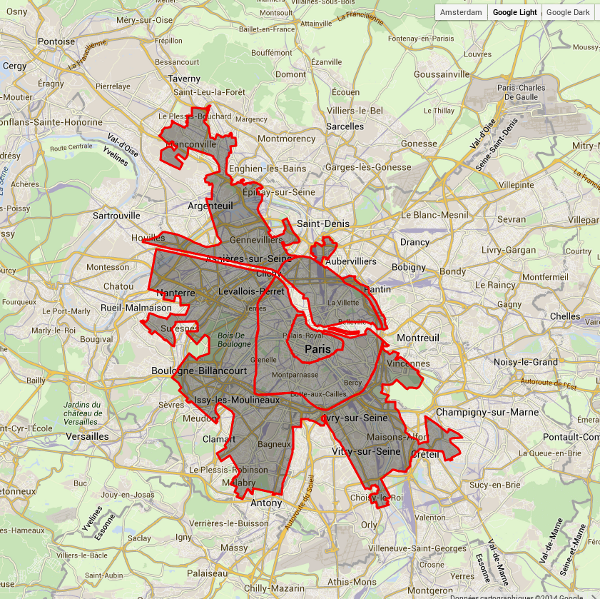
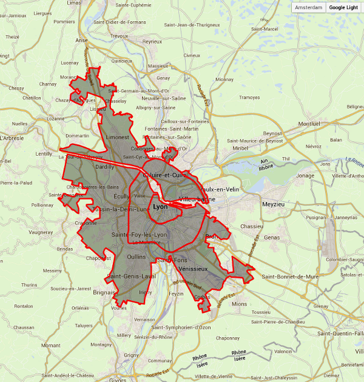
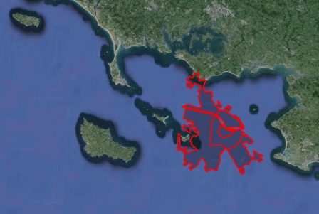

Dans le cadre des projets Open Data qui fleurissent dans toutes les municipalités intelligentes[^1], la ville d'Amsterdam a répondu à une question pour laquelle j'avais enquêté à mon arrivée en 2006. [J'avais mesuré la longueur](/peripherique-amsterdam) du **ring A10** amstelodamois et du **périphérique parisien** et constaté que c'était presque kif-kif.

La ville d'Amsterdam fait mieux aujourd'hui en mettant à disposition du public de [nombreuses cartes](http://maps.amsterdam.nl) de la ville [dont une](http://maps.amsterdam.nl/hoegroot/) où l'on peut déplacer les limites de l’agglomération sur la carte du monde. Comme on peut le voir, la carte propose plusieurs traces : celle du centre ville (*Centrum*) celle du ring A10 (que j'avais mesuré) et celle de l’agglomération, comprenant, entre autres, les villes limitrophes de **Zaandam** et d'**Amstelveen**, l'**aéroport de Schiphol** sur la commune d'**Haarlemmermeer** et même les bourgades attenantes comme **Weesp**, , **Krommenie** ou **Halfweg**. [^2]Il aurait été possible de prendre en compte la [conurbation du Randstad](/le-randstad) mais cette dernière n'a pas de limite officiellement définie ce qui rend le travail délicat. Et surtout, le Randstad ne met pas Amsterdam au centre et ici, la ville veut pouvoir se mettre en avant.[^3]Sur mes cartes exemples, l'aéroport de Schiphol n'est pas inclus..

## Amsterdam et elle même
Ceci juste pour vous indiquer la zone couvert par chaque trait rouge.

{.center}

## Amsterdam et Paris
Reprennons mon exemple de 2006 avec une présentation bien plus opendata qu'avant

{.center}

## Amsterdam et Lyon
Une ville de province pour éviter de me faire traiter de parisianocentriste.
{.center}

## Amsterdam et votre ville

<!--excerpt-->

[Allez sur la page dédiée](http://maps.amsterdam.nl/hoegroot/) et déménagez la trace d'Amsterdam sur la planète. Comparez-là à **Tokyo**, **Londres**, **Mexico** ou les **Îles Kergelen**... À vous de jouer !

{.center}

---
[^1]: Pour les projets Open Data de la ville d'Amsterdam, voir [le site dédié](http://www.amsterdamopendata.nl/).
[^2]: Mais curieusement pas 
[^3]: Alors qu'en 2006, je vous proposait 2 cartes que je posait cote à cote en affirmant que les échelles étaient les mêmes, je recommence l'exercice en juxtaposant les agglomérations en vous laissant seuls juges. Trois petits exemples pour vous rendre compte de la taille d'Amsterdam.

<!-- post notes:
http://maps.amsterdam.nl/hoegroot/ 
http://www.amsterdamopendata.nl/ 
http://maps.amsterdam.nl/open_geodata/ 
///html
<small style="color:#FFFFFF; background:red; padding-left:.3em; padding-right:.3em;"><strong>A&nbsp;10</strong></small>
///
--->
