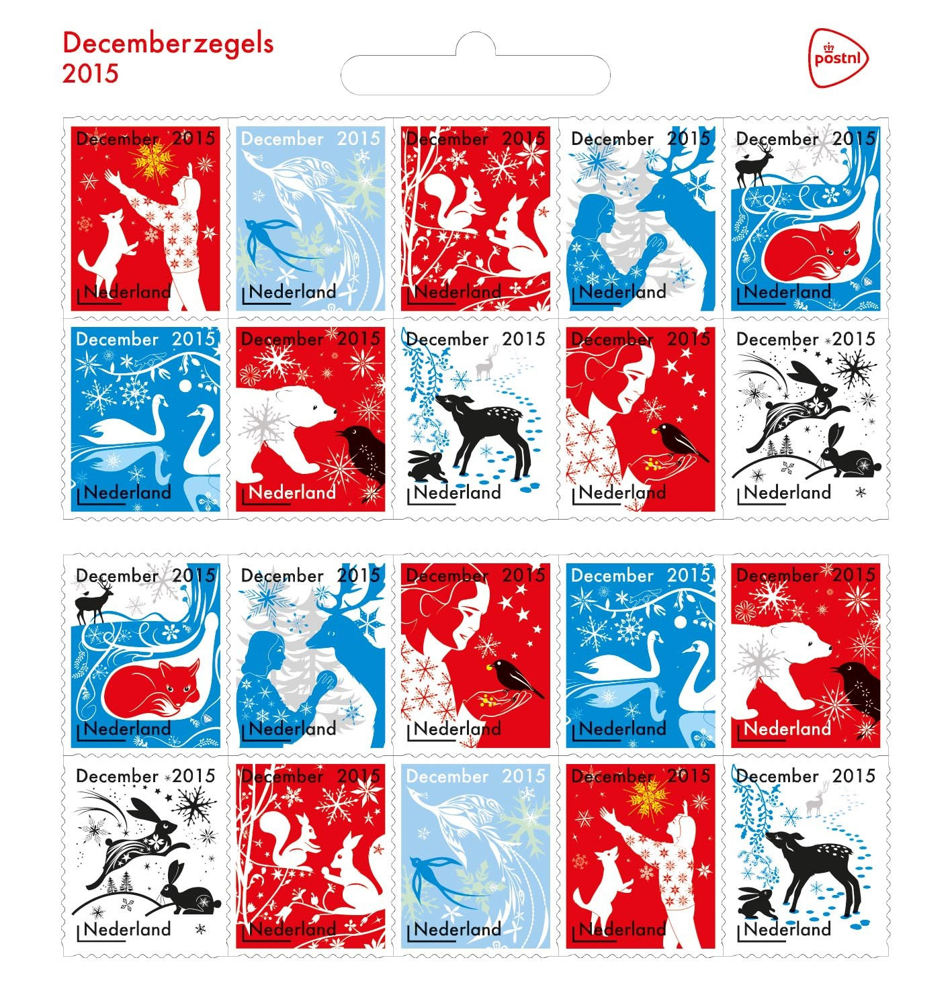

Les timbres de décembre sont une tradition pour les fêtes aux Pays bas et tous les ans (ou presque) depuis 2006 je vous fait découvrir de nouveaux visuels de timbres qui vous permettent d'envoyer vos courriers à moindre coût.

Cette année alors que les réseaux sociaux et les avatars se couvrent de drapeaux tricolores, la poste a fait un effort particulier en reprenant les trois couleurs bleu, blanc rouge pour ses timbres de décembre. Les envois de cartes pour la [saint Nicolas](/?q=sinterklaas), [Hanukkah](/nouveau-mot-chanoeka), le solstice d'hiver, [Noël](/?q=noël) et les vœux de [nouvel an](/un-plongeon-le-nouvel-an) porteront cette année les couleurs de Paris sous la neige.

{.center}

## Voir aussi
* [Timbres de décembre en 2006](/augmentation-du-prix-du-timbre)
* [Timbres de décembre en 2007](/timbres-en-promo)
* [Timbres de décembre en 2008](/les-timbres-de-saison)
* désolé, je n'ai pas ceux de  2009
*  [Timbres de décembre en 2010](/les-timbres-de-decembre-2010)
* désolé, je n'ai pas ceux de 2011
*  [Timbres de décembre en 2012](/Les-timbres-de-decembre-ont-25-ans)
---