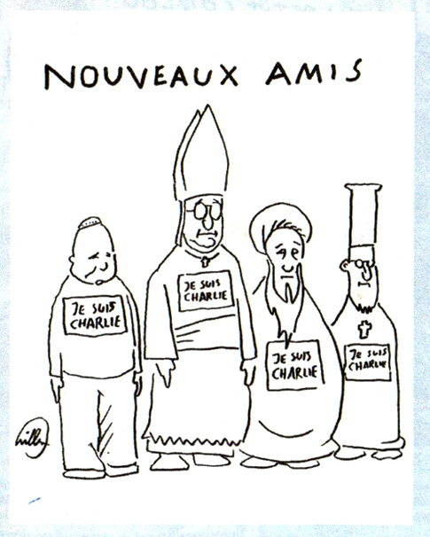

Un mois après la fusillade tragique dans les locaux de Charlie Hebdo, qui a coûté la vie à 12 personnes dont des dessinateurs connus, je me permets de revenir brièvement sur cet événement à froid[^1]

C'est suite à cet évènement que j'ai appris que la plume qui signait ses dessins d'un Willem dans un rond était néerlandais. Un néerlandais à Charlie, voilà qui justifie ce petit billet. En fait Willem, de son vrai nom  **Bernhard Willem Holtrop**, est un néerlandais d'origine mais en France de longue date et il collaborait déjà à Charlie avant sa refondation en Hebdo par Philippe Val en 1992. Il y tenait une rubrique **Autre choses** dans le plus pur style de bédé soixante-huitarde d'inspiration provo[^2] comme dans Hara Kiri à ses débuts. C'est d'ailleurs dans Hara Kiri qu'il s'est fait connaître. Il signe aussi dans Libération sous « [l'œil de Willem](http://www.liberation.fr/politiques/2012/09/07/l-oeil-de-willem_844710?photo_id=466000) » dans les pages « politique » du quotidien.

Suite à l'assassinat de ses collègues, Willem a répondu offert son témoignage, disant ne pas aimer les conférences de rédaction, [ce qui lui a peut-être sauvé la vie](http://www.liberation.fr/video/2015/01/07/willem-je-ne-vais-jamais-aux-conferences-de-redaction-ca-m-a-sauve-la-vie_1175897). Il a aussi offert une interview au Vokskrant où, bien qu'il reconnaissait que le soutien apporté par la foule au journal, aux survivants, aux familles des victimes, était formidable. Il ajoute quand même qu'il ne considère pas mieux certaines personnes qui apportent leur soutien. Il parle du Pape, de la reine d'Angleterre et de Poutine. Lui qui est toujours anti-religieux a résumé la singularité de ces nouveaux soutiens dans le numéro suivant de Charlie Hebdo (le numéro des survivants).

{.center}

Cette interview a été reprise par l'AFP et de [nombreux journaux](http://www.midilibre.fr/2015/01/10/willem-nous-vomissons-sur-ceux-qui-subitement-disent-etre-nos-amis,1108958.php) l'on repris alors que le numéro des survivants n'étaient pas encore imprimé. Les journaux français ont titré du racoleur **Nous vomissions sur ceux qui subitement disent être nos amis**.

Vu de l'étranger, les tournures que prennent les choses en France, laissent présager que la liste des destinataires du vomi de Willem s'allonge de jour en jour. Des parlementaires qui décident de plus de surveillance, de ministres qui dictent aux français quoi penser, des juges qui envoient en prison des potaches qui font des blagues (de mauvais goût) sur facebook. Des policiers qui convoquent un enfant de 8 ans au commissariat... Tout cela au nom du respect d'un journal qui a toujours prôné l'insolence, dénoncé la censure et combattu les autoritarismes.

Cette interview de Willem a presque un mois mais à mesure que le temps passe elle est hélas de plus en plus d'actualité.

---
[^1]: J'aurais bien aimé conseiller à tout le monde, et surtout BFM, de ne pas réagir à chaud à cette tragédie mais qui suis-je pour dicter l'émotion des gens ?
[^2]: [Provo](https://fr.wikipedia.org/wiki/Provo_%28mouvement%29) est un mouvement artistique et politique pré-hippie qui a vu le jour à Amsterdam dans les années 60. J'aurais dû en parler depuis longtemps mais je n'en ai jamais pris le temps. Le [musée d'Amsterdam](/gratis-week-in-ahm/) en consacre une salle entière.
<!-- post notes:
http://lesbeauxdimanches.hautetfort.com/archive/2011/11/22/paix-a-leurs-cendres-2.html 
http://www.omroepgelderland.nl/web/nieuws-1/2079850/striptekenaar-willem-holtrop-ermelo-verliest-vrienden-bij-aanslag-parijs.htm#.VK1NaRDn9M3 
http://s.vk.nl/dossier-aanslag-op-charlie-hebdo/nederlandse-charlie-hebdo-cartoonist-we-moeten-doorgaan~a3824860/ 
http://s.vk.nl/dossier-aanslag-op-charlie-hebdo/we-gaan-nog-zeker-twintig-jaar-door~a3826650/ <--payant
--->
