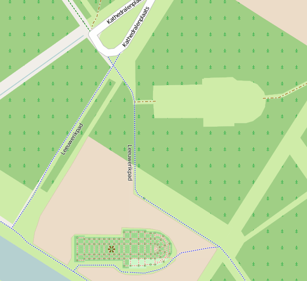
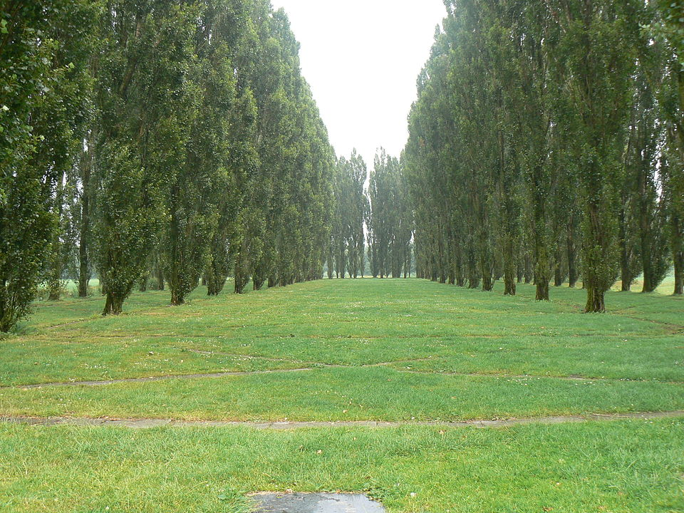
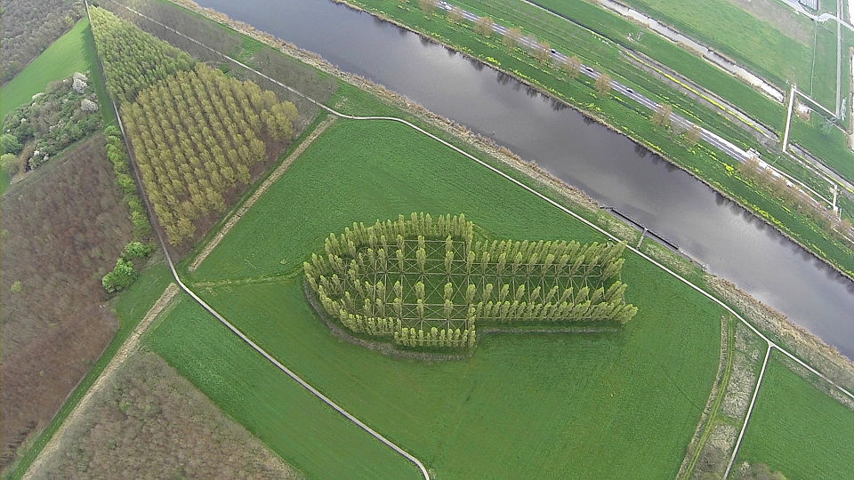

Parfois, au détour d'un petit tour en voiture ou à vélo, on découvre qu'on est passé à proximité d'une cathédrale. Cathédrale construite dans un endroit et d'un matériau inhabituels. J'ai parlé de cette [cathédrale de Reims en rochers](/cathedrales-impromtues) à proximité du delta project, réalisée par  **Marinus Boezem**. Mais l'artiste ne s'est pas arrêté à cette seule cathédrale. L'une d'elle se croise sur l'île du Flevoland, le long des pistes cyclables d'Almère. C'est **la cathédrale verte**, (*De Groene Kathedraal*).

## La cathédrale verte

La cathédrale verte est en fait mieux visible du ciel et aujourd'hui même les plans du coin la font apparaître, ce qui n'était pas le cas pendant de nombreuses années. Ici vous pouvez la voir sur OpenStreetMap :

{.center}

La cathédrale verte est en fait une double cathédrale, le monument lui même, composé de peupliers plantés de la même manière que les piliers de la cathédrale de Reims, et une clairière dans le bois juste à coté, de la même taille et forme que la cathédrale. Tout est fait comme si les arbres avaient été transportés d'un lieu d'extraction à un lieu de construction, comme pour les pierres d'une cathédrale. Ici, la clairière est à quelques minutes de marche de la cathédrale verte. 

chaque arbre est relié par un petit chemin piéton qui achève le plan de la cathédrale. Au sol, on voit les chemins et on peut les emprunter mais on voit surtout un grand bosquet de peupliers dont l'alignement est peut être singulier mais pas très explicite.

[{.center}](https://commons.wikimedia.org/wiki/File:Almere_-_Groene_Kathedraal.jpg)

Comme pour les *crop circles* anglais, il faut prendre de la hauteur pour admirer au mieux ce monument arboricole. Les meilleurs photos sont donc prises d'avion ou de drônes et montrent la cathédrale verte dans toute sa splendeur.

[{.center}](https://commons.wikimedia.org/wiki/File:GOPR0061.MP4_000124020.jpg)

**La construction de la cathédrale a commencée en 1987** quand la mairie d'Almère a décidé de planter selon les plans de Marinus Boezem conçus en 1978, des chênes et des hêtres et des haies selon le plan de cette cathédrale, ainsi qu'une autre avec des peupliers de Lombardie. La première cathédrale *tombait en ruine* à mesure que les arbres poussaient de manière irrégulière (c'est aujourd'hui la clairière) alors que la seconde montait vers le ciel lentement comme devait le faire la cathédrale de Reims au 13ème siècle. En 1996 les peupliers étaient suffisamment grand pour que la cathédrale soit officiellement ouverte et les chemins ont été installés au sol. Le musée du Pavillon d'Almere (*Museum De Paviljoens*) [qui présente cette oeuvre](http://www.depaviljoens.nl/page/286/nl), la date de 1978-1996 comme si l'artiste avait passé presque 20 ans à travailler dessus. 

En fait ce sont les arbres qui ont fait le plus gros du travail en poussant pendant toutes ces années. Cette œuvre de land art s'intègre tellement dans le paysage que c'est le paysage qui la fait vivre...
