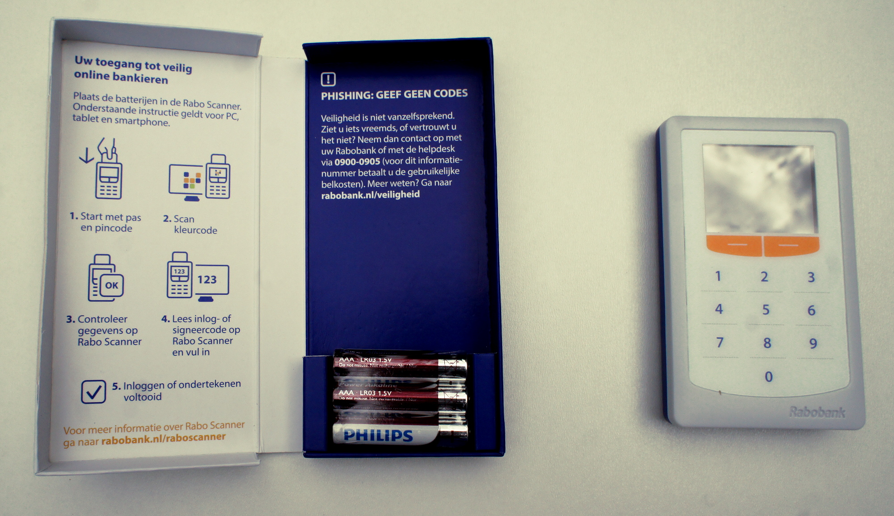
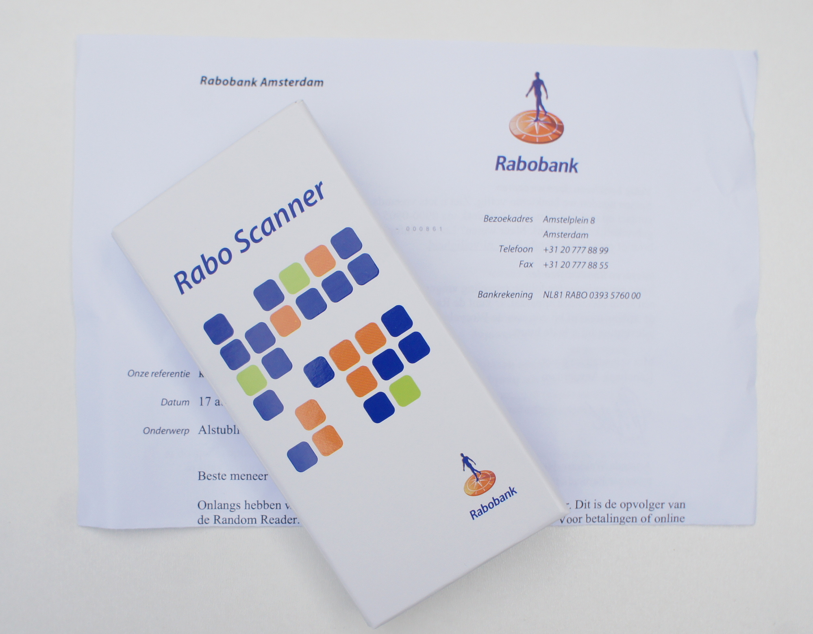

J'ai évoqué les systèmes de connexion [sécurisée des sites de banque par Internet aux Pays bas](/la-securite-des-sites-bancaires) Malgré que ce système soit bien meilleur que ce que j'ai pût voir chez les banques françaises, [ma banque](/une-banque-qui-demande-moins-de-sous) a jugé qu'il présentait encore des vulnérabilités. Alors elle propose un nouveau moyen (ce sera bientôt le seul moyen pour faire de l'*Internet banking*) avec une nouvelle machinette: **le Rabo Scanner.**

{.center}

J'ai finalement reçu mon nouveau scanner de la part de ma banque. J'ai décrit le fonctionnement de ces petites machines permettant de signer toutes ses connexions et transactions bancaires en ligne avec
un code unique validé par sa carte de paiement. 

{.center}

Le système a été amélioré, voyez plutôt: écran couleur et caméra au dos de l'appareil, piles changeables et emballage de protection, le **Rabo Scanner** fait beaucoup plus riche que son prédécesseur. Mais toutes ces nouveautés sont utiles.
 
* il n'y a plus besoin de taper les chiffres sur l'écran, un code compliqué, en couleur est scanné directement par la caméra.
* L'appareil affiche le montant de la transaction que l'utilisateur est invité à confirmer. Ceci coupe court à toute « attaque de l'homme du milieu » qui aurait put être imaginable avec le précédent système.
* Comme dans l'ancien système, le clavier sert à signer la transaction en tapant le pin de sa carte bancaire, libérant un code unique (*TAN code*) à entrer sur le site de banque en ligne.

Franchement à ce niveau là, je ne vois pas comment le système pourrait être exploité malicieusement. Aussi, je n'ai pas l’esprit malicieux, peut être connaissez vous des failles ? Faites m'en part ici.

### Lire aussi :
 **[France / Pays bas: Comparatif des services bancaires](/france-pays-bas-comparatif-des-services-bancaires)**

 **[Une banque qui demande moins de sous](/une-banque-qui-demande-moins-de-sous)**

 **[La fin du porte monnaie électronique](/Porte-monnaie-electronique-la-fin-du-Chipknip)**

 **[Aventures à la carte bancaire](/aventures-carte-bancaire)**

 **[Attention, emprunter de l'argent coûte de l'argent](/emprunter-de-l-argent-coute-de-l-argent)**

 **[Changement de banque: Rabobank](/changement-de-banque-rabobank)**

 **[Choisir une banque](/choisir-une-banque)**
---