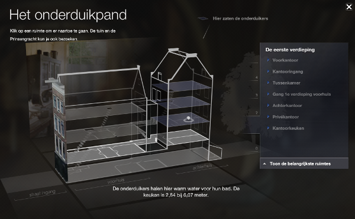

Il ne se passe pas une semaine sans que la folie des ayant trop de droits ne fasse l'actualité avec des décisions agressives ou des raisonnements alambiqués pour expliquer leur cupidité. C'est au tour d'**Anne Frank, une enfant d'Amsterdam**, d'en être la victime.

## Le nouveau domaine public 2016

Selon les traités internationaux, le monopole que les ayant droits conservent sur un œuvre court pendant 70 ans après la mort de l'auteur. Ce monopole expire précisément l'année suivant la date anniversaire de cette mort. C'est pour cela que le premier janvier est une fête, chaque année le domaine public s'élargit de centaines d'œuvres. Aujourd'hui, 1er janvier 2016 entrent dans le domaine public de nombreuses œuvres d'auteurs décédé en 1945. C'est le cas de **Maurice Ravel**, auteur du boléro portant son nom, de **Josef Čapek**, l'inventeur du mot « robot »[^1] ou du philosphe **Paul Valery** star de son époque. Coté néerlandais, le domaine public s'enrichit des écrits de **Willem Jan Aalders** et **Hendrik Bulthuis** auxquels on peut ajouter **Anne Frank**, Juive Allemande qu'Amsterdam a accueilli en 1934 et qui est morte du tifus dans le camp de Bergen Belsen.

Seulement pour cette dernière, les droits étaient détenus par le fond eponyme qui a annoncé qu'il continuera à exercer son monopole après le premier janvier 2016. C'est **Olivier Ertzshield** qui a lancé l'alerte en publiant un billet sur son blog [Affordance](http://affordance.typepad.com), [repris sur Rue89](http://rue89.nouvelobs.com/2015/10/08/chere-anne-frank-libere-texte-toute-illegalite-261561). L'éditeur a expliqué qu'il défendrait ses droits exclusifs jusqu'au premier janvier 2051, parce que le journal intime de la jeune fille a été rassemblé par son père Otto Frank qui en a supprimé des parties. Ce dernier est considéré par l'éditeur comme l'auteur du journal et comme il est mort en 1980, les droits exclusifs sont donc prolongés de 35 ans[^2].

<!-- HTML -->

<blockquote class="twitter-tweet" lang="en">
Komt het Dagboek van Anne Frank volgend jaar in het publiek domein? <a href="https://t.co/IodZzcG9zx">https://t.co/IodZzcG9zx</a> via <a href="https://twitter.com/deVolkskrant">@DeVolkskrant</a>
&mdash; OpenCultuurData (@OpenCultuurData) <a href="https://twitter.com/OpenCultuurData/status/666541259289444352">November 17, 2015</a></blockquote>

<!-- / HTML -->

<!--excerpt-->

L'auteur d'un journal intime d'une jeune fille, censuré ou non, est bien la fille qui a écrit le journal elle même et non son père, même si ce dernier s'est battu pour le faire connaître. Le raisonnement du fond de gestion des droits Anne Frank ne tient pas deux minutes. Il pratique ici de l'intimidation mais il se trouve que  Olivier Ertzshield ne s'est pas laissé intimider et a décidé de publier dès 2015 le journal de la jeune allemande sous forme numérique en se disant prêt à affronter la justice. L'ayant droit a répondu chiche par la voie de son avocat, **le cabinet Koelman** (prononcez cool man), en envoyant un courrier le 28 décembre dernier. En plus de rappeler au blogueur les raisons de sa pingrerie son interprétation des lois sur le droit d'auteur, Koelman en rajoute en l’astreignant à se censurer et écrire contre son opinion. 

Le 29 décembre, **Olivier Ertzshield** a répondu paisiblement à l'avocat, puis le premier janvier, il a publié les textes du journal en néerlandais. Comme il avait appelé à faire de même et que ce texte est maintenant domaine public, je m'empresse de le faire, moi aussi, sur ce blog.

## Het Achterhuis

La fondation Anne Frank (*Stichting Anne Frank*[^3]) fait un remarquable travail de mémoire pour dénoncer l'horreur nazie par le partage de la vie de cette jeune fille, migrante, obligée de se cacher. Le nom du journal d'Anne Frank en néerlandais est *Het Achterhuis* ce qui veut dire **la maison de derrière**. Cette maison de derrière était la maison, située derrière une maison du canal Prinsengracht, dans laquelle se sont cachés sa famille Frank et la famille van Pels alors que les juifs d'Amsterdam était déportés en masse. Anne y décrit l'ambiance du quartier alors qu'elle ne pouvait sortir et ne voyait qu'un marronnier de la fenêtre. Hélas, une dénonciation a permis à la police de trouver la cachette le 4 oût 1944 et les familles Frank et van Pels ont été, elles aussi, déportées. Anne Frank n'a pas survécu.

La fondation Anne Frank a installé un musée à la mémoire de cette histoire dans la maison même où les Frank et les van Pels se sont cachés. De nombreux documents et des bornes interactives permettent de revivre la vie de ces familles et d'aller plus loin dans le travail de mémoire. 

C'est un haut lieu touristique à Amsterdam et il y a des dates à éviter si on ne veut pas faire la queue. Pour ceux qui ne viennent pas à Amsterdam[^4], la fondation a mis en ligne un site où l'on peut visiter la maison de derrière en 3D. Du très bon boulot qui a offert [un Webby Award](http://webbyawards.com/winners/2011/web/general-website/cultural-institutions/anne-frank-house/) à la fondation en 2011.

{.center}

Cette fondation attend que les droits du journal entrent dans le domaine public pour en sortir une version interactive qu'elle diffuserait une fois encore en ligne. Mais il appartient à chacun de poursuivre le travail de cette fondation en lisant et en publiant ce journal entré dans le domaine public. C'est donc ce que je vais faire sur ce blog, à mon modeste niveau, à la fin de ce billet.

## Un acte politique

L'absurdité des lois sur le droit d'auteur et leur application limitant souvent la diffusion du savoir est souvent pointée du doigt et l'histoire du journal d'Anne Frank n'est que le dernier d'une longue liste.

Pour lutter contre ces abus, la députée du Calvados **Isabelle Attard** a déposé en novembre 2013, [une proposition de loi](http://www.assemblee-nationale.fr/14/propositions/pion1573.asp) visant à condamner ces pratiques d'intimidation de privatisation du Domaine Public. Elle a elle aussi [promis sur son blog]( http://isabelleattard.fr/blog/2015/10/journal-danne-franck-polemique-autour-de-lentree-dans-le-domaine-public/) le texte original du journal d'Anne Frank après le premier janvier ce qui lui a aussi valut un courrier d'intimidation.

Elle a aussi expliqué sur son blog que si cette traduction en français est ensuite versée volontairement au domaine public, elle pourra être diffusée par quiconque légalement. Ce serait un très beau cadeau qui pourrait être fait à Anne Frank et à sa mémoire, loin des querelles de chiffonniers des ayants trop de droits.

Si parmi mes lecteurs de néerlandophones et francophones certains ce sentent l'envie et le temps d'offrir ce cadeau à l'humanité, n'hésitez pas à télécharger les textes ci-dessous et faites m'en part, je serais heureux de vous accompagner dans cette tâche.

## En France aussi

Une jeune française est aussi morte en 1945 dans le camp de Bergen Belsen après avoir écrit un journal intime. **Hélène Berr** était plus vieille qu'Anne mais elle a vécu l'horreur du même camp avant d'y laisser la vie. [Son journal intime](https://fr.wikipedia.org/wiki/Le_Journal_d'H%C3%A9l%C3%A8ne_Berr) a été publié en 2008 et est lui aussi entrée aujourd'hui dans le domaine public. Ce dernier, moins connu et moins lucratif n'a pas généré de querelles autour de ses droits exclusifs.

## Le journal d'Anne Frank

Téléchargez et lisez :

* Version text brut: [Het_Achterhuis_-_Anne_Frank.txt](/files/2016/Het_Achterhuis_-_Anne_Frank.txt)
* En html sur Wikisource: [nl.wikisource.org/wiki/Het_Achterhuis_(Anne_Frank)](https://nl.wikisource.org/wiki/Het_Achterhuis_(Anne_Frank))

---
[^1]: On ne dira pas que j'ai essayé d'apprendre le tchèque avec ses livres pour enfants (celui avec le chien et le chat qui font un gâteau).
[^2]: Les raisonnements sur les droits de cette œuvre sont plus compliqués puisqu'il y a plusieurs version du journal d'Anne Frank mais le Fond Anne France retient cette date de 2050 (la date la plus éloignée) pour l'expiration des droits exclusifs [comme l'explique le Volkskrant](http://www.volkskrant.nl/boeken/juridische-botsing-over-auteursrecht-anne-frank-lijkt-onvermijdelijk~a4187985/).
[^3]: La fondation qui gère le musée Anne Frank à Amsterdam, entité différente du Fond Anne Frank, fondation suisse qui ne fait que gérer les droits du bouquin et qui devrait être un des bailleurs de fond du musée.
[^4]: Ce blog s'appelle « me in Amsterdam » et je préfère quand même inciter les gens à venir dans cette belle ville.
<!-- post notes:
Domaine Public
http://www.aventdudomainepublic.org/?date=2015-12-31
http://www.piratskelisty.cz/clanek-1468-stastny-novy-rok-2016-s-novorocni-kulturni-nadilkou 
http://affordance.typepad.com//mon_weblog/2016/01/anne-frank.html#comments 
 

Slotwoord 
 

Hier eindigt Anne's Dagboek. Op 4 Augustus 1944 deed de Grüne Polizei een inval in het Achterhuis. Alle onderduikers en ook Kraler en Koophuis werden gearresteerd en naar Duitse en Nederlandse concentratiekampen gevoerd. 
 
Het Achterhuis werd door de Gestapo leeggeroofd. Tussen een hoop oude boeken, tijdschriften en kranten, die op de grond waren achtergebleven, vonden Miep en Elli Anne's dagboeken. Op enkele gedeelten na, die van weinig waarde voor den lezer zijn, is de oorspronkelijke tekst afgedrukt. 
Van de onderduikers kwam alleen vader terug, terwijl Kraler en Koophuis de ontberingen in het Nederlandse kamp doorstonden, en in hun familiekring terugkeerden. 
In Maart 1945 overleed Anne in het concentratiekamp Bergen-Belsen, twee maanden voor de bevrijding van Nederland.
--->
