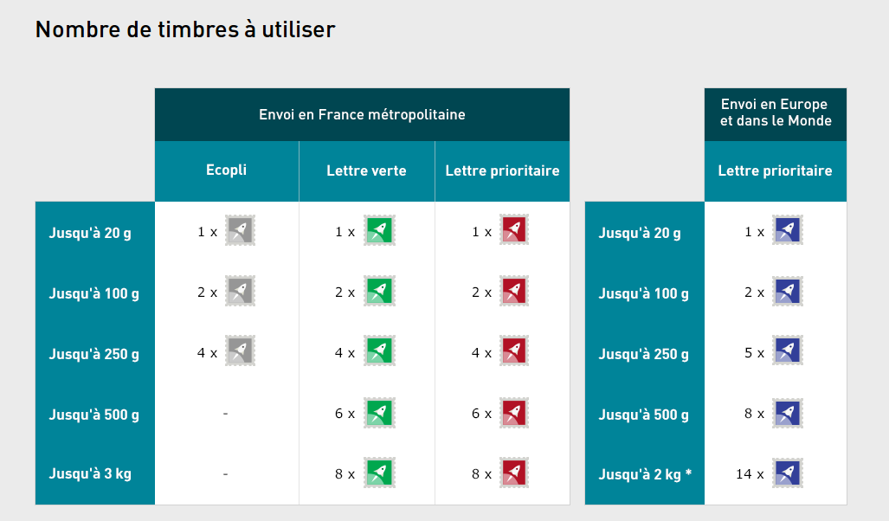
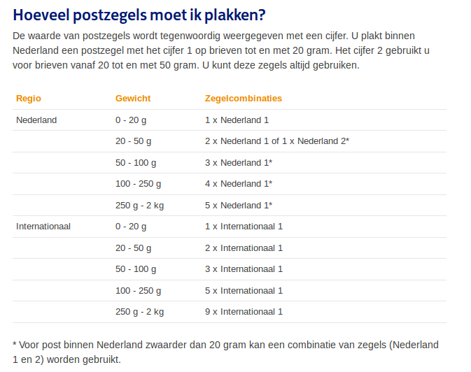

Vous avez peut-être remarqué les publicités de la poste pour ses nouveaux tarifs postaux, en vigueur depuis le premier janvier 2016 (bonne année). Ces publicités insistent sur le coté pratique de l’affranchissement avec le timbre pour unité de compte. 20g = 1 timbre, 20 à 100g = 2 timbres etc. Le coté pratique est incontestable, un carnet de timbres permet de réaliser tous ses affranchissements au centime prêt.

{.center}  
  
**Cette bonne idée est en usage aux Pays bas depuis au moins 2006** année de l'ouverture de mon blog (10 ans déjà) et [je vous l'expliquais](/les-tarifs-postaux) en concluant par un : « ''Il y a quand même un coté pratique qu'on ne saurait retirer à TPG Post. Une idée à exporter'' ». Depuis, la poste a [changé de nom](/le-nouveau-nom-de-la-poste-aux-pays-bas) deux fois mais l'idée est restée.

## Les différences 

Actuellement sur le site de la poste française, les tarifs sont présentés avec de jolis dessins de timbres colorés pour chaque tranche de poids. Ce n'est pas plus lisible mais ça fait joli. On remarque qu'il y a trois colonnes parce que le tarif éco et le tarif vert (la même chose avec un emballage écolo) subsiste en France alors que la poste néerlandaise [a supprimé le courrier deuxième classe en 2010](/les-timbres-de-decembre-2010).

{.center}

Aux Pays bas, on est tellement habitués à cette unité de compte timbresque qu'il existe un timbre qui en vaut deux. C'est marqué dessus. Les codes couleur n'existent pas comme en France, les timbres à validité permanente ont été introduit en 2005 et ils s'appellent *Nederland* et *Internationaal* On notera que le tarif *Europa* a disparu, C'est donc au tarif international qu'il faut affranchir dès qu'on veut franchir les frontières de ce petit pays. Envoyer une lettre au Luxembourg coûte autant que l'envoyer au Japon. La France fait encore la différence entre « Europe » et « Monde » même si ces deux tarifs sont représentés dans la même colonne.

{.center}

On remarquera aussi que les envois aux Pays bas sont limités à moins de 2kg alors que la poste française autorise un large 3kg.

## Comparaison des tarifs postaux des deux pays

Avec ces deux tableaux simples, on se dit qu'il est possible de comparer les prix des affranchissements postaux entre la France et les Pays bas pour savoir quel pays est le moins cher pour envoyer ses vœux de nouvel an.

<!-- HTML -->
<table width="100%" cellpadding="4" cellspacing="0">
	<col width="37*">
	<col width="37*">
	<col width="37*">
	<col width="37*">
	<col width="37*">
	<col width="37*">
	<col width="37*">
	<tr valign="top">
		<td width="14%" style="border-top: 1px solid #000000; border-bottom: 1px solid #000000; border-left: 1px solid #000000; border-right: none; padding-top: 0.04in; padding-bottom: 0.04in; padding-left: 0.04in; padding-right: 0in">
			

			 
			

		</td>
		<td width="14%" bgcolor="#dddddd" style="border-top: 1px solid #000000; border-bottom: 1px solid #000000; border-left: 1px solid #000000; border-right: none; padding-top: 0.04in; padding-bottom: 0.04in; padding-left: 0.04in; padding-right: 0in">
			
<b>0
			à 20g</b>

		</td>
		<td width="14%" bgcolor="#dddddd" style="border-top: 1px solid #000000; border-bottom: 1px solid #000000; border-left: 1px solid #000000; border-right: none; padding-top: 0.04in; padding-bottom: 0.04in; padding-left: 0.04in; padding-right: 0in">
			
<b>20
			à 50g</b>

		</td>
		<td width="14%" bgcolor="#dddddd" style="border-top: 1px solid #000000; border-bottom: 1px solid #000000; border-left: 1px solid #000000; border-right: none; padding-top: 0.04in; padding-bottom: 0.04in; padding-left: 0.04in; padding-right: 0in">
			
<b>50
			à 100g</b>

		</td>
		<td width="14%" bgcolor="#dddddd" style="border-top: 1px solid #000000; border-bottom: 1px solid #000000; border-left: 1px solid #000000; border-right: none; padding-top: 0.04in; padding-bottom: 0.04in; padding-left: 0.04in; padding-right: 0in">
			
<b>100
			à 250g</b>

		</td>
		<td width="14%" bgcolor="#dddddd" style="border-top: 1px solid #000000; border-bottom: 1px solid #000000; border-left: 1px solid #000000; border-right: none; padding-top: 0.04in; padding-bottom: 0.04in; padding-left: 0.04in; padding-right: 0in">
			
<b>250
			à 500g</b>

		</td>
		<td width="14%" bgcolor="#dddddd" style="border: 1px solid #000000; padding: 0.04in">
			
<b>500g
			à 2kg</b>

		</td>
	</tr>
	<tr valign="top">
		<td rowspan="2" width="14%" bgcolor="#dddddd" style="border-top: none; border-bottom: 1px solid #000000; border-left: 1px solid #000000; border-right: none; padding-top: 0in; padding-bottom: 0.04in; padding-left: 0.04in; padding-right: 0in">
			
<b>Vers
			la France</b>

		</td>
		<td width="14%" bgcolor="#00ccff" style="border-top: none; border-bottom: 1px solid #000000; border-left: 1px solid #000000; border-right: none; padding-top: 0in; padding-bottom: 0.04in; padding-left: 0.04in; padding-right: 0in">
			
<b>0,80</b>

		</td>
		<td width="14%" bgcolor="#00ccff" style="border-top: none; border-bottom: 1px solid #000000; border-left: 1px solid #000000; border-right: none; padding-top: 0in; padding-bottom: 0.04in; padding-left: 0.04in; padding-right: 0in">
			
<b>1,60</b>

		</td>
		<td width="14%" bgcolor="#00ccff" style="border-top: none; border-bottom: 1px solid #000000; border-left: 1px solid #000000; border-right: none; padding-top: 0in; padding-bottom: 0.04in; padding-left: 0.04in; padding-right: 0in">
			
<b>1,60</b>

		</td>
		<td width="14%" bgcolor="#00ccff" style="border-top: none; border-bottom: 1px solid #000000; border-left: 1px solid #000000; border-right: none; padding-top: 0in; padding-bottom: 0.04in; padding-left: 0.04in; padding-right: 0in">
			
<b>3,20</b>

		</td>
		<td width="14%" bgcolor="#00ccff" style="border-top: none; border-bottom: 1px solid #000000; border-left: 1px solid #000000; border-right: none; padding-top: 0in; padding-bottom: 0.04in; padding-left: 0.04in; padding-right: 0in">
			
<b>4,80</b>

		</td>
		<td width="14%" bgcolor="#00ccff" style="border-top: none; border-bottom: 1px solid #000000; border-left: 1px solid #000000; border-right: 1px solid #000000; padding-top: 0in; padding-bottom: 0.04in; padding-left: 0.04in; padding-right: 0.04in">
			
<b>6,40</b>

		</td>
	</tr>
	<tr valign="top">
		<td width="14%" bgcolor="#ffd320" style="border-top: none; border-bottom: 1px solid #000000; border-left: 1px solid #000000; border-right: none; padding-top: 0in; padding-bottom: 0.04in; padding-left: 0.04in; padding-right: 0in">
			
1,25

		</td>
		<td width="14%" bgcolor="#ffd320" style="border-top: none; border-bottom: 1px solid #000000; border-left: 1px solid #000000; border-right: none; padding-top: 0in; padding-bottom: 0.04in; padding-left: 0.04in; padding-right: 0in">
			
2,50

		</td>
		<td width="14%" bgcolor="#ffd320" style="border-top: none; border-bottom: 1px solid #000000; border-left: 1px solid #000000; border-right: none; padding-top: 0in; padding-bottom: 0.04in; padding-left: 0.04in; padding-right: 0in">
			
3,75

		</td>
		<td width="14%" bgcolor="#ffd320" style="border-top: none; border-bottom: 1px solid #000000; border-left: 1px solid #000000; border-right: none; padding-top: 0in; padding-bottom: 0.04in; padding-left: 0.04in; padding-right: 0in">
			
6,25

		</td>
		<td width="14%" bgcolor="#ffd320" style="border-top: none; border-bottom: 1px solid #000000; border-left: 1px solid #000000; border-right: none; padding-top: 0in; padding-bottom: 0.04in; padding-left: 0.04in; padding-right: 0in">
			
11,25

		</td>
		<td width="14%" bgcolor="#ffd320" style="border-top: none; border-bottom: 1px solid #000000; border-left: 1px solid #000000; border-right: 1px solid #000000; padding-top: 0in; padding-bottom: 0.04in; padding-left: 0.04in; padding-right: 0.04in">
			
11,25

		</td>
	</tr>
	<tr valign="top">
		<td rowspan="2" width="14%" bgcolor="#dddddd" style="border-top: none; border-bottom: 1px solid #000000; border-left: 1px solid #000000; border-right: none; padding-top: 0in; padding-bottom: 0.04in; padding-left: 0.04in; padding-right: 0in">
			
<b>Vers
			les Pays bas</b>

		</td>
		<td width="14%" bgcolor="#00ccff" style="border-top: none; border-bottom: 1px solid #000000; border-left: 1px solid #000000; border-right: none; padding-top: 0in; padding-bottom: 0.04in; padding-left: 0.04in; padding-right: 0in">
			
1,00

		</td>
		<td width="14%" bgcolor="#00ccff" style="border-top: none; border-bottom: 1px solid #000000; border-left: 1px solid #000000; border-right: none; padding-top: 0in; padding-bottom: 0.04in; padding-left: 0.04in; padding-right: 0in">
			
2,00

		</td>
		<td width="14%" bgcolor="#00ccff" style="border-top: none; border-bottom: 1px solid #000000; border-left: 1px solid #000000; border-right: none; padding-top: 0in; padding-bottom: 0.04in; padding-left: 0.04in; padding-right: 0in">
			
<b>2,00</b>

		</td>
		<td width="14%" bgcolor="#00ccff" style="border-top: none; border-bottom: 1px solid #000000; border-left: 1px solid #000000; border-right: none; padding-top: 0in; padding-bottom: 0.04in; padding-left: 0.04in; padding-right: 0in">
			
4,00

		</td>
		<td width="14%" bgcolor="#00ccff" style="border-top: none; border-bottom: 1px solid #000000; border-left: 1px solid #000000; border-right: none; padding-top: 0in; padding-bottom: 0.04in; padding-left: 0.04in; padding-right: 0in">
			
8,00

		</td>
		<td width="14%" bgcolor="#00ccff" style="border-top: none; border-bottom: 1px solid #000000; border-left: 1px solid #000000; border-right: 1px solid #000000; padding-top: 0in; padding-bottom: 0.04in; padding-left: 0.04in; padding-right: 0.04in">
			
14,00

		</td>
	</tr>
	<tr valign="top">
		<td width="14%" bgcolor="#ffd320" style="border-top: none; border-bottom: 1px solid #000000; border-left: 1px solid #000000; border-right: none; padding-top: 0in; padding-bottom: 0.04in; padding-left: 0.04in; padding-right: 0in">
			
0,73

		</td>
		<td width="14%" bgcolor="#ffd320" style="border-top: none; border-bottom: 1px solid #000000; border-left: 1px solid #000000; border-right: none; padding-top: 0in; padding-bottom: 0.04in; padding-left: 0.04in; padding-right: 0in">
			
1,46

		</td>
		<td width="14%" bgcolor="#ffd320" style="border-top: none; border-bottom: 1px solid #000000; border-left: 1px solid #000000; border-right: none; padding-top: 0in; padding-bottom: 0.04in; padding-left: 0.04in; padding-right: 0in">
			
2,19

		</td>
		<td width="14%" bgcolor="#ffd320" style="border-top: none; border-bottom: 1px solid #000000; border-left: 1px solid #000000; border-right: none; padding-top: 0in; padding-bottom: 0.04in; padding-left: 0.04in; padding-right: 0in">
			
<b>2,92</b>

		</td>
		<td width="14%" bgcolor="#ffd320" style="border-top: none; border-bottom: 1px solid #000000; border-left: 1px solid #000000; border-right: none; padding-top: 0in; padding-bottom: 0.04in; padding-left: 0.04in; padding-right: 0in">
			
<b>3,65</b>

		</td>
		<td width="14%" bgcolor="#ffd320" style="border-top: none; border-bottom: 1px solid #000000; border-left: 1px solid #000000; border-right: 1px solid #000000; padding-top: 0in; padding-bottom: 0.04in; padding-left: 0.04in; padding-right: 0.04in">
			
<b>3,65</b>

		</td>
	</tr>
	<tr valign="top">
		<td rowspan="2" width="14%" bgcolor="#dddddd" style="border-top: none; border-bottom: 1px solid #000000; border-left: 1px solid #000000; border-right: none; padding-top: 0in; padding-bottom: 0.04in; padding-left: 0.04in; padding-right: 0in">
			
<b>Vers
			le reste de l'Europe</b>

		</td>
		<td width="14%" bgcolor="#00ccff" style="border-top: none; border-bottom: 1px solid #000000; border-left: 1px solid #000000; border-right: none; padding-top: 0in; padding-bottom: 0.04in; padding-left: 0.04in; padding-right: 0in">
			
<b>1,00</b>

		</td>
		<td width="14%" bgcolor="#00ccff" style="border-top: none; border-bottom: 1px solid #000000; border-left: 1px solid #000000; border-right: none; padding-top: 0in; padding-bottom: 0.04in; padding-left: 0.04in; padding-right: 0in">
			
<b>2,00</b>

		</td>
		<td width="14%" bgcolor="#00ccff" style="border-top: none; border-bottom: 1px solid #000000; border-left: 1px solid #000000; border-right: none; padding-top: 0in; padding-bottom: 0.04in; padding-left: 0.04in; padding-right: 0in">
			
<b>2,00</b>

		</td>
		<td width="14%" bgcolor="#00ccff" style="border-top: none; border-bottom: 1px solid #000000; border-left: 1px solid #000000; border-right: none; padding-top: 0in; padding-bottom: 0.04in; padding-left: 0.04in; padding-right: 0in">
			
<b>5,00</b>

		</td>
		<td width="14%" bgcolor="#00ccff" style="border-top: none; border-bottom: 1px solid #000000; border-left: 1px solid #000000; border-right: none; padding-top: 0in; padding-bottom: 0.04in; padding-left: 0.04in; padding-right: 0in">
			
<b>8,00</b>

		</td>
		<td width="14%" bgcolor="#00ccff" style="border-top: none; border-bottom: 1px solid #000000; border-left: 1px solid #000000; border-right: 1px solid #000000; padding-top: 0in; padding-bottom: 0.04in; padding-left: 0.04in; padding-right: 0.04in">
			
14,00

		</td>
	</tr>
	<tr valign="top">
		<td width="14%" bgcolor="#ffd320" style="border-top: none; border-bottom: 1px solid #000000; border-left: 1px solid #000000; border-right: none; padding-top: 0in; padding-bottom: 0.04in; padding-left: 0.04in; padding-right: 0in">
			
1,25

		</td>
		<td width="14%" bgcolor="#ffd320" style="border-top: none; border-bottom: 1px solid #000000; border-left: 1px solid #000000; border-right: none; padding-top: 0in; padding-bottom: 0.04in; padding-left: 0.04in; padding-right: 0in">
			
2,50

		</td>
		<td width="14%" bgcolor="#ffd320" style="border-top: none; border-bottom: 1px solid #000000; border-left: 1px solid #000000; border-right: none; padding-top: 0in; padding-bottom: 0.04in; padding-left: 0.04in; padding-right: 0in">
			
3,75

		</td>
		<td width="14%" bgcolor="#ffd320" style="border-top: none; border-bottom: 1px solid #000000; border-left: 1px solid #000000; border-right: none; padding-top: 0in; padding-bottom: 0.04in; padding-left: 0.04in; padding-right: 0in">
			
6,25

		</td>
		<td width="14%" bgcolor="#ffd320" style="border-top: none; border-bottom: 1px solid #000000; border-left: 1px solid #000000; border-right: none; padding-top: 0in; padding-bottom: 0.04in; padding-left: 0.04in; padding-right: 0in">
			
11,25

		</td>
		<td width="14%" bgcolor="#ffd320" style="border-top: none; border-bottom: 1px solid #000000; border-left: 1px solid #000000; border-right: 1px solid #000000; padding-top: 0in; padding-bottom: 0.04in; padding-left: 0.04in; padding-right: 0.04in">
			
<b>11,25</b>

		</td>
	</tr>
	<tr valign="top">
		<td rowspan="2" width="14%" bgcolor="#dddddd" style="border-top: none; border-bottom: 1px solid #000000; border-left: 1px solid #000000; border-right: none; padding-top: 0in; padding-bottom: 0.04in; padding-left: 0.04in; padding-right: 0in">
			
<b>Vers
			le reste du monde</b>

		</td>
		<td width="14%" bgcolor="#00ccff" style="border-top: none; border-bottom: 1px solid #000000; border-left: 1px solid #000000; border-right: none; padding-top: 0in; padding-bottom: 0.04in; padding-left: 0.04in; padding-right: 0in">
			
<b>1,25</b>

		</td>
		<td width="14%" bgcolor="#00ccff" style="border-top: none; border-bottom: 1px solid #000000; border-left: 1px solid #000000; border-right: none; padding-top: 0in; padding-bottom: 0.04in; padding-left: 0.04in; padding-right: 0in">
			
<b>2,50</b>

		</td>
		<td width="14%" bgcolor="#00ccff" style="border-top: none; border-bottom: 1px solid #000000; border-left: 1px solid #000000; border-right: none; padding-top: 0in; padding-bottom: 0.04in; padding-left: 0.04in; padding-right: 0in">
			
<b>2,50</b>

		</td>
		<td width="14%" bgcolor="#00ccff" style="border-top: none; border-bottom: 1px solid #000000; border-left: 1px solid #000000; border-right: none; padding-top: 0in; padding-bottom: 0.04in; padding-left: 0.04in; padding-right: 0in">
			
<b>5,00</b>

		</td>
		<td width="14%" bgcolor="#00ccff" style="border-top: none; border-bottom: 1px solid #000000; border-left: 1px solid #000000; border-right: none; padding-top: 0in; padding-bottom: 0.04in; padding-left: 0.04in; padding-right: 0in">
			
<b>10,00</b>

		</td>
		<td width="14%" bgcolor="#00ccff" style="border-top: none; border-bottom: 1px solid #000000; border-left: 1px solid #000000; border-right: 1px solid #000000; padding-top: 0in; padding-bottom: 0.04in; padding-left: 0.04in; padding-right: 0.04in">
			
17,50

		</td>
	</tr>
	<tr valign="top">
		<td width="14%" bgcolor="#ffd320" style="border-top: none; border-bottom: 1px solid #000000; border-left: 1px solid #000000; border-right: none; padding-top: 0in; padding-bottom: 0.04in; padding-left: 0.04in; padding-right: 0in">
			
<b>1,25</b>

		</td>
		<td width="14%" bgcolor="#ffd320" style="border-top: none; border-bottom: 1px solid #000000; border-left: 1px solid #000000; border-right: none; padding-top: 0in; padding-bottom: 0.04in; padding-left: 0.04in; padding-right: 0in">
			
<b>2,50</b>

		</td>
		<td width="14%" bgcolor="#ffd320" style="border-top: none; border-bottom: 1px solid #000000; border-left: 1px solid #000000; border-right: none; padding-top: 0in; padding-bottom: 0.04in; padding-left: 0.04in; padding-right: 0in">
			
3,75

		</td>
		<td width="14%" bgcolor="#ffd320" style="border-top: none; border-bottom: 1px solid #000000; border-left: 1px solid #000000; border-right: none; padding-top: 0in; padding-bottom: 0.04in; padding-left: 0.04in; padding-right: 0in">
			
6,25

		</td>
		<td width="14%" bgcolor="#ffd320" style="border-top: none; border-bottom: 1px solid #000000; border-left: 1px solid #000000; border-right: none; padding-top: 0in; padding-bottom: 0.04in; padding-left: 0.04in; padding-right: 0in">
			
11,25

		</td>
		<td width="14%" bgcolor="#ffd320" style="border-top: none; border-bottom: 1px solid #000000; border-left: 1px solid #000000; border-right: 1px solid #000000; padding-top: 0in; padding-bottom: 0.04in; padding-left: 0.04in; padding-right: 0.04in">
			
<b>11,25</b>

		</td>
	</tr>
</table>
<!-- / HTML -->

Les Pays bas restent plus cher que la France pour affranchir son courrier mais sur les envois les plus lourds (entre 500g et 2kg), le nombre de timbres à coller en France rend les envois si cher que **Postnl** arrive à faire mieux pour l'international et même pour l'Europe. Sans surprise il est moins cher de poster dans le pays d'affranchissement, les tarifs français sont les mieux pour la France et les tarifs hollandais sont les mieux pour les Pays bas… sauf… Sauf, à cause des tranches différentes entre les deux pays, sauf pour les plis de 50 à 100g où l'envoi depuis la France coûte **19 centimes de moins** que depuis le même pays. Vive les [effets de seuil](/impot-sur-le-revenu-effet-de-seuil).

## Voir aussi
* [Timbres de décembre en 2006](/augmentation-du-prix-du-timbre)
* [Timbres de décembre en 2007](/timbres-en-promo)
* [Timbres de décembre en 2008](/les-timbres-de-saison)
* désolé, je n'ai pas ceux de  2009
*  [Timbres de décembre en 2010](/les-timbres-de-decembre-2010)
* désolé, je n'ai pas ceux de 2011
*  [Timbres de décembre en 2012](/Les-timbres-de-decembre-ont-25-ans)
* [Timbres de décembre de 2015](/Tricolore-sur-les-timbres-de-decembre)
---