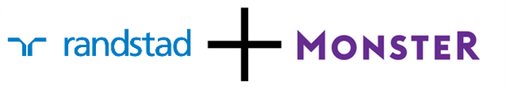

{.center}

En vous présentant la [région du Randstad](/le-randstad), je vous promettais de vous présenter la compagnie. C'est l'actualité qui me le fait faire aujourd'hui puisque **la holding qui porte le nom de la conurbation néerlandaise** vient de racheter le site d'annonces de recrutement Monster pour $429 million de dollars (environ selon [le communiqué de presse](https://www.ir.randstad.com/news-and-events/press-releases/pr-2016/2016-08-09.aspx)).

Les deux entreprises sont complémentaires puisque la seconde est très présente aux États unis et est une compagnie *pur player* c'est à dire qu'elle ne propose ses services que sur Internet alors que la première est une entreprise *Brick and mortar* dont la présence numérique n'est pas le cœur d'activité et peu présente aux États Unis. Concrètement, c'est Randstad qui fait une offre publique d'achat amical à un prix validé par le conseil d'administration des deux structures, de 3,40 dollars par action. Ça fait plusieurs plusieurs années que Monster est à vendre. Le site de petites annonces n'a pas su assurer le virage des médias sociaux et s'est fait souffler sa première place par l'américain **LinkedIn**. En arrivant aux Pays bas, c'est sur un des sites de ce groupe (**monsterboard.nl**) que j'ai trouvé [mon premier emploi](/de-mon-boulot) mais cela fait des années que mon cv n'y figure plus.

<!--excerpt-->
{.center}

Randstad de son coté n'a pas opéré de tournant numérique comme d'autres entreprises historiques du secteur, comme le numéro un mondial **Adecco** mais sent bien qu'il est grand temps d'aborder ce virage. L'entreprise s'est développé en trouvant des jobs à ceux qui en cherchent mais surtout en accompagnant les entreprises dans leurs besoins en ressources humaines. Dans les cas de recherche de profils pointus ou la recherche de personnels temporaires qualifiés pour des projets ou chantiers limités dans le temps, les services qu'une agence peut offrir sont encore difficile à obtenir sur le web. C'est donc dans ces secteurs que Randstad s'est développé notamment à l'international.

Si l'entreprise Randstad était déjà présente dans de nombreux pays comme la France ou l'Allemagne depuis les années 90, sa véritable internationalisation s'opère au milieu des années 2000 avec son entrée sur les marchés chinois et d'Europe centrale. En Inde, la holding opère une croissance externe en rachetant deux entreprises locales de travail temporaire. En 2007, Randstad annonce la fusion de ses activités avec **Vedior bis** ce qui permet à la holding néerlandaise de pénétrer les marchés japonais et brésiliens entre autres.

## Le petit bureau aux États Unis
L'aventure de Randstad aux États unis est déjà ancienne puisque suite à l'ouverture de son premier bureau à Atlanta, l'entreprise marque notablement sa présence en **sponsorisant les jeux olympiques d'Atlanta en 1996**. Aujourd'hui Randstad possède plus de 1000 agences en Amérique du nord et le chiffre d'affaire dans cette région est le plus important du groupe mais au regard de ce marché il reste encore une marge de développement. Le rachat de Monster devrait ouvrir des perspectives.

Cette acquisition reste avant tout motivé par la volonté de Randstad d'opérer un virage numérique. La société Monster a récemment acquis la startup **Jobr** qui se présentait comme le **Tindr** de l'emploi. Il restera au groupe néerlandais de faire la preuve qu'elle sait intégrer toute cette nouvelle culture pour peut-être révolutionner[^1] le monde de l'interim.

---
[^1]: À défaut de le disrupter.
<!-- post notes:
http://www.frenchweb.fr/randstad-uber-salesforce-les-principales-acquisitions-de-lete-2016/252399?utm_source=FRENCHWEB+COMPLETE&utm_campaign=7dcd043ed5-FrenchWeb_AM_14_11_2016&utm_medium=email&utm_term=0_4eb3a644bc-7dcd043ed5-106754197 
https://techcrunch.com/2016/08/08/randstad-buys-monster-for-429m-as-recruitment-consolidation-continues/
--->
