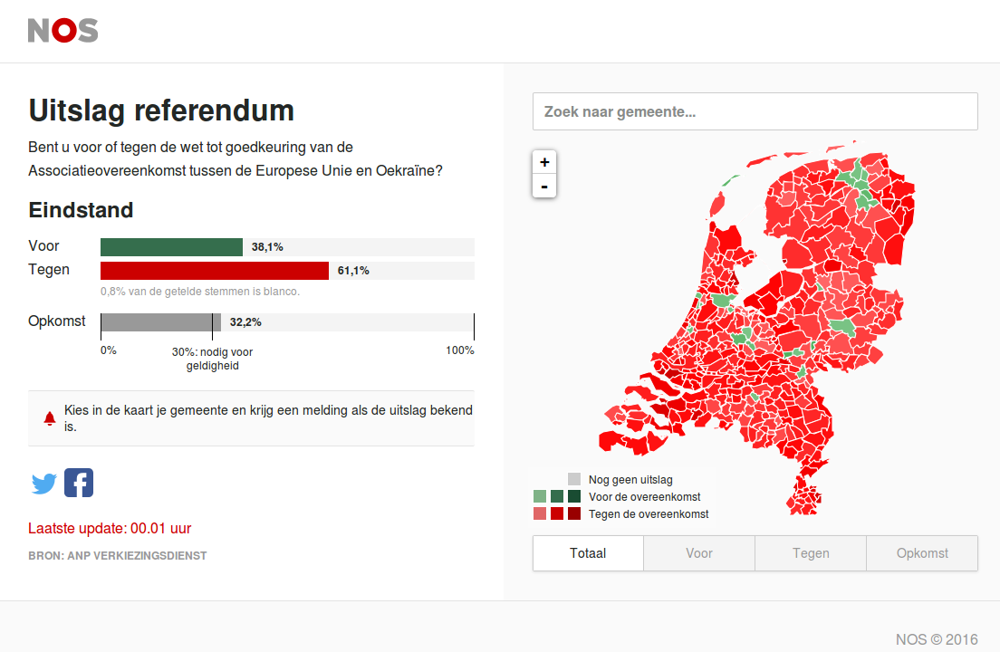

> Bent u voor of tegen de wet tot goedkeuring van de Associatieovereenkomst tussen de Europese Unie en Oekraïne?

 C'est la question qui était posé hier à l'ensemble des néerlandais par voie référendaire. (**Etes-vous pour ou contre la ratification de l'accord d'association entre l'Union européenne et l'Ukraine ?**). 

Ça peut parraitre assez futile comme question, pas de grand choix de société ou constitutionnel mais c'est tout ce que les partis anti-européens ont trouvés pour gripper la mecanique européenne des Pays bas. Et ça marche. Le quorum de plus de 30% a été atteind et le **contre** (*Tegen*) est sorti majoritaire de manière écrasante.

<!--excerpt-->
### La loi sur le référendum consultatif

Cette loi, *Wet raadgevend referendum* a été promulguée en 2015 et **permet d'associer le peuple aux décisions législatives**. Selon cette loi, il est désormait possible aux Pays bas de contester par référendum une loi qui a été promulguée. Il faut pour cela réunir deux fois un minimum de signatures réclamant la tenue de ce référendum. La première demande doit rassembler un minimum de 10.000 signatures en 4 semaines et la seconde 300.000 signatures en 6 semaines.

L'accord d'association entre l'Union européenne et l'Ukraine, signé entre les deux territoires en 2014 et 2015 se doit d'**être ratifié par l'ensemble des pays de l'Union**. Les Pays bas l'ont donc fait par voie parlementaire en avril 2015, promulguée par le roi en juillet 2015, juste après la promulgation de la loi sur le référendum consultatif. L'occasion était trop belle de tester si ça marche. C'est ca qu'a fait le blog populairiste *Geenstijl* surfant sur la vague eurosceptique et peut être aussi l'emotion créé par le crash du vol MH17 (Amsterdam à Kuala Lumpur), abattu au dessus de l'Ukraine. 

Geenstijl et divers groupes eurosceptiques ont fait campagne pour la collecte des signatures et le nombre de signatures nécessaires a été atteind et même dépassé.

<!-- HTML -->

<table class="wikitable" style="text-align:right">
<tbody>
<tr>
<th>Étape</th>
<th>Requises</th>
<th>Reçues</th>
<th>Validées</th>
</tr>
<tr>
<td align="left">Signatures préliminaires</td>
<td>10 000</td>
<td>14 441</td>
<td>13 480</td>
</tr>
<tr>
<td align="left">Signatures définitives</td>
<td>300 000</td>
<td>472 849</td>
<td>427 939</td>
</tr>
</tbody>
</table>

<!-- / HTML -->

Ya pas photo. Le 14 octobre 2015, le Conseil électoral, après avoir vérifié la validité des signatures, a annoncé que les deux étapes avaient bien été remplies. **Le référendum a donc été organisé pour le 6 avril 2016** et 25 millions d'euros[^1]. En attendant, la loi promulguée a été suspendue mais s'agissant le l'approbation d'un accord, cela ne s'oppose pas à ce que les dispositions prévues par cet accord soient mises en place.

### Pour ou contre le gouvernement

Par le passé les électeurs ont souvent préféré répondre **pour ou contre celui qui pose la question** que pour ou contre la question. C'est l'époque ou la question était posée par le Président ou le Premier Ministre. Avec le référendum consultatif, c'est un peu différent, la question est posée par la commission électorale au nom des personnes motivées par la tenue de ce referendum. Évidement il reste des votants pour s'exprimer pour ou contre le gouvernement en place à l'occasion d'un référendum, un peu comme aux élections locales.

Le gouvernement et tous les partis de la coalition gouvernementale on fait campagne pour le **pour** (*Voor*) et donc la ratification de l'accord parce que c'est quand même moins de boulot pour eux. L'ensemble des partis de la coalition gouvernementale vivent une chute de popularité due à leur présence au gouvernement. Il n'était peut-être pas judicieux de leur part de se lancer dans cette campagne sachant le rejet qu'il pouvaient générer. Le parti libéral (*VVD*) du premier ministre Rutte est même opposé au principe de référendum consultatif. De quoi apporter de l'eau au moulin de GeenStijl qui n'a eu qu'à faire campagne que pour augmenter la participation.

### Pour ou contre l'Europe

L'enjeu du scrutin n'est pas énorme, d'autant qu'il ne force le parlement qu'à réexaminer la loi visée et non à l'abroger, que cette loi n'empèche pas la mise en place des dispositions de l'accord sans ratification. Ça c'est pour le coté pragmatique. Du coté symbolique, l'enjeu du scrutin est énorme. Sans la ratification des Pays bas, l'accord d'association entre l'Union européenne et l'Ukraine est nul. Tous les autres pays l'ont ratifié et la Commission n'attend plus que les Dutch. Un non au référendum est une sérieuse épine dans le pied de la commission. Soit ils appliquent l'accord sans base légale parce que non ratifié par tous les pays ce qui est un déni de démocratie, soit ils espèrent que le parlement néerlandais ratifie à nouveau cet accord contre l'avis de leur population ce qui est aussi un déni de démocratie. Enfin, elle peut toujours revoir l'accord alors que 27 pays l'ont ratifié et que des milliers de personnes en Europe l'attendent.

Une épine dans le nez de la Commission c'est exactement le genre de pied de nez qui plait aux eurosceptiques. Alors ils sont tous partis en campagne pour le non. Leur discours reste simple, l'Europe c'est caca, on n'en veut pas, faut voter non. Et même si le non ne met pas fin à l'Europe, ça les mets bien dedans !

C'est ce discours qui a gagné le référendum de manière écrasante.

### Les résultats

La carte diffusée par NOS dès le soir montre l'ampleur de la défaite européenne. À part les ilôts hipster d'Amsterdam, Groningue Wageningen et Utrecht, la réserve mandarinale de la Haye, l'ensemble des Pays bas[^2] ont voté contre l'accord d'association avec l'Ukraine.

{.center}

Il reste à savoir ce que la Commission -Il-n'y-a-pas-de-plan-B- va faire de ce résultat.

### Et après

> We gaan dit heel zorgvuldig bespreken. Daar gaan dagen zo niet weken overheen
*Premier Mark Rutte*

Le Premier ministre Mark Rutte a déjà annoncé qu'il allait travailler à une alternative, lui qui est aujourd'hui à la tête du gouvernement qui a la présidence tournante de l'Union. L'idée serait de renégocier une partie de l'accord afin de tenir compte du message des électeurs mais de faire en sorte que les autres partenaires européens puisse avancer sur le dossier. L'accord a un volet économique et un volet politique. Le premier volet n'ayant jamais fait trop de vagues, il est fort probable que ce soit le volet politique qui sera discuté dans les cabinets dans les jours, voire les semaines qui viennent.

---
[^1]: J'aime les zeugmas
[^2]: À peu de choses près, je ne connais pas du tout la commune de Lochen ni l'île de Vlieland où le oui l'a emporté aussi
<!-- post notes:
C'est ce qu'a fait Thierry Baudet, juriste eurosceptique (''Euroscepticus'')
--->
