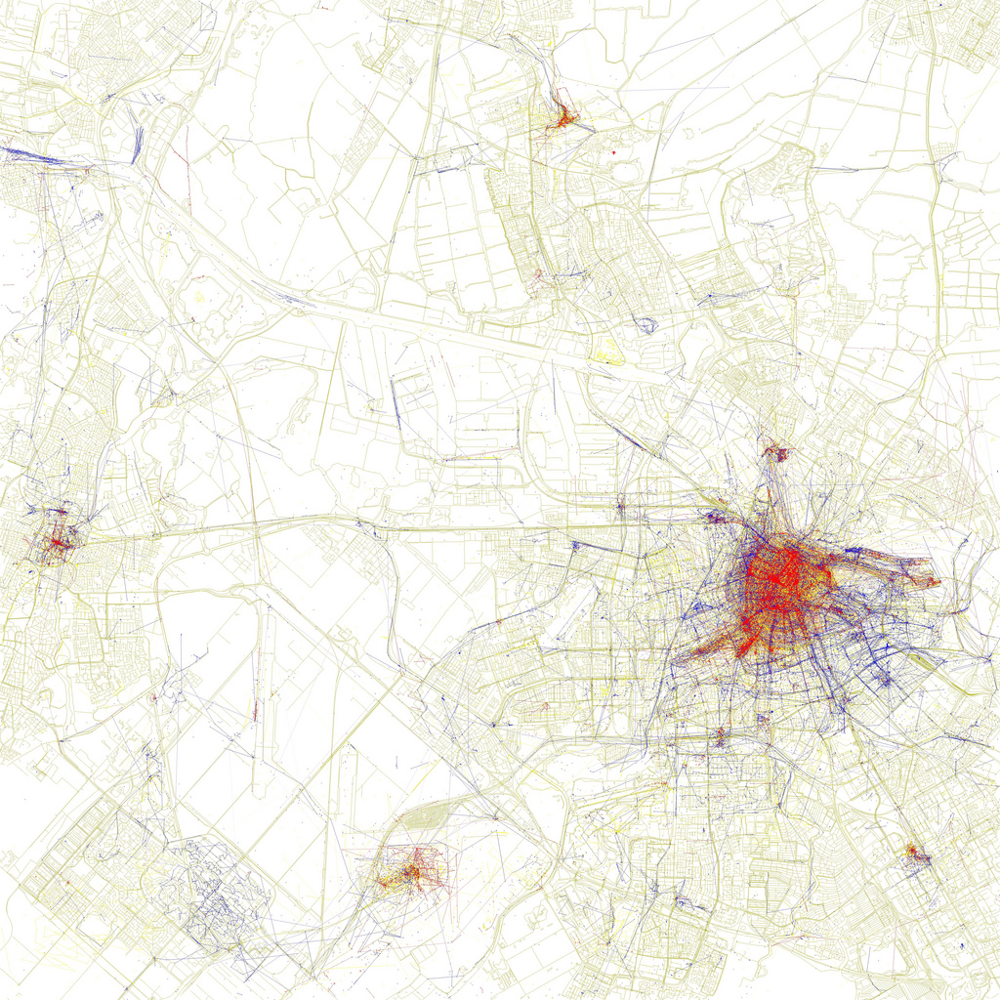

En cette période de rentrée penchons nous sur les vacances et son corollaire, le tourisme. Après les [cartes des tweets néerlandais](/twitter-aux-pays-bas), un autre spécialiste a fait une étude sur les données partagés par les internautes. Cette fois c'est le partage de photos qui nous intéressent et qui dit photos dit photos de vacances. Voici le Amsterdam des touristes… et celui des locaux.

En mai 2010, Erik Fisher a publié une [série de cartes de grandes villes](http://www.visualcomplexity.com/vc/project.cfm?id=727) réalisées avec les données géographiques des photos envoyées sur Flickr et Picassa. Il a appelé cette série [The Geotaggers' World Atlas](https://www.flickr.com/photos/walkingsf/sets/72157623971287575/), **l'atlas mondial des photos géolocalisées**. Les villes y sont classées par nombre de photos dans le centre urbain. Amsterdam est classée 14ème juste avant Madrid mais derrière Hong-Kong.

Beaucoup de commentaires interprétait ces cartes comme la carte mondiale des photos de tourisme mais les gens ne mettent pas uniquement en ligne les photos de leurs excursions estivales, Eric Fischer a donc travaillé à une nouvelle série de cartes qu'il a cette fois nommé [Locals and Tourists](https://www.flickr.com/photos/walkingsf/sets/72157624209158632/). En analysant les photos des utilisateurs, il a supposé que ceux qui envoyaient des photos du même endroit pendant longtemps pouvaient être considérés comme des locaux alors que ceux qui postaient des photos d'un lieu en une seule fois pouvaient être considérés comme des touristes. Il a coloré les premiers en bleu et les seconds en rouge. Le utilisateurs qu'il n'a pas put identifier sont en jaune.

<!--excerpt-->

On y découvre que des villes comme Venise, Las-Vegas sont presque entièrement photographiées par des touristes alors que des derniers sont presque absents de Portland ou Minneapolis. Les villes comme Paris, New-York ou Amsterdam sont partagées et présentes des zones ou les touristes photographie en abondance tandis que les locaux prennent en photo les quartiers moins touristiques.

[{.center}](https://www.flickr.com/photos/walkingsf/4672179886/in/set-72157624209158632)

On y voit clairement les hauts lieux touristiques du centre d'Amsterdam avec la **gare centrale**, le **quartier rouge** et **les canaux**, la **zone des musées** (*museumplein*) et dans une certaine mesure le [Vondelpark](/le-vondelpark). Les hauts lieux touristiques loin du centre sont aussi bien visibles comme le grand **stade Arena** au sud, le **centre d'Haarlem** à l'ouest et **Zaanse Schaans** au nord, ainsi que les lieux de transit comme l'**aéroport de Schiphol**, **la marina** et le **terminal de passagers** où les gros paquebots de croisière font escale. La gare du sud apparaît plus timidement comme lieu touristique, les touristes préfèrent prendre en photo les avions et les bateaux que les trains jaunes.

À l'opposé les quartiers de **Oud West** et de **Watergraafsmeer**, **Rievierenbuurt** ou **Sloterdijk** sont très visibles mais en bleu. Ils voient passer beaucoup de photographes mais ces derniers sont des locaux. On notera aussi quelques allées et venues de photographes locaux [le long de l'IJ](/nouveau-mot-ij-2) à **IJmuiden** et un peu partout dans les rues d'**Hoofddorp**.

## Clin d'œil des 9 ruelles 
Un petit clin d'œil sur la distinction entre touristes et locaux avait été produite par un artiste lors du *Het Negen Straatjes Festival* de 2008. Les commerçants de [ce quartier très touristique de la ville](/les-neuf-ruelles-9-straatjes) étaient amenés à donner un sac rouge à leur clients, sur lequel était écrit en grosses lettres la qualité du client **Tourist** ou **Local**. Savoir si les deux font bon ménage est une autre question…

---
<!-- post notes:
VOIR AUSSI :
http://www.parool.nl/parool/nl/34261/PS/article/detail/3968728/2015/04/21/Dit-zijn-de-10-grootste-fotocliches-van-Amsterdam.dhtml 
https://www.mapbox.com/labs/twitter-gnip/locals/#6/50.653/7.427
With the power of MapBox and Twitter data from Gnip, data artist Eric Fischer worked with the Gnip team to create a fully-browsable worldwide map of local allegiances. 

Album: https://www.flickr.com/photos/walkingsf/sets/72157624209158632 
http://petapixel.com/2010/06/09/big-city-heat-maps-of-local-and-tourist-photo-spots/ 
https://www.flickr.com/photos/walkingsf/6766250415/in/set-72157629014750905 

http://www.flickr.com/photos/walkingsf/4672179886/in/set-72157624209158632#/
--->
