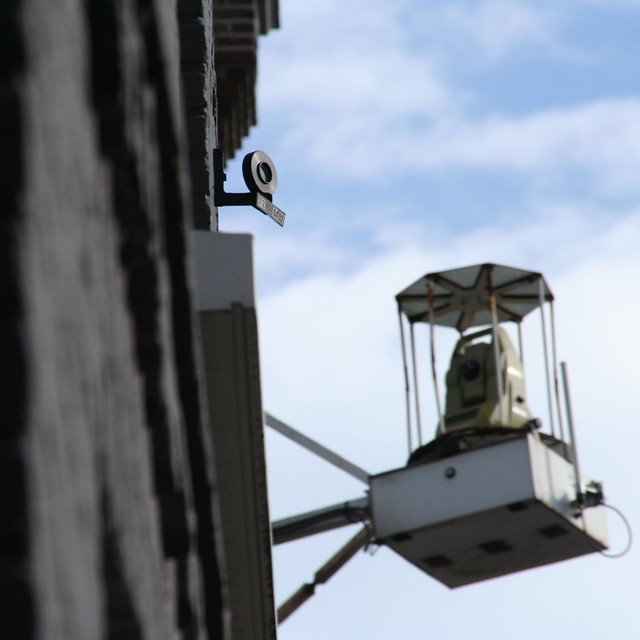

On vante souvent le **savoir faire de l'ingénierie néerlandaise** en matière de canaux et d'îles artificielles[^1]. On vante beaucoup moins ce savoir-faire quand on évoque **la construction de la Noord-Zuidlijn**, souvent repoussée et sujet d'accidents remarquables[^2].

Ce qu'on oublie souvent c'est de vanter **le savoir-faire français** pour la surveillance de la stabilité des maisons tout au long de la ligne.

## La stabilité des maisons d'Amsterdam

Les maisons d'Amsterdam reposent sur des pieux en bois enfoncées profondément dans un sol sablonneux. La cohérence du sol est assurée avec la nappe phréatique et les travaux souterrains du métro sont un risque pour cet ensemble fragile. Les vibrations d'un tunnelier mal orienté ou une fuite dans un voussoir peut déstabiliser l'ensemble et mettre les maisons du centre ville en danger. Les travaux sont calculés au mieux mais comme il y a toujours des aléas, il faut aussi mesurer régulièrement la stabilité des maisons.

Ces le rôle de ces drôles de machines accrochées dans des cages sur les murs le long de **Damrak**, **Rokin**, **Vijzelgracht** et **Ferdinand Bolstraat**. Les plus observateurs auront déjà vu ces appareils changer de cible alors que les touristes contemplent le galbes des pignons.

[{.center}](https://commons.wikimedia.org/wiki/File:Theodoliet_en_doelwit.jpg "Quelqu'un a mis cette photo sur Wikimedia commons")
*Un théodolite Leica série 1000, sur support, pour auscultation automatique d'ouvrages, avec en premier plan, un des nombreux réflecteur catoptrique utilisés, sur lesquels l'appareil fait des mesures répétées pour détecter des éventuels mouvements des maisons*

<!--excerpt-->
Ces appareils automatiques sont appelés des **Cyclops** (*CYCLic OPtical Surveyor*), ce sont des théodolites automatisés qui visent alternativement plusieurs cibles (des réflecteurs catoptrique) accrochées aux murs des maisons alentours. Un théodolite peut mesurer la distance et l'angle entre deux points. Si un décalage est constaté entre la position précédente d'une cible la nouvelle mesure, une alerte est envoyée et les responsables de la ville choisissent ensuite la réponse adaptée comme dans [le cas des maisons qui s'enfonçaient sur Vijzelgracht](/les-maisons-s-enfoncent).

## Des mesures réalisées par Sol Data et l'IGN 

Ces appareils ont été posés par la société **Soldata** qui a remporté, avec l'assistance d'**IGN** le marché des mesures nécessaires à la construction de la Noord Zuidlijn en 2000. Soldata est une filiale de Solétanche, société de génie civil spécialisé dans les fondations spéciales. Soldata s'est illustré en France en mesurant les vibrations durant les travaux au Louvre et au château de Versailles. La société opère maintenant dans le monde entier et a installé des filiales sur tous les continents. Elle est toujours spécialisée dans les mesures des bruits ou des vibrations et la gestion des risques lors de grands travaux. En 2007, Solétanche a été racheté par le groupe Vinci.

La solution de mesures automatisées de Soldata est née lors de l’extension de la Jubilee line à Londres dans les années 90 Les travaux avait pris du retard après un écroulement sur le chantier du *Heathrow Express*. La société a été créée sur cette solution qui a ensuite été reproduite à diverses occasions[^3].

## Big Data à Amsterdam

Les 74 théodolites et leurs 6400 prismes sur les façades est la partie visible du système. Ce dernier comprend aussi des piézomètres à l'intérieur des maisons ainsi que divers installation de mesures le long des tunnels, l'installation d'un système informatique capable de collecter et de traiter ces données avant de les envoyer à la société Noord ZuidLijn. Au moment du percement des tunnels, le système collecte jusque 55.000 données par heure. Ces données sont traitées par le logiciel GEOSCOPE et c'est sur cette partie là que l'IGN a apporté son concours grâce à son expertise dans le cadre des Systèmes d'Information en Géographie (SIG). Les données sont ensuite transmises à l'organisme de la Noord Zuidlijn qui est la mieux placée pour les exploiter. On espère que le service qui gère ces données le fait avec moins de retard que les travaux eux-même…

---
[^1]: Comme dans le golfe persique évoqué [en forme de tulipe](/un-polder-en-forme-de-tulipe)
[^2]: Voir les articles sur [Des travaux qui n'en finissent toujours pas](/travaux-n-en-finissent-toujours-pas) et [Les maisons d'Amsterdam s'enfoncent](/les-maisons-s-enfoncent)
[^3]: Comme dans la surveillance de ce [barrage à Chypre](http://www.soldatagroup.com/C1256954003EC4A6/type/9AF6C0B72BC3B426C125696D0051199E/$File/Chypre-fr.pdf).[^4] Voir la [fiche technique du chantier](http://fr.soldatagroup.com/C1256954003EC4A6/type/7ECC4695506CDFAAC125696D0051195D/$File/Amsterdam-fr.pdf).
[^4]: avant de l'être aussi dans le cadre de la construction de la Noord-Zuidlijn à Amsterdam
<!-- post notes:
http://commons.wikimedia.org/wiki/File:Theodoliet_en_doelwit.jpg 

IGN_Magazine/46
http://www.ign.fr/publications-de-l-ign/Institut/Publications/IGN_Magazine/46/IGNmag46.pdf 
CYCLOPS (CYCLic OPtical Surveyor) et des prismes sur les bâtiments environnants. cité dans
http://loemi.recherche.ign.fr/pdf/brochureGeocube1.pdf 
 
descriptif détaillé
www.aftopo.org/download.php?matricule=410312
et commande du document sur refdoc http://cat.inist.fr/?aModele=afficheN&cpsidt=16837759 
http://fr.soldatagroup.com/soldata/refchsoldata.nsf/8a9a55afa2a103bec12571d4002d61cb!OpenView 
http://gespot.at5.nl/2010/02/16/meetapparatuur-bij-de-bijenkorf/
image archivée ici http://www.studiokoning.nl/Damrak.html
--->
