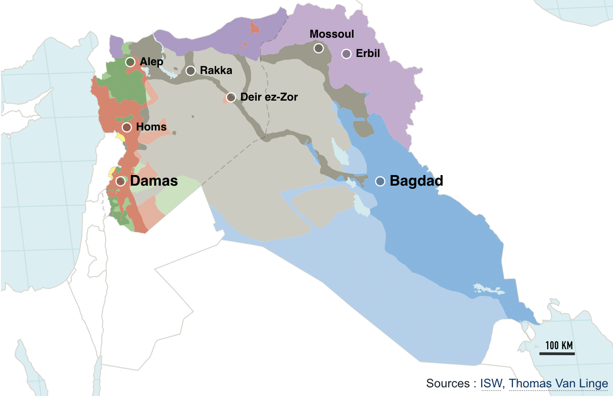
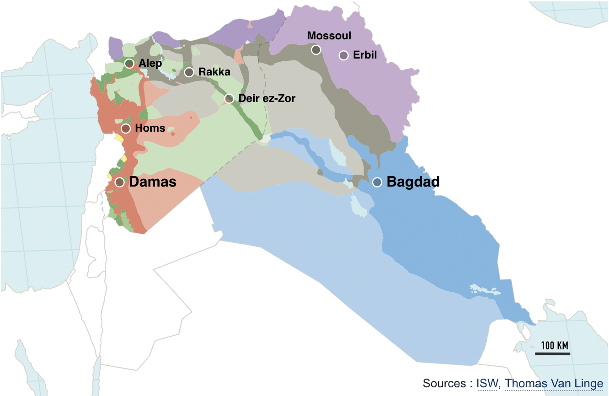

J'aime bien les décodeurs du Monde quand ils présentent des données qui aident à comprendre certaines infos compliqués avec des infographies bien choisies. Ils ont récemment [publié un récapitulatif](https://www.lemonde.fr/les-decodeurs/visuel/2016/01/19/syrie-irak-deux-annees-de-guerre-cartographiees-acteur-par-acteur_4849580_4355770.html) de la situation de l'État Islamique depuis deux ans que la guerre en Syrie et en Irak s'invite tristement dans notre actualité. On y voit une belle carte avec des zones de couleur qui changent quand le temps passe (suivant un curseur).

{.center}
*Syrie et Irak en juin 2014*

{.center}
*Syrie et Irak en décembre 2015*

<!--excerpt-->

Joli travail. Mais même si cette carte est réalisée par les infographistes du journal, les données ne proviennent pas de leurs correspondants de guerre mais principalement d'un cartographe amateur vivant près d'Amsterdam. **Thomas van Linge**, cité comme source en bas à droite est un jeune Néerlandais qui vient de passer son bac (VWO) en 2015. Il s'est rendu célèbre dans le monde entier en réalisant des cartes de Syrie et d'Irak présentant la situation du conflit en glanant des informations de terrain sur twitter, Youtube ou facebook.

## Thomas van Linge

Très intéressé par [le printemps arabe](https://fr.wikipedia.org/wiki/Printemps_arabe) et les espoirs de libertés qu'il a siccité le jeune homme a commencé suivit les conflits qui ont suivit en Syrie et en Libye Pour mieux comprendre la situation. il a ouvert un compte twitter ([@arabthomness](https://twitter.com/arabthomness)) pour glaner plus d'information de terrain. Il a même commencé à apprendre quelques formules arabes pour pouvoir converser avec les belligérants sur le terrain. Il a ainsi dessiné sa première carte en 2014 sans que soit demandé au bac. Il raconte son quotidien [en ouvrant sa porte à la NOS](https://nos.nl/op3/artikel/2041770-18-jarige-kaartenmaker-verovert-de-wereld). Ses cartes sont fait avec *Paint* parce qu'il ne s'y connaît pas trop en informatique…

Très vite ses cartes ont été utilisé par les rédactions ne trouvant pas d'information plus fiable pour couvrir cette guerre et le jeune Thomas a fait l'objet d'articles dans des journaux du monde entier dont [le magazine Newsweek](https://www.newsweek.com/dutch-high-school-student-maps-isiss-terrifying-advance-syria-and-iraq-342604). [National Geographic le cite aussi mais rappelle](https://www.nationalgeographic.com/history/article/160408-online-mapmakers-chart-syrian-conflict) qu'il n'est pas le seul cartographe amateur à travailler de la sorte. Sa différence est peut être d'afficher son soutien à la rébellion syrienne alors que la plupart des cartographes amateurs s'affichent neutres. Ceci expose aussi le biais d'une carte qui présente la vision schématique d'une personne, avec ses préférences (et parfois des intentions) politiques. Aussi documentée soit-elle une carte présentera comme vérité tangible  une situation complexe et comprendra toujours des zones d’incertitudes voir d'erreurs non documentées. 

Thomas van Linge n'expose pas ces sources pour conserver ses contacts et leur crédibilité mais il expose sa méthode montrant qu'il essaye de croiser au mieux ses informations. Avec le temps, Thomas van Linge met à jour ses cartes ce qui lui permet aussi de faire des animations montrant les évolutions sur le terrain. Produit très intéressant pour expliquer la progression de Daesh sur un plateau télé ou dans les colonnes d'une page web. C'est ce que fait le Monde aujourd'hui montrant cette fois ci les pertes essuyées par l'État Islamique depuis ces derniers mois.

---
<!-- post notes:
féfrier 2016 
http://www.lemonde.fr/les-decodeurs/visuel/2016/01/19/syrie-irak-deux-annees-de-guerre-cartographiees-acteur-par-acteur_4849580_4355770.html 
https://decorrespondent.nl/3067/waarom-je-de-macht-van-islamitische-staat-nooit-in-een-kaart-kunt-vatten/339025036009-a7fd4731
--->
