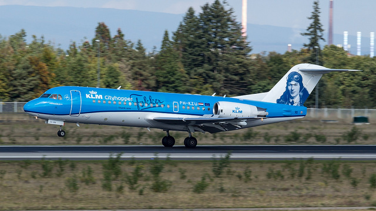

J'ai commencé ce blog il y a 10 ans pour vous [parler du Fokker](/hier-en-fokker), un avion de conception néerlandaise qui équipait la flotte **Cityhopper** de la compagnie néerlandaise **KLM**. Il y a quelques années je vous ai parlé des nouveaux **Embraer** que cette même compagnie achetait pour remplacer les vieux Fokker. Déjà les **Fokker 100** et les **Fokker 50** ont [été remplacés](/pas-hier-pas-en-fokker) Il ne reste plus que des **Fokker 70** qui vont eux aussi être décommissionnés. Quand le dernier Fokker 70 aura quitté le tarmac de Schiphol, ce sera fini de cette longue relation de 97 ans entre la compagnie KLM et l'avionneur local. Cela valait bien un dernier baroud d'honneur:

{.center}
*Fokker 70 avec une livrée représentant Antonny Fokker par tjdarmstadt*

Le 7 juin dernier KLM [a révélé](http://news.klm.com/portrait-of-anthony-fokker-to-adorn-fokker-70-tail/) la dernière livrée de son Fokker 70 immatriculé **PH-KZU** à l'effigie d'**Anthony Fokker**, l'homme à l'origine de ce constructeur aéronautique. Cette livrée, qualifiée de livrée d'adieu est complété du logo Fokker comme une signature et d'un discret **Thank you** sur les flancs de l'appareil. L'avion restera en service avec ces couleurs moins de six mois. Les derniers vols ayant eu lieu le 28 octobre 2017.

La liste des derniers vols KLM en Fokker a été annoncée par la compagnie suffisamment en avance pour que les fans (et [les spotters](/vliegtuigspotters)) puissent en être:
<!--excerpt-->
- DUS – Düsseldorf KL1862 arrival Amsterdam 19.05 hrs

- NWI- Norwich KL1512 arrival Amsterdam 19.15 hrs

- HAJ – Hannover KL1912 arrival Amsterdam 19.15 hrs

- BRU – Brussel KL1732 arrival Amsterdam 19.15 hrs

- LUX – Luxembourg KL1746 arrival Amsterdam 19.35 hrs

- LHR – London KL1070 arrival Amsterdam 20.30 hrs

Le tout dernier vol a donc été un vol en provenance de Londres à destination d'Amsterdam. Ce choix n'est pas dû au hasard, la compagnie a rappelé que le premier vol KLM à bord d'un avion Fokker a eu lieu le 15 septembre 1920 à destination de Londres. 

Le **KL1070** du 28 octobre 2017 a donc été le dernier d'une longue liste de vols en Fokker. 

Les adieux ont été fêtés en grande pompe avec les six avions, [leurs personnel de bord](https://blog.klm.com/our-fokkers-a-fleet-full-of-memories/) et les *community managers* qui ont pu tweeter les bons moments jusqu'aux aventures dans le cockpit du dernier vol.

<!-- HTML -->

<blockquote class="twitter-tweet" data-lang="en">
After a shared history of 97 years, KLM will phase out its last Fokker. Two passionate Fokker pilots share their love for this aircraft. ♥ <a href="https://t.co/2AKDcCcwm8">pic.twitter.com/2AKDcCcwm8</a>
&mdash; Royal Dutch Airlines (@KLM) <a href="https://twitter.com/KLM/status/923831217996386304?ref_src=twsrc%5Etfw">October 27, 2017</a></blockquote>

<blockquote class="twitter-tweet" data-lang="en">
What a Fantastic Fokker farewell this weekend# You can find the full story here: <a href="https://t.co/nzTHNEKZNc">https://t.co/nzTHNEKZNc</a> <a href="https://t.co/FUK8NQEeGw">pic.twitter.com/FUK8NQEeGw</a>
&mdash; Royal Dutch Airlines (@KLM) <a href="https://twitter.com/KLM/status/924688978112106499?ref_src=twsrc%5Etfw">October 29, 2017</a></blockquote>

<blockquote class="twitter-tweet" data-lang="en">
Fasten your seatbelts and join us on the final flight of the Fokker 70! <a href="https://t.co/QgomfVVFVN">pic.twitter.com/QgomfVVFVN</a>
&mdash; Royal Dutch Airlines (@KLM) <a href="https://twitter.com/KLM/status/925010910502060032?ref_src=twsrc%5Etfw">October 30, 2017</a></blockquote>

<!-- / HTML -->

Biensûr les passagers ont été gâtés avec des petits cadeaux spécialement pour ce jour spécial. L'histoire ne dit pas combien de fans ont gardé le gâteau sous son plastique marqué « Last Fokker 70 flight » sans ouvrir.

<!-- HTML -->

<blockquote class="twitter-tweet" data-lang="en">
Yesterday&#39;s <a href="https://twitter.com/KLM?ref_src=twsrc%5Etfw">@KLM</a> <a href="https://twitter.com/hashtag/KL1746?src=hash&amp;ref_src=twsrc%5Etfw">#KL1746</a> service from <a href="https://twitter.com/luxairport?ref_src=twsrc%5Etfw">@luxairport</a> to <a href="https://twitter.com/Schiphol?ref_src=twsrc%5Etfw">@Schiphol</a> operated by PH-KZI was a lovely flight ♥ <a href="https://twitter.com/hashtag/AvGeek?src=hash&amp;ref_src=twsrc%5Etfw">#AvGeek</a> <a href="https://twitter.com/hashtag/Fokker70?src=hash&amp;ref_src=twsrc%5Etfw">#Fokker70</a> <a href="https://twitter.com/hashtag/Fokker?src=hash&amp;ref_src=twsrc%5Etfw">#Fokker</a> <a href="https://t.co/vLIh7Rgsa7">pic.twitter.com/vLIh7Rgsa7</a>
&mdash; cloudsurferaero (@cloudsurferaero) <a href="https://twitter.com/cloudsurferaero/status/924558245255090177?ref_src=twsrc%5Etfw">October 29, 2017</a></blockquote>

<!-- / HTML -->
<!-- HTML -->

<blockquote class="twitter-tweet" data-lang="en">
Голландская KLM отказалась от голландских самолетов марки Fokker после 97 лет полетов<a href="https://t.co/wi9H9qD7K8">https://t.co/wi9H9qD7K8</a> <a href="https://t.co/J11cjAqK6o">pic.twitter.com/J11cjAqK6o</a>
&mdash; Avianews.com (@avianewscom) <a href="https://twitter.com/avianewscom/status/925062138770665473?ref_src=twsrc%5Etfw">October 30, 2017</a></blockquote>

<blockquote class="twitter-tweet" data-lang="en">
The last <a href="https://twitter.com/KLM?ref_src=twsrc%5Etfw">@KLM</a> Fokker 70 flight. <a href="https://twitter.com/hashtag/KLM?src=hash&amp;ref_src=twsrc%5Etfw">#KLM</a> <a href="https://twitter.com/hashtag/Fokker?src=hash&amp;ref_src=twsrc%5Etfw">#Fokker</a> <a href="https://twitter.com/hashtag/Fokker70?src=hash&amp;ref_src=twsrc%5Etfw">#Fokker70</a> <a href="https://t.co/wwQNWuTnNl">pic.twitter.com/wwQNWuTnNl</a>
&mdash; Brendan Dorsey (@brendan_dorsey) <a href="https://twitter.com/brendan_dorsey/status/925420177830940672?ref_src=twsrc%5Etfw">October 31, 2017</a></blockquote>

<!-- / HTML -->

Le lendemain KLM découvrait un monument à la gloire de cet avion, une statue qui n'est rien d'autre que la queue d'un F70 immatriculé **PH-KBX** qui a été décommissionné plus tôt cette année. Si certains d'entre vous se demandent ce qu'ils ont fait du reste de l'avion et bien il a été découpé en morceau. Les morceaux peuvent numérotés avec certificat et tout peuvent être  achetés à l'occasion de la sortie d'un livre consacré à l’épopée Fokker et KLM,

<!-- HTML -->

<blockquote class="twitter-tweet" data-lang="en">
<a href="https://twitter.com/KLM?ref_src=twsrc%5Etfw">@KLM</a> Zondag 291017 indrukwekkend afscheid van de Fokker 70. Hiermee is een tijdperk afgesloten. Mooi monument op Schiphol Oost. <a href="https://t.co/TrItrBavSY">pic.twitter.com/TrItrBavSY</a>
&mdash; Joop Hupkes (@JoopHupkes) <a href="https://twitter.com/JoopHupkes/status/925114569785331712?ref_src=twsrc%5Etfw">October 30, 2017</a></blockquote>

<blockquote class="twitter-tweet" data-lang="en">
<a href="https://twitter.com/hashtag/KLM?src=hash&amp;ref_src=twsrc%5Etfw">#KLM</a> <a href="https://twitter.com/hashtag/Fokker?src=hash&amp;ref_src=twsrc%5Etfw">#Fokker</a> book released today at <a href="https://twitter.com/hashtag/amsterdam?src=hash&amp;ref_src=twsrc%5Etfw">#amsterdam</a> after <a href="https://twitter.com/hashtag/Fokker70?src=hash&amp;ref_src=twsrc%5Etfw">#Fokker70</a> farewell <a href="https://t.co/Q3SAJuz0n0">pic.twitter.com/Q3SAJuz0n0</a>
&mdash; JetFlix (@JetFlixTV) <a href="https://twitter.com/JetFlixTV/status/924599424357191681?ref_src=twsrc%5Etfw">October 29, 2017</a></blockquote>

<blockquote class="twitter-tweet" data-lang="en">
<a href="https://twitter.com/KLM?ref_src=twsrc%5Etfw">@KLM</a> Dit was voor mij een Fokker weekend <a href="https://twitter.com/hashtag/Fokker?src=hash&amp;ref_src=twsrc%5Etfw">#Fokker</a> <a href="https://twitter.com/hashtag/farewell?src=hash&amp;ref_src=twsrc%5Etfw">#farewell</a> <a href="https://t.co/hVwsMW86gp">pic.twitter.com/hVwsMW86gp</a>
&mdash; Ton (@TonvanderToolen) <a href="https://twitter.com/TonvanderToolen/status/924693179865096193?ref_src=twsrc%5Etfw">October 29, 2017</a></blockquote>

<!-- / HTML -->

Le lendemain ce sont les **Embraer** qui prennent le relais dans les flotte Cityhopper constitués maintenant uniquement d'avions de cette société brésilienne. Une page se tourne…

Plus de Fokker au départ de Schiphol ? Bien en fait…
<!-- HTML -->

<blockquote class="twitter-tweet" data-lang="en">
LIVE: The last four <a href="https://twitter.com/KLM?ref_src=twsrc%5Etfw">@KLM</a> Fokker 70s have just left Amsterdam <a href="https://twitter.com/Schiphol?ref_src=twsrc%5Etfw">@Schiphol</a> in formation. Follow on <a href="https://twitter.com/flightradar24?ref_src=twsrc%5Etfw">@flightradar24</a> with Aircraft filter &#39;F70&#39;. <a href="https://t.co/nT020hUr1g">pic.twitter.com/nT020hUr1g</a>
&mdash; Airport Webcams (@AirportWebcams) <a href="https://twitter.com/AirportWebcams/status/924577074488193025?ref_src=twsrc%5Etfw">October 29, 2017</a></blockquote>

<!-- / HTML -->

Oui car c'est sur le bord d'une piste de Norwich en Angleterre que trois des F70 restant, dont le PH-KZU[^1] à effigie d'Anthony Fokker vont aller prendre un repos bien mérité.

---
[^1]: Pour les plane spotters, vous trouverez là bas le PH-KZU avec la livrée d'adieu et les PH-KZS et PH-KZB en livrée plus classique.
<!-- post notes:
https://worldairlinenews.com/2017/09/14/klm-announces-the-last-fokker-70-flights/ 

https://commons.wikimedia.org/wiki/Category:Anthony_Fokker 
https://commons.wikimedia.org/wiki/File:KLM_CityHopper_F-28-4000_PH-CHF_at_LHR_(23450245914).jpg 
https://www.flickr.com/search/?text=ANTHONY%20FOKKER%20KLM&license=2%2C3%2C4%2C5%2C6%2C9 
et l'avion du gov
https://www.flickr.com/photos/108177986@N05/33438488911/ 
https://blog.klm.com/insta-inspiration-october-celebrate-good-times/?WT.mc_id=C_WW_SocialCampaign_Twitter_Editorial_BlogInstagram_blog_null 
www.flightglobal.com/news/articles/pictures-retirement-of-klm-fokker-ends-era-that-be-442696/ 
http://aviationforall.proboards.com/thread/9497/klm-fokker-come-norwich-retirement?page=1
--->
