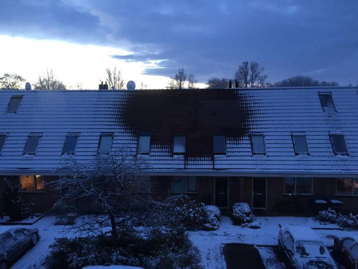
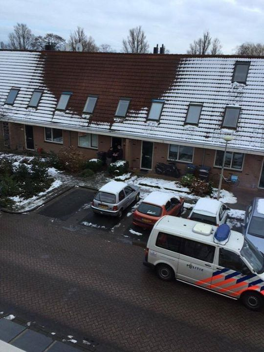
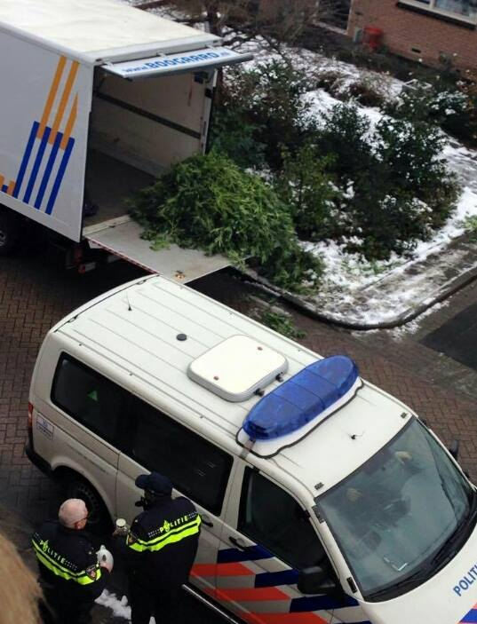
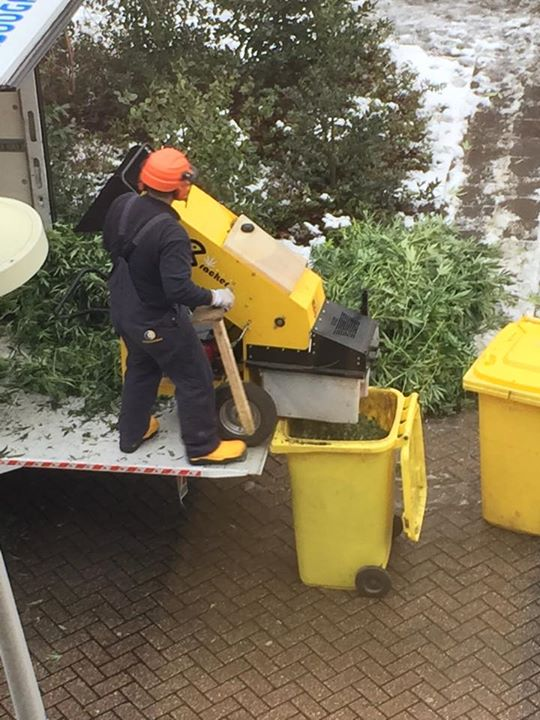

L'industrie néerlandaise des coffeeshops est grande consommatrice de produits (beuh, shit, cannabis, chichon et autre superskunk) qui sont illégaux en trop grande quantité. Mais comme ce commerce est florissant et qu'il amène des touristes **par la porte de devant**, la police ne met pas trop son nez sur ce qu'il se passe par** la porte de derrière**. Elle préfère laisser les utilisateurs tranquilles et se concentrer sur les gros trafics[^1].

Se sont donc multipliés aux Pays-Bas des fermes de cannabis donc l'activité ne peut pas être déclarée parce que la loi la juge illégale. La police traque ces fermes, cachées dans des appartements bon marché et des jardins aux clôtures opaques. Une des techniques pour détecter ces fermes clandestines est d'éplucher les consommations d'électricité au m². Les appartements couverts de lampes chauffantes et d'humidificateurs d'air consomment trop pour être à usage d'habitation... Une autre technique est d'attendre qu'il neige...

<!-- HTML -->

<!-- / HTML -->

{.center}
Il neige la nuit mais la chaleur de la ferme fait fondre la neige sur le toit. (*Photo: Erik Bras*)

<!-- HTML -->

<!-- / HTML -->

<!-- HTML -->

<!-- / HTML -->

{.center}
Au petit matin, la police est sur les lieux pour vérifier l'éxcès de chauffage (*Photo: Flabber*)

{.center}
Les cultures sont saisies, les voisins commencent à préparer les sacs pour ramasser les graines... (*Photo: Boyd Swaans*)

{.center}
La récolte est broyée sous les yeux des voisins. (*Photo: Erik Bras*)

<!-- HTML -->

<!-- / HTML -->

Voilà qui change des [cartes postales à la neige](http://meinamsterdam.nl/la-temperature-ressentie) qui fleurissent aujourd'hui sur les fils de média sociaux de ceux qui ont des amis à Amsterdam.
---
[^1]: Voir à ce sujet [les débats autour de la porte de derrière](/cannabis-une-loi-plus-dure-pour-les-drogues-douces) 
<!-- post notes:
https://www.facebook.com/flabber.nl/photos/a.10150149241300159.331623.286900600158/10153103786565159/ Flabber 
https://www.facebook.com/photo.php?fbid=10205966082737565&set=p.10205966082737565Erik Bras 
https://www.facebook.com/photo.php?fbid=834187763306365&set=p.834187763306365 Boyd Swaans 
https://www.facebook.com/photo.php?fbid=10205966085977646&set=p.10205966085977646 Erik Bras
--->
