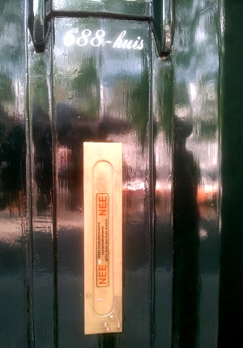

Les tracts qui encombrent la boîte aux lettre c'est sympa pour apprendre le néerlandais[^1] mais on a vite fait le tour. Il est temps de faire cesser tout ça. Pour cela il y a une solution locale très utilisée, le **NEE NEE Sticker**.

[{.center}|/public/images/photos/2014/nee-ja-boite-lettres.jpg||nee-ja-boite-lettres.jpg]

Il suffit d'apposer un autocollant sur sa boîte aux lettres indiquant: Non je ne veux pas d'imprimés publicitaires ni ne journaux distribués en porte à porte (*NEE, géén ongeadresseerd reclamedrukwerk en geen huis-aan-huisbladen.*) ou bien Non je ne veux pas d'imprimés publicitaires mais Oui, les journaux je veux bien. (*NEE, géén ongeadresseerd reclamedrukwerk. JA  wél huis aan huis bladen*).

Ces autocollants bien familiers depuis plus de 25 ans sont facilement identifiables et bien respectés. Ils sont utilisés sur tout le territoire et aussi en Flandres.

[{.center}](https://www.flickr.com/photos/13274211@N00/534321891/in/dateposted-public/)

Pour en mettre un sur sa boîte-aux-lettres, il est possible d'en obtenir **gratuitement à la mairie de  son domicile** comme le rappelle le site du gouvernement sur une page bien nommée: [Que faire contre les publicités et les dépliants indésirables dans ma boîte-aux-lettres ?](https://www.rijksoverheid.nl/onderwerpen/bescherming-van-consumenten/vraag-en-antwoord/wat-kan-ik-doen-tegen-ongewenste-reclame-en-folders-in-mijn-brievenbus) (*Wat kan ik doen tegen ongewenste reclame en folders in mijn brievenbus?*).

Si les administrations vous rebutent vous pouvez toujours **commander votre NEE NEE Sticker (ou votre NEE JA sticker) par téléphone au 0900-2025095** (le coup de fil n'est pas gratuit lui) sur [l'un des nombreux sites](https://www.neeneeneeja.nl/) qui vous propose de vous en envoyer un contre une modique somme.

## Pourquoi c'est payant ?

Cela peut paraître surprenant de voir la quantité de sites offrant ce service alors que les Néerlandais sont réputés pingres[^2] et que le produit est disponible gratuitement par ailleurs. C'est sans compter sans une deuxième caractéristique Néerlandaise, les gens aiment montrer des signes extérieurs de richesse au monde extérieur. C'est une des explications de [l'absence de rideaux aux fenêtres](/venez-voir-chez-moi). La boîte-aux-lettres qui n'est souvent qu'une fente dans la porte d'entrée, est un bel emplacement pour signes extérieurs de richesse et cet autocollant peut en être un. L’autocollant sans le message « gratuit à la mairie » est un signe plutôt discret mais il est possible d'acheter les mêmes en doré-façon-gravure qui va à ravir sur les maisons qui ont pignon sur quai le long des canaux.

{.center}

## Pourquoi c'est gratuit ?

Autre chose surprenante, cet autocollant est né en 1992 à l'initiative du groupement des entreprises de marketing direct (*het Direct Marketing Instituut Nederland*), en un mot par les spammeurs de papier. L'idée alors était de répondre aux plaintes de plus en plus nombreuses. À regarder de plus près, il n'est pas déraisonnable pour les distributeurs de tracts d'avoir le moins possible de détracteurs[^3]. Cela leur permet de toucher un peu plus finement la population cible en évitant ceux qui en auront un avis négatif et en espérant que les publicités seront lues par les autres.

Les mesures sont faites régulièrement par la DDMA (Dutch Dialogue Marketing Association) et l'utilisation de ces autocollants continue de se développer. Cela représentait 16% des foyers en 2009 et près de 20% en 2016. Selon la profession, les prospectus sont lus par un foyer sur deux et le temps de lecture est lui aussi en augmentation.

Vous qui lisez ce blog, ne serait-il pas temps de demander votre autocollant ?

[{.center}|/public/images/photos/2014/deux-boites-lettre.jpg||deux-boites-lettre.jpg]

### Nouvel autocollant sop pub

lire aussi: [Ja Ja, stop la pub](/ja-ja-stop-la-pub) ,une encore meilleure initiative
---
[^1]: Et pour illustrer [des articles sur les traditions locales](/qui-est-tu-zwarte-piet).
[^2]: Et qu'ils viennent passer leurs vacances en France avec le coffre plein de pommes-de-terre.
[^3]: Si les tracts ont trop de détracteurs, les distributeurs sont moins décontractés.