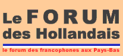
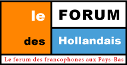
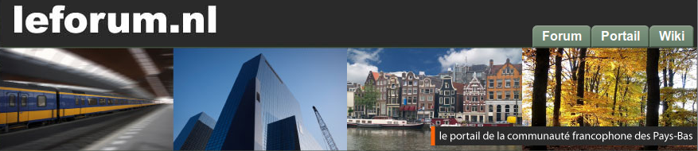

{.center}

Je vous ai [présenté le forum des Hollandais](/le-forum-des-hollandais) dès mon arrivée à Amsterdam en 2006 et je n'ai cessé de le citer depuis. Le pot organisé à l'époque et que j'ai immortalisé d'une photo de table n'a pas été le seul. Il y eu des rencontres irremplaçables et des discussions dans des fils sans fin. Pour mes [un an de ce blog](/un-an-de-blog-a-amsterdam), je citais le nombre de posts sur le forum comme gage de ma présence active entre les canaux. Ce forum va fermer ses portes au 1er janvier 2018, comme annoncé par [un message de Zungo](http://www.leforum.nl/forum/viewtopic.php?f=5&t=47785&p=474961#p474917). **Toute bonne chose a une fin**.

Le forum a ouvert un wiki en 2008 basé sur le logiciel Wikimedia ce qui permettait d'archiver tous les détails pratiques qui pouvaient être répétés plusieurs fois dans le mois. Pas toujours évident à tenir à jour tant les procédures administratives peuvent changer d'une année à l'autre mais cela a servit à pas mal de gens aussi.

{.center}

Le forum a fait peau neuve l'année suivante en lançant un portail s'appuyant sur le logiciel libre Joomla. La rédaction de ces articles revenait le plus souvent aux animatrices les plus actives du forum. Quand une véritable communauté se crée, elle devient productive et les plus actifs prennent du gallon. J'ai eu même l'honneur d'avoir quelques article de ce blog repris un sein du portail.

{.center}

Comme Zygo et Zungo et sa bande ne sont pas du genre à se tourner les pouces. Le forum a continué d'évoluer et la surprise de 2009 a été l'ouverture de forums en langue anglaise, espagnole, italienne et portugaise. De nouvelles communautés ont pu se créer grâce à ces nouveaux outils polyglottes. 2009 C'est aussi l'année de la création du groupe facebook du forum. Le succès du média social grandissant le rendait indispensable pour toute communauté ouverte vers l'extérieure. C'est ce même facebook qui est aujourd'hui pointé du doigt pour la baisse du succès du forum et finalement sa fermeture.

Il reste que cet outil en ligne formidable a marqué des centaines de vies de francophones installés au Pays bas et en a changé définitivement comme en témoigne framboise:

<!-- HTML -->

<iframe src="https://www.facebook.com/plugins/post.php?href=https%3A%2F%2Fwww.facebook.com%2Fchristina.polidori.94%2Fposts%2F10155895657698413&width=500" width="500" height="386" style="border:none;overflow:hidden" scrolling="no" frameborder="0" allowTransparency="true" style="margin: 0, auto;"></iframe>

<!-- / HTML -->

Déjà chacun relate ses souvenirs avec le forum grâce auquel certain ont trouvé un boulot, un appart ou l'âme sœur. Mon dernier souvenir est je crois [la sortie tulipe](/la-sortie-tulipes-2011) à laquelle j'ai participé plusieurs années de suite et qui m'a valut de prêter ma voix à [un film promouvant un véhicule antique](/la-chanson-mobile-extraordinaire). Il y a aussi les pots et les match de rugby au *Mulligans* et au ''Coco's outback'' que je ne peux pas oublier.

Le forum était aussi une association qui, se joignant avec les autres assos françaises des Pays bas, organisent tous les ans [le 14 juillet](/la-revolution-du-14-juillet) festif [que l'ambassade a lâché](/juillet-sans) en 2008. Je pense que cette activité hors ligne perdurera. Et puis il reste toujours je groupe facebook.
---