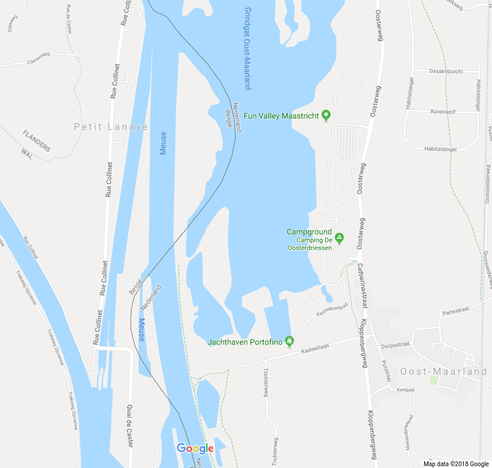
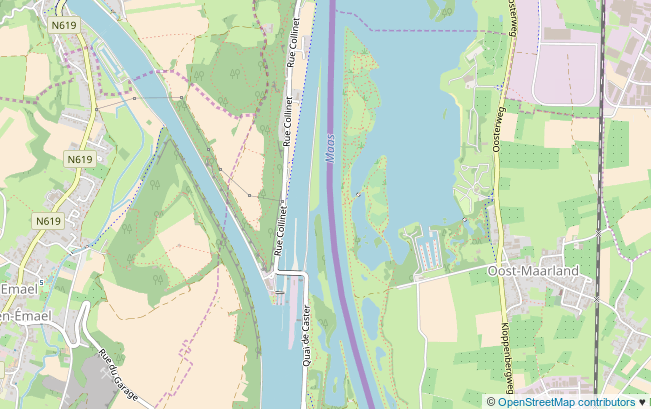

Les billets de début d'année sont souvent l'occasion d'annoncer des réductions comme la [réduction de libertés](/deux-nouvelles-annees) ou du [nombre de communes](/fusions-communes-se-poursuivent). Une fois n'est pas coutume, je vais vous parler d'augmentation. Les Pays bas ont grandit de 10 ha en ce 1er janvier et ce n'est pas en gagnant des m² sur la mer… En fait les nouveaux territoires néerlandais ont été gagnés sur la Belgique, sans tambours ni trompettes.

La Belgique et les Pays-Bas ont procédé le 1er janvier à un échange officiel de territoires. Cet échange a été accepté en juin 2016 par les gouvernements des deux pays[^1] qui en ont fait part à cette époque. [Le communiqué néerlandais](https://www.rijksoverheid.nl/actueel/nieuws/2016/11/28/nederland-en-belgie-passen-grens-aan) est plus tardif puisqu'il date de la signature officielle après que les deux parlements nationaux ont ratifié le texte. Alors il présente une belle photo de la signature officielle avec les deux rois et reines en arrière plan.

{.center}

En fait, cet échange de territoire remonte à plus longtemps que cette signature et l'on peut remonter jusqu'à [l'indépendance de la Belgique](/au-bord-de-la-belgique) en 1830. Le tracé de la frontière entre les deux pays a pris beaucoup de temps et en Zélande comme entre le Limbourg et la province de Liège ou cette échange de territoires a eu lieu, la frontière a été bornée en 1843. Ici elle devait être au point le plus profond du lit de la Meuse sauf autour de la commune de Maastricht qui, bien que rive droite de la rivière reste aux Pays bas.

La Meuse est navigable sur tout son long dans les deux pays mais souvent grâce à un réseau de canaux qui suit le lit de la rivière. Chaque période apporte son lot de modifications des espaces navigables en fonction du trafic fluvial projeté. Au sud, le canal Albert contourne Maastricht et rejoint le port d'Anvers. Au nord, le canal Juliana longe la Meuse et connecte Maastricht à Maasbracht. La jonction entre les deux canaux a été améliorée entre 1962 et 1980 et durant les travaux, le cours du fleuve a été modifié. Des méandres ayant été supprimés certain terrains ont ainsi changé de rive. 

Des terrains changeant de rive, ce n'est pas un gros problème sauf si la frontière continue à les relier administrativement à un territoire situé de l'autre coté de la rivière. C'est ainsi que les secours, la police ou les administrations fluviales des deux pays ont eu à se plaindre de devoir faire un détour par l'étranger pour accéder à ces enclaves territoriales. Les discussions pour rattacher ces territoires au pays du bon coté ont commencé en 2014. Elles ont impliqué les trois communes concernées, les provinces de Liège et du Limbourg néerlandais ainsi que les services cadastraux et les organismes gérant les voies navigables.

Au final, les Pays bas gagnent 14 hectares de la presqu'île de L'Ilal qui restera une réserve naturelle, la presqu'île d'Eijsden et la Belgique récupère les 4 hectares de la Fraillère du petit gravier et un bout de l'écluse de Lanaye, un point de passage stratégique pour le trafic fluvial.

### La mise à jour des cartes

Les atlas de nos CDI ne vont pas changer pour ce point de détail mais ce blog étant à deux clics de plusieurs cartes du monde, je me suis permis de faire un petit tour sur les cartes en ligne pour voir si elles ont été mises à jour en ce 1er janvier. Après tout, la nouvelle est connue depuis deux ans…

Bon, pour Google maps, c'est pas encore fait. L'année du © a été mise à jour automatiquement mais pour tracer la frontière qui va bien, il va falloir attendre. Bingmaps et Here ne font pas mieux.

{.center}

Encore une fois, c'est OpenStreetMaps qui gagne la course à la mise à jour. Le regroupement hétéroclite de contributeurs bénévoles est encore une fois plus efficace qu'une des plus grosses boites commerciales du monde.

{.center}

La différence entre les deux captures d´écran vous montre donc l’étendue de ce changement de frontière.
---
[^1]: Le communiqué du gouvernement belge a l'avantage d'être aussi [disponible en français](https://diplomatie.belgium.be/fr/newsroom/nouvelles/2016/la_belgique_et_les_pays_bas_signent_protocole_accord_sur_rectification_frontiere).