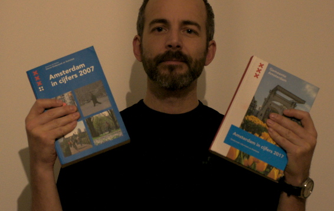
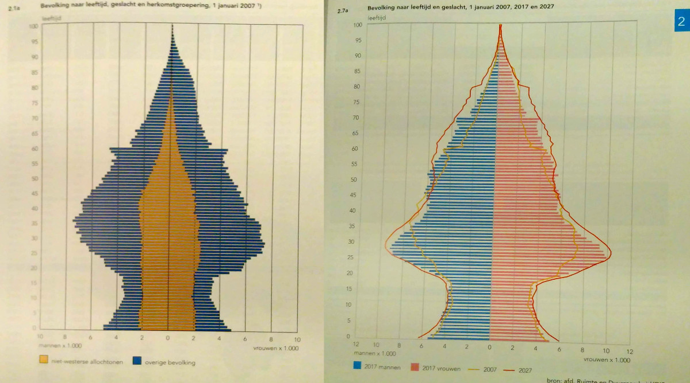

Il y a un peu mois de 10 ans, [mon copain Laurent](/kreukreuscopie) déménageait et, faisant le tri dans ses affaires me demande si ça m'intéresse un bouquin des statistiques d'Amsterdam d'il y a deux ans:  **Amsterdam in Cijfers 2007** . 2007 ? Je veux # C'est (presque) l'année de [mon arrivée à Amsterdam](/demenagement-en-photos). J'ai donc reçu de sa part le livre des données statistiques d'Amsterdam en 2007. Édité par le Service d'études et de statistiques (*Dienst Onderzoek en Statistiek*) de la ville[^1] il est distribué aux élus, journalistes… disponible en ligne et dans les services municipaux.

Le feuilletant 10 ans après je me suis demandé si les résultats de pollution de l'air, les statistiques de fréquentation des cinémas ou le salaire moyen avaient beaucoup évolué. Je me suis dit que ce serait bien d'avoir le bouquin **Amsterdam in Cijfers 2017** juste à coté pour comparer. Laurent ne déménageant pas et n'étant plus élu de Oud Zuid, il me fallut trouver un autre fournisseur alors j'ai écrit au *Dienst Onderzoek en Statistiek* qui entre temps a été renommé en *Onderzoek, Informatie en Statistiek*. La vague *opendata* est passée par là et le service de recherche est devenu service d'information. Il continue d'agréger les données et de faire de la recherche et des statistiques.

Le livre de 2017 est disponible en ligne ([ici](https://www.ois.amsterdam.nl/pdf/2017%20jaarboek%20amsterdam%20in%20cijfers.pdf)) et il est toujours distribué aux élus en version papier mais pas aux gens qui envoient une demande par email… normalement. A réception de ma demande une gentille dame m'a répondu que ce n'était pas dans leurs habitudes de faire de tels envois mais elle m'a envoyé malgré tout le livre tant attendu. Me voilà heureux possesseur de 10 ans de statistiques sur la capitale néerlandaise.

{.center}

## Quoi de neuf en 2017 ?
<!--excerpt-->
Le livre est au même format mais il a gagné une couverture cartonnée et reliée qui donne encore plus envie de garder l'ouvrage en vue sur les rayonnages de sa bibliothèque. En 2007, la préface était signée de **Job Cohen**, le maire. En 2017, la préface est signée de **Kajsa Ollongren**, la maire par interim qui est aujourd'hui Vice-Première ministre des Pays-Bas. Le format est quasiment le même avec pratiquement les mêmes chapitres dans le même ordre, seul le chapitre santé (*zorg*) a rejoint celui du bien-être et des sports (*Welzijn, zork en Sport*).

À part les têtes de chapitres se sont enrichies de photos couleur, la maquette, n'a pas changé d'un pixel. Les tableaux sont présentés avec le même bleu pour souligner les titres et les colonnes de résultats.

C'est biensûr le contenu qui a bien évolué en 10 ans. Les *kerncijfers* (chiffres clés) nous indiquent une augmentation significative de la population passant de 743.104 habitants en 2007 à **844.952 habitants en 2017**. La taille de la commune d'Amsterdam augmente beaucoup moins vite passant de 21939 hectares à **21949 ha**, elle gagne tout de même 10 hectares suite à l'ouverture d'un bout d'île artificielle dans l'est. Dans les autres capitales européennes, nul doute que cette donnée ne change pas du tout.

Pour vous donner un exemple, j'ai regardé **les pyramides des ages** qui traduisent la distribution de ces 844.952 habitants en fonction de leur age. La forme en sapin est caractéristique des grandes villes qui n'offrent pas assez de logements capable d'accueillir beaucoup d'enfants. La base de la pyramide est donc tronquée de tous les enfants qui vivent dans les villes alentours ou plus loin dans une maison abordable. 

{.center}

Il y a maintenant une différence notable entre la pyramide de 2007 et celle de 2017. Ce n'est pas la barre des baby-boomers, elle est passée de 60 ans à 70 ans et c'était prévisible c'est plutôt le renflement des jeunes de 20 à 35 ans.  en 2007, ce renflement était régulier et en aligné avec les générations suivantes mais en 2017 ce renflement montre un afflux de cette tranche d'age dans la population de la ville. Je ne sais pas qu'elle en est la cause ni si tous ces jeunes sont étudiants mais en proportion, cela montre qu'Amsterdam s'est rajeunie et c'est souvent bon signe pour une grande métropole. Peut-être avez-vous une idée plus précise de la cause de cette évolution, n'hésitez pas à le partager en commentaire.

[^1]: C'est ce même service qui met [quelques données amusantes](/Quelle-est-la-taille-d-Amsterdam) sur le site Opendata de la ville.