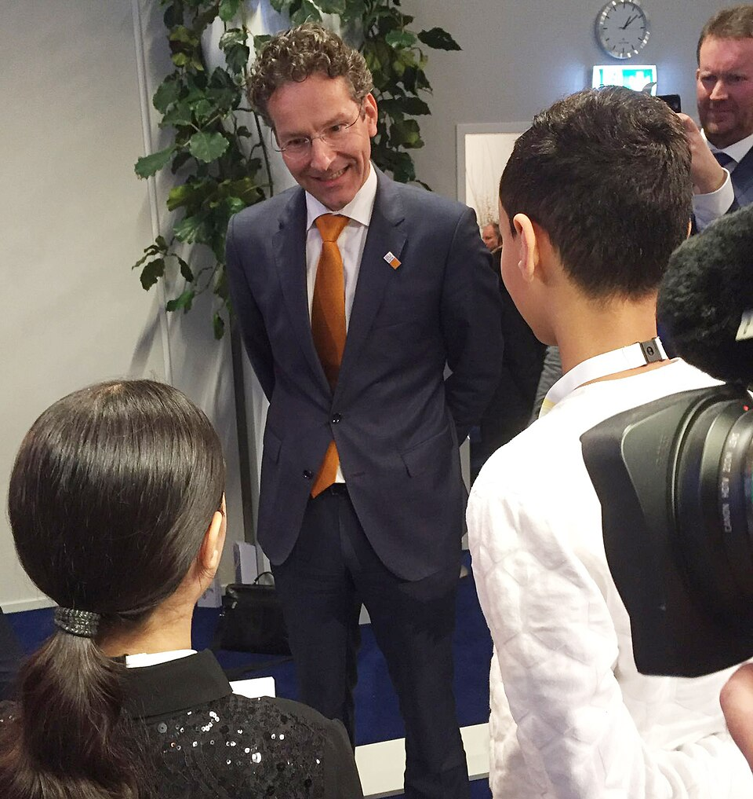

En mars dernier, **Jeroen Dijsselbloem**, le ministre des finances néerlandais et président de l'Eurogroupe[^1] a suscité la colère dans les pays du sud de l'Europe avec sa réplique destinée aux Grecs  du genre 

> Vous ne pouvez pas dépenser votre argent en alcool et en femmes et après venir pleurnicher pour avoir de l'aide.

Suite aux protestations, il s'était justifié ensuite en prétextant la franchise très calviniste des Néerlandais. Cette justification a bien sûr attisé les animosités entre l'Europe du nord et celle du sud au sein de l'Eurogroupe et dans les éditoriaux. Non seulement cela lui évitait bien de demander des excuses pour avoir offensé tout un peuple mais en plus il donnait le crédit de la franchise à ce qui ne sont que des conneries de café du commerce.

<!-- HTML -->

<!-- / HTML -->
{.center}
<!-- HTML -->

<!-- / HTML -->

Seulement voilà le ministre a été unanimement applaudit au pays. Non pas parce qu'il gère bien les relations avec ses partenaires de l'Eurogroupe mais parce qu'il a agit en bon Néerlandais en faisant preuve de franchise. Il a eu droit à la reconnaissance de son Premier Rutte et de l'ensemble de la classe politique.  Quand ailleurs dans le monde, ont trouve cette attitude néerlandaise brutale et rustre, les Néerlandais eux, son fiers d'être francs. C'est là une grande différence qu'ils ont avec les Français.

## La tenue des comptes

Jeroen Dijsselbloem a déjà eu la faveur de ce blog alors que je vous présentais la tradition de [la présentation du budget avec sa valise](/La-note-des-millions-et-sa-valise) et sa note des millions (*Miljoenennota*). Justement, la note des millions est un petit nom pour le budget de l'État (*Rijksbegroting*), elle est souvent présenté en analogie au budget du ménage Pays bas (*het huishoudboekje van Nederland*). Le ministre des finances est donc en quelque sorte le [bon père de famille](https://fr.wiktionary.org/wiki/en_bon_p%C3%A8re_de_famille) du royaume et son rôle est donc celui d'un gestionnaire bienveillant.

Le Néerlandais a la réputation d'être pingre mais cet attribut a une appellation positive: être économe. La tradition néerlandaise est de connaître ses limites et de ne pas effectuer de dépenses superflues jugées « décadentes ». Encore une tradition [calviniste](/catholiques-et-protestants). Même si elle n'est pas toujours très bien respectée[^2] l'attitude du ministre des finances résonne dans le cœur des gens et sa remarque sur les Grecs le place définitivement du coté de ceux qui font ce qu'il faut : le coté des bons gestionnaires qui ne gaspillent pas.

## Retour historique 
<!--excerpt-->
L'indélicatesse et l'avarice des Néerlandais, ( pardon, la franchise et la bonne gestion des Néerlandais) sont des qualités nationales et [un article de Saskia Pieterse](https://www.groene.nl/artikel/de-rel-rond-jeroen-dijsselbloem-en-waarom-nederlanders-zo-bot-zijn) passe en revue quelques exemples historiques très intéressants en citant **Erasme** et **Justus van Effen** ou en commentant les affiches de motivation de la chaîne de magasin [Albert Hein](/albert-hein-et-compagnie) en en soulignant leur arrogance crase. Pour résumer son article, les Hollandais sont des paysans peu éduqués qui sont devenus des marchands prospères. Ils n'ont jamais appris la bienséance et les subtilités du langage et ont dû très tôt faire attention à bien épargner leurs gains pour faire face à l'hiver. Avec leur succès dans les affaires, leur maque de tact est devenu un franc parler vertueux. D'ailleurs, *quiconque ne fait pas de vaines promesses et ne gaspille pas son argent en vains plaisirs, peut conclure des accords écrits ou oraux avec de fortes garanties, devient un partenaire commercial fiable avec une bonne réputation de solvabilité.* 

La franchise peut aussi être une explication de l'[absence de rideaux aux fenêtres](/venez-voir-chez-moi). « Regardez voir, je suis honnête, je n'ai rien à cacher ».

L'article donne des exemples où l'enseignement de ces préceptes dans les colonies hollandaises sont une belle illustration de condescendance et d'arrogance que le peuple batave a du mal assumer.

Force est de constater que cette façon de voir les choses est à l'opposée de la culture de la France, de sa tradition diplomatique et de son *bon usage*.  À propos de la France, **Saskia Pieterse** cite un roman de *Wolff en Dekens* (1782), où le marchand Abraham Blankaart, basé à Paris écrit que *vous pouvez obtenir des « sacs pleins de compliments » des Français, mais pas de « l'argent »*.

Les français ont aussi plein d'exemples d'arrogance avec leurs colonies mais elle s'illustre plus dans la manière d'enseigner sa culture et ses règles de bonne tenue et la politesse aux autochtones.

Après leur age d'or, les Hollandais ont connu une période de crise au XVIIIe siècle et naturellement les écrits ont attribué cette perte de prospérité à une perte d'identité à cause de l'influence extérieure. Influence des colonies d'abord mais aussi des voisins d'Europe qui ne savent pas s'exprimer directement et dilapident tous nos biens à des plaisirs de débauche.

Quand Napoléon met son frère Louis[^3] sur le trône du royaume Batave, ce dernier se consacre, durant les quatre ans de son règne à la prospérité de son peuple, parfois contre l'avis de son frère, au point que ce dernier a ensuite décidé d'annexer les Pays-Bas à la France # Pourtant Louis Bonaparte ne reste pas un monarque apprécié dans l'histoire du pays, il lui est reproché… son goût trop prononcé pour le faste, déménageant d'un palais à l'autre en les faisant réaménager et provoquant des dépenses inconsidérées.

Saskia Pieterse termine son article en indiquant que la franchise (*directheid*) batave n'est qu'un moyen pour indiquer sa supériorité face à des peuples jugés inférieurs. C'est flagrant dans l'île de Curaçao prise en exemple mais c'est aussi vrai en Europe comme on peut le voir chez Jeroen Dijsselbloem.

### La tolérance néerlandaise

Cela peut paraître surprenant de découvrir cette condescendance de la part d'un peuple qui est un exemple de tolérance jusqu'à avoir la capitale la plus internationale du monde. Amsterdam, centre de la nouvelle puissance des Provinces Unies a une longue tradition d'accueil des immigrants rejetés de partout. Depuis les Flamands, les Juifs du sud de l'Europe aux Huguenots,  jusqu'aux Coptes et aux gays. Seulement c'est aussi dans cette ville qu'on apprend la différence entre tolérer et accepter. Par exemple, les catholiques ont toujours été présents à Amsterdam, même après la réforme mais ils n'étaient que tolérés. Leur pratique et leur lieux de cultes devraient être cachés.

J'ai pour ma part été surpris de voir dans le monde de l'entreprise les mélanges de genres mais aussi de couleur de peau et de nationalité qui me laissait penser que tout le monde pouvait trouver sa place pour être heureux[^4].  J'ai aussi vu des réactions « franches » de collègues néerlandais qui m'ont réellement fait pensé que tel ou tel autre collègue était le pédé de service ou le noir de service.  Même si je n'ai pas étudié la question, j'ai senti qu'il y avait ça et là des plafonds de verre dans cette société multiculturelle.

Comme en conclut Saskia Pieterse, on ne sait pas si les Néerlandais sont historiquement sincères ou pas ou pas mais ce trait de personnalité souligné en fait une *prophétie auto-réalisatrice*.  Le Néerlandais aime bien aujourd'hui affirmer sa vérité et cette franchise, considérée comme normale coupe court à toute critique extérieure.  

### A franchise, franchise et demi

Cette histoire Dijsselbloem est ancienne l'article de Saskia Pieterse aussi mais j'avais envie depuis pas mal de temps d'en faire un post jusqu'à ce que le temps  chassant les actualités anciennes, je me décourage. Mais voilà, un Grec proche de cette histoire m'a fait rebondir.  En effet, **Yanis Varoufakis** a sorti un livre *Conversations entre amis* le 11 Octobre dernier. Il y parle des négociations pour faire tenter de faire sortir la Grèce de la Crise, avec le FMI, La BCE, La Troïka et l'Eurogroupe dont le président était … Jeroen Dijsselbloem. Dans ce livre, il parle du plan qu'il avait élaboré à l'époque et surtout de la manière dont il a été reçu par les responsables d'alors. Il explique[^5] que Jeroen Dijsselbloem était venu le voir peu de temps après sa nomination mais qu'il évitait de parler du fond… Dans le genre franc, il y a mieux.

---
[^1]: Jeroen Dijsselbloem n'est plus président de l'Eurogroupe depuis le 13 janvier 2018. Il a été remplacé par le portugais [Mário Centeno](https://fr.wikipedia.org/wiki/M%C3%A1rio_Centeno).
[^2]: Il suffit de voir leur [dépenses superflues](/Bresil-en-orange) en [orange tous les deux ans](/decorations-oranges-choisies) pour s'en assurer. 
[^3]: Louis Napoléon de son nom de scène.
[^4]: Et j'en ai bien profité dès [mon premier boulot](/de-mon-boulot).
[^5]: Certains passages sont détaillés par l'auteur lors d'[une émission passionnante de France Culture](https://www.franceculture.fr/emissions/entendez-vous-leco/entendez-vous-leco-lundi-16-octobre-2017).
<!-- post notes:
https://commons.wikimedia.org/wiki/File:Informal_Meeting_of_EU_Finance_Ministers_(26553428616).jpg
https://commons.wikimedia.org/wiki/File:Informal_Meeting_of_EU_Finance_Ministers_(26524350831).jpg
https://commons.wikimedia.org/wiki/File:Informal_Meeting_of_EU_Finance_Ministers_(26482508722).jpg
https://commons.wikimedia.org/wiki/File:Informal_Meeting_of_EU_Finance_Ministers_(26505213381).jpg 

Et aussi les fuites dans la presse que font dire à Yanis Varoufakis des choses qu'il n'a pas dit. Vous croyez que ça vient de qui ? 
https://www.franceculture.fr/emissions/entendez-vous-leco/entendez-vous-leco-lundi-16-octobre-2017
--->
