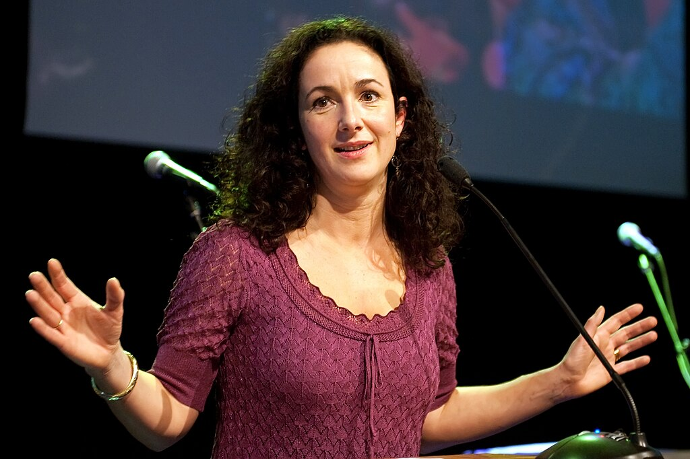

*Femke Halsema wordt nieuwe burgemeester van Amsterdam*. Femke Halsema sera la nouvelle maire d'Amsterdam [titre NOS](https://nos.nl/artikel/2238741-femke-halsema-wordt-nieuwe-burgemeester-van-amsterdam.html) alors je ne peut pas m’empêcher de commenter la nouvelle avec un titre jouant sur les mots de maire et de bourgmestre (ne cherchez-pas c'est la même chose). Femke Halsema est mère de jumeaux et va devenir maire d'une capitale européenne.

*Femke Halsema en 2010 par Jos van Zetten « La politique, c'est fini, j'en ai marre ».*

C'est un peu sa qualité de femme qui a fait connaître la bourgmestre au monde entier. les Pays-Bas sont plutôt connus pour pratiquer l'égalité des sexes en politique avec une presque parité à la chambre basse et au gouvernement sans loi pour les y forcer, avec de nombreuses grandes villes comme Rotterdam ayant déjà eu plusieurs mairesses. Mais la capitale du pays n'a jamais eu de bourgmestre femme depuis que Godevaert Wormbouts [a inauguré la fonction](https://fr.wikipedia.org/wiki/Liste_des_bourgmestres_d%27Amsterdam "Liste des bourgmestres d'Amsterdam") en 1343 !

## Une vrai nouveauté

<!--excerpt-->

#### Une femme…

Les quelques 1500 bourgmestres d'Amsterdam avant elle étaient tous des hommes et cela brise enfin de manière symbolique cette très longue habitude d'avoir un maire au masculin. En fait l’opportunité d'avoir une femme à ce poste n'est pas si ancienne au Pays-Bas. Les premières femmes au conseil municipal ont été élues en 1919, année où les femmes pouvaient être candidates mais pas encore voter. L'une des cinq femmes élues à Amsterdam, **Carrie Pothuis-Smit** devint même plus tard la première sénatrice du pays.

Il faut quand même attendre 1978 pour qu'Amsterdam voit une première femme au collège des échevins (*college van burgemeester en wethouders*), le bureau exécutif de la ville. **Irene Vorrink** avait auparavant été la ministre de la santé à l'origine de la dépénalisation des drogues.

En 2010, le VVD (conservateur) avait présenté une candidate **Annemarie Jorritsma** mais c'est le candidat travailliste **Eberhard van der Laan** qui l'a emporté.

#### Pas une travailliste

L'autre grande nouveauté c'est que le plus haut poste de la ville n'est plus occupé par un membre du PvdA. Depuis l'après guerre, les travaillistes tiennent la ville et c'est le candidat du PvdA qui est à chaque fois nommé par le commissaire du roi. Seulement, depuis plusieurs années les travaillistes s'occupent plus du PIB que des travailleurs et leurs résultats à Amsterdam aussi ont commencé à se comprimer. Aux élections municipales de 2014 c'est le parti social-libéral D66 qui est arrivé en tête à Amsterdam et dans d'autres grandes villes. Cette année c'est Groenlinks, les verts de gauche qui sont arrivés en tête avec 10 sièges sur 45. Mais arriver en tête ne suffit pas à placer son bourgmestre. Si D66 a remporté 14 sièges en 2014, Eberhard van der Laan, membre du PvdA a conservé son fauteuil de maire en 2016 lorsque ce dernier devait être renouvelé.

Le populaire Eberhard van der Laan est hélas mort l'année suivante en cours de mandat et ceux qui ont occupé son fauteuil jusqu'à aujourd'hui ne l'ont fait qu'*ad interim*. Les candidatures pour le poste vacant ont été ouvertes en mai et même rouvertes le 4 juin pour ne rater personne. Au sein de la coalition majoritaire, regroupant les Groenlinks et le PvdA le choix est difficile entre la verte retirée de la vie politique **Femke Halsema** et **Carolien Gehrels** l'ancienne échevin travailliste au profil plus lise. C'est même cette dernière qui arrive en tête des recommandation du commité de confiance (*vertrouwenscommissie*), un comité de 12 élus qui font passer les entretiens d'embauche.

Chacune des deux candidates aurait pu devenir la première femme maire d'Amsterdam mais une seule pouvait prétendre être la première maire non travailliste de la ville depuis la dernière guerre. C'est finalement Femke Halsema qui l'a emporté aux voix parce que deux nouveautés c'est mieux qu'une.

#### Pas une ancienne ministre

Troisième nouveauté un peu anecdotique, c'est aussi la première personne depuis 2001 qui occupe le poste de bourgmestre sans avoir été ministre ou secrétaire d'état par le passé. Cette nouveauté n'est d'ailleurs pas si anecdotique puisque les mauvaises langues arguent le manque de compétence de la nouvelle venue qui a quitté la politique en 2010. Il faut quand même rappeler qu'elle a quitté la politique après 8 ans à la chambre basse comme chèfe de son groupe parlementaire et était à la tête de son parti depuis 2003. Parti qui n'a jamais été que dans l'opposition ce rend difficile l'accès à un marocain de ministre…

# Ce qui ne change pas

Il semble qu'il y ait une tradition à Amsterdam qui veuille que le maire soit Juif. Pour mettre toutes les chances de leur coté, chaque parti présente une candidat juif pour le plus haut poste de cette bonne vielle [ville de Mokum](/nouveau-mot-chanoeka). Avec l'arrivée de Femke Halsema, cette tradition perdure.

<!-- post notes:
https://www.parool.nl/nieuws/hoe-de-benoeming-van-favoriet-halsema-bijna-mislukte~bd4e6247/
--->
