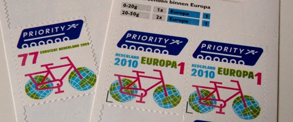

Aujourd'hui **la petite reine**[^1] fait un retour en force dans le cool et la pratique du vélo gagne du terrain un peu partout. Cela n'a pas été toujours le cas et la deuxième moitié du XXème siècle est plutôt marquée par le déclin du cyclisme toutes catégorises confondues. Alors quand on arrivait aux Pays bas dans les années 90, c'était un choc de voir ce peuple continuer à se déplacer à bicyclette dans tout le pays.

Seulement cela n'a pas toujours été le cas et **cette pratique du vélo est le résultat de choix politiques datant des années 70**, mettant l'accent sur les infrastructures et la sécurité. C'est un tweet signalé par un lecteur qui m'a rappelé que je n'en avais pas encore parlé ici:

<!-- HTML -->

<blockquote class="twitter-tweet" data-lang="en">
[THREAD] Je souhaiterais vous faire partager un évènement auquel je me suis intéressé récemment et qui raconte comment les Pays-Bas ont commencé progressivement à réaliser des aménagements cyclables. Cette histoire, je l&#39;ai lue dans le livre Bike Nation de <a href="https://twitter.com/peterwalker99?ref_src=twsrc%5Etfw">@peterwalker99</a>. 1/19
&mdash; Monsieur Ours (@GospodMedved) <a href="https://twitter.com/GospodMedved/status/948559218558324736?ref_src=twsrc%5Etfw">January 3, 2018</a></blockquote>

<!-- / HTML -->

L'histoire du livre **Bike Nation** est résumée en moins d'une dizaine de tweets mais pour les *réfractwitters*, il y avait possibilité de connaître cette histoire grâce à un article de *dadine* sur le portail de leforum.nl. L'article inspiré d'un blogpost en anglais reprenait le film suivant, centré sur les infrastructures où l'on voit un Amsterdam du début du siècle avec des tacots qui se joignent aux bicyclettes dans le trafic urbain naissant.

<!--Gone:  (http://leforum.nl/index.php/report-section/39-reportages/315-lhistorique-des-pistes-cyclables-neerlandaises). -->
<!-- HTML -->

<iframe width="560" height="315" src="https://www.youtube.com/embed/XuBdf9jYj7o" frameborder="0" allow="autoplay; encrypted-media" allowfullscreen title="video-voitures"></iframe>

<!-- / HTML -->
<!--excerpt-->

## L'avénement de la voiture
Le film ne manque pas de chiffres pour expliquer les changements d'infrastructures dans le pays. Suite à une augmentation du revenu moyen de 222% durant les 30 glorieuses bataves, la voiture a supplanté le vélo pour les trajets quotidiens. Le film arrête l'année charnière **1958** comme **l'année ou la voiture supplante définitivement le vélo**. Comme en France, la ville doit s'adapter aux voitures. Les squares et quinconces deviennent des parkings et des quartiers entiers sont rasés pour faire place à des axes urbains comme lors de percement de Wesperstraat à Amsterdam.

## La mort des enfants
Mais cette avancée a eu un prix humain considérable. Partout les morts se comptaient par (dizaines de) milliers tous les ans. 3300 morts aux Pays bas en 1971[^2]. Au Pays bas les gens sont descendus dans la rue pour dénoncer les assassinats d'enfants (*Stop de kindermoord*).

{.center}

En France cette prise de conscience a permis au gouvernement de **Pierre Messmer** de limiter la vitesse pour la première fois en 1973[^3]. Aux Pays bas c'est le premier ministre **Joop den Uyl** qui, aidé par la crise pétrolière de 1973, a annoncé aux Néerlandais qu'ils allaient devoir changer leurs habitudes pour « utiliser moins la voiture sans perdre en qualité de vie ».

## Premières mesures en faveur du vélo
Les premières mesures ont été symboliques en inventant [la journée sans voiture](/pas-de-voiture-des-gros-velos) et en créant des secteurs piétons en centre-ville. Mesures reprises aujourd'hui dans les villes du monde entier. À l'époque même, la journée sans voiture était chaque dimanche et en 1973 prendre sa voiture un dimanche était passible d'une amende. Dans le même temps, les activistes voulant dénoncer les tués de la route se sont mis à faire la promotion du vélo au lieu de focaliser sur les chauffards, ce qui leurs aurait mis à dos une majorité de la population. Leurs actions d'alors étaient originales comme organiser des randonnées cyclistes de masse en occupant toute la route ou bien réclamer l'espace public en dessinant des pistes cyclables sauvages sur la chaussée. Ces actions sont aujourd'hui encore reprises par les activistes du monde entier comme par exemple le mouvement *critical mass* [mondialement connu](https://fr.wikipedia.org/wiki/Masse_critique_(mouvement_social)).

Favoriser l'usage de la bicyclette est devenu la réponse logique du gouvernement pour aider les néerlandais à changer leurs habitudes de transports sans perdre en qualité de vie. En 1975. les communes de Tilburg et de la Haye ont inauguré leurs premières pistes cyclables séparées de la chaussée construites avec l'aide de l'État. Dans la même année le trafic vélocipède a littéralement explosé[^4] sur ces axes prouvent si besoin était, que quand les infrastructures sont là, les gens les utilisent. Ce test grandeur nature a permis à d'autres collectivités locales de s'engager elles aussi dans des dépenses d’infrastructures dédiées, sachant qu'elles allaient être utilisées. L'évolution de l'aménagement des villes a ainsi commencé aidé par la participation de l'État qui voyait là un excellent moyen de combattre la mortalité routière et encourager les économie d'énergies.

## Épilogue
Aujourd'hui, il y a 5 millions de cyclistes quotidiens aux Pays bas, effectuant 14 millions de trajets alors que le pays compte 17 millions d'habitants. Les Néerlandais parcourent 800 à 1.000 km par an contre 87km par an et par habitant en France ([source](http://poussepoussepace.fr/wp-content/uploads/2015/05/Economie_du_velo_F.pdf) PDF 2015). Ceci fait économiser plusieurs millions au pays par les économies d'énergie et tous les frais induits par l'utilisation de la voiture (pollution, accidents, embouteillages). Les Pays bas sont le premier producteur de vélos d'Europe avec 1,3 millions de vélos vendus pour le seul territoire national en 2009. Le vélo est devenu un symbole national au même titre que [les tulipes et les moulins](/pays-des-velos-moulins-tulipes).

[{.center}](/timbres-nouvelle-numerotation)

Mais les Pays bas ne s'arrêtent pas là, les décideurs estiment que **l'usage du vélo peut encore se développer** et continuent d'investir massivement pour faciliter l'usage de la bicyclette. Dans une ville comme Amsterdam 30% des déplacements se font à vélo mais l'usage peine à se développer parce que certains axes saturent et qu'il n'y a pas assez de places pour garer sa bicyclette. Les dépenses se portent donc maintenant vers la construction de parkings à vélo en sous sol ou [à plusieurs étages](/une-heure-sans-velo). La ville dépense encore 26€ par habitant pour les infrastructures cyclables ce qui est bien plus que n'importe quelle autre capitale européenne.

Les investissements les plus spectaculaires se portent aujourd'hui sur la construction d'*autoroutes pour vélos*. L'idée est que le réservoir de croissance pour la pratique du vélo est dans les trajets de plus de 12km et qu'il faut donc rendre ces trajets plus efficaces en vélo, pour que les usagers décident de laisser leur voiture au garage. C'est la raison pour laquelle les autoroutes pour vélos se développent autour et entre les villes de provinces. L'idée est de pouvoir relier les deux villes à vélo sans s'arrêter en construisant ci besoin des passerelles ou des tunnels. Quelques exemples existent déjà et illustrent que l'avance des Pays bas quand au développement des structures pour vélos n'est pas près de se résorber.

<!-- HTML -->

<iframe src="https://www.facebook.com/plugins/video.php?href=https%3A%2F%2Fwww.facebook.com%2Fweffrancais%2Fvideos%2F1577103105676161%2F&show_text=0&width=476" width="476" height="476" style="border:none;overflow:hidden" scrolling="no" frameborder="0" allowTransparency="true" allowFullScreen="true"></iframe>

<!-- / HTML -->

---
[^1]: Non, je ne vais pas parler de Beatrix.
[^2]: Ce qui est énorme même si la France faisait bien pire avec 18.000 morts en 1972.
[^3]: Lire à ce sujet la [mise en perspective de Thierry Noisette sur l'Obs](https://www.nouvelobs.com/societe/20180111.OBS0484/une-mesure-imbecile-quand-la-france-a-commence-a-limiter-la-vitesse.html) en ces temps de réduction supplémentaire de la vitesse.
[^4]: De 30 à 65% d'augmentation à la Haye et de 75% à Tilburg !

<!-- post notes:
http://www.aviewfromthecyclepath.com/2011/10/how-dutch-got-their-cycling.html 
http://www.bbc.com/news/magazine-23587916 
https://nl.ambafrance.org/Presse-neerlandaise-du-mardi-26,11671
--->
