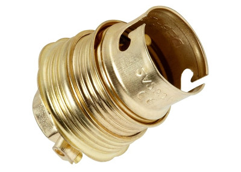
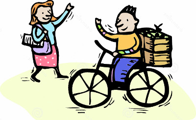

C'est toujours surprenant pour les primo-arrivants de voir comment les locaux se saluent. Pour se dire en revoir, ils essaye de ce remémorer l'histoire du fou qui change une ampoule. Et ils se crient, parfois de l'autre bout de la rue (à vélo) **« douille # douille ! »**.

{.center}

## Nouveau mot: Doie

Bon en fait c'est l'impression que ça donne mais c'est un peu différent… En fait ils se saluent **pour se dire au revoir** (et parfois à vélo) en disant "*doei# doei!*" parfois "*doe-doei*" ou bien "*doe — oei*" qui peuvent s'entendre respectivement «douille douille», «dou-douille» ou «dou-ouille».

{.center}

## Doei ça vient?

En fait cette salutation vient de  *Dag!* qui est une version courte de "Goede dag" ou "Goeje dag" qui se traduit littéralement **bon jour**. Rien de plus normal que de se souhaiter une bonne journée au moment de se quitter. Rien de surprenant que cette salutation récurrente trouve des diminutifs familiers  façon 'lut, bail, tchô… Ici le *Dag* est devenu *doei* et très vite tout le monde l'adopte, même les allochtones, même ceux qui ne parlent pas vraiment la langue.

Bon allez, *doei* à la prochaine…
---