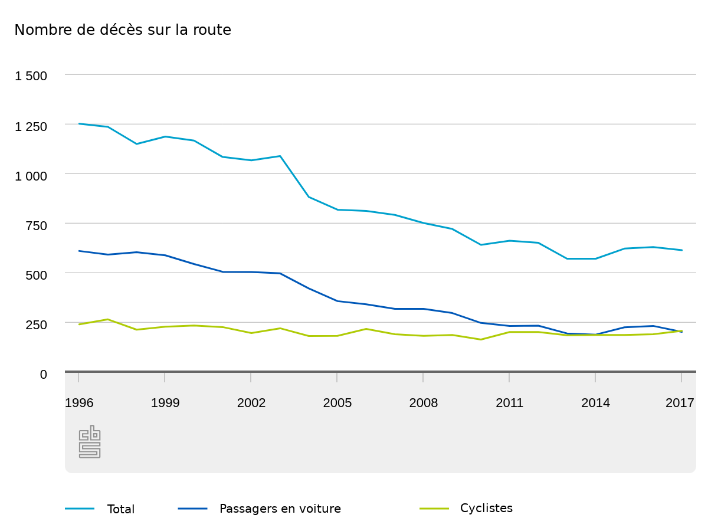
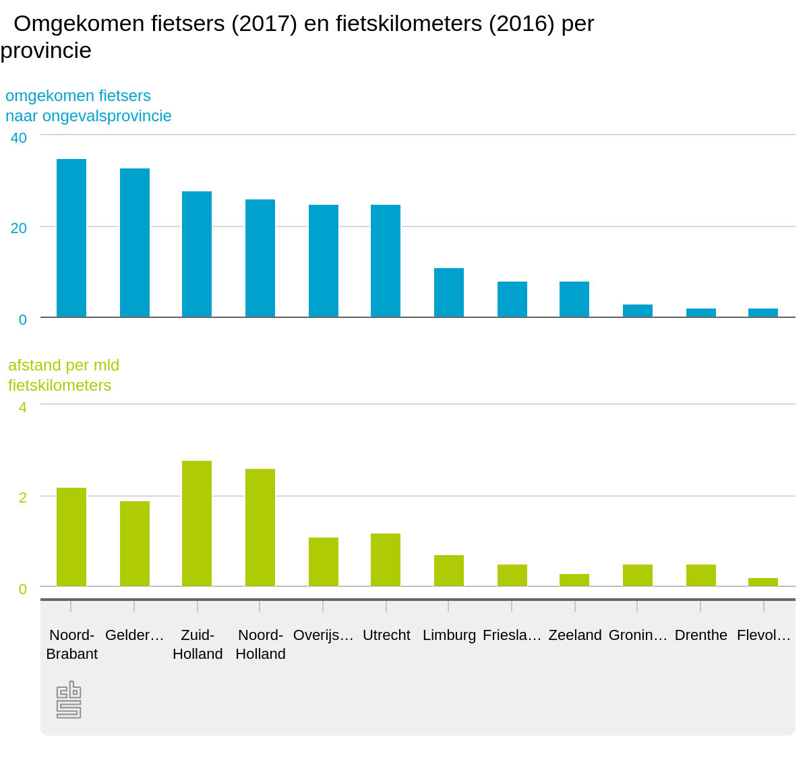
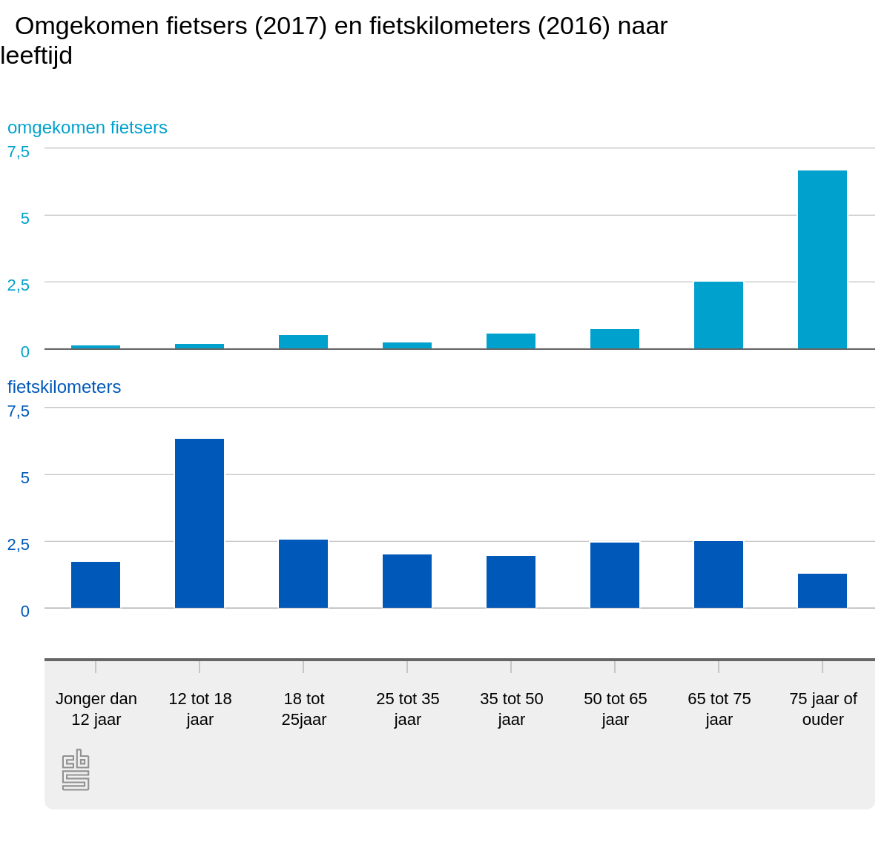

C'est une première et c'est bien triste. 2017 a été une année noire en terme de mortalité à vélo si bien que pour l'année 2017 il y a eu pour première fois il y a eu plus de cyclistes tués sur les routes (206) que d'automobilistes (201).  L'institut national des statistiques (*Centraal Bureau voor de Statistiek*) en a fait un communiqué spécial tant la nouvelle marque un tournant.

La pratique du vélo de cesse d'augmenter depuis les années 70 mais comme les infrastructures de sécurité suivent, le nombre d'accidents fatals reste plutôt stable (ligne verte). Pour la voiture, les infrastructures mais aussi les mesures visant à responsabiliser les conducteurs ont aussi amené une baisse du nombre des  accidents mortels (ligne bleue). Il fallait bien que ça arrive, les courbes se sont donc croisées en 2017 aux Pays bas.

{.center}

Cela ne veut pas dire que le vélo est devenu plus dangereux que la voiture ; le *Centraal Bureau voor de Statistiek* nous aide à mieux lire cette triste nouvelle et à en analyser les causes.

La nouvelle pourrait nous faire pense que faire du vélo aux Pays bas est dangereux mais en fait, comme le nombre de kilomètre parcourus à vélo a aussi augmenté en 2017 ce qui fait qu'il y a moins de décès par distance parcourus en 2017 qu'en 2016. Mais la pratique plus intensive du vélo n'est pas la seule explication de ce pic et les statistiques par age, catégories ou région nous aident à comprendre mieux les tendances et les pratiques qui font augmenter le nombre de morts en selle.

L'étude est disponible en ligne ici|https://www.cbs.nl/nl-nl/nieuws/2018/17/in-2017-meer-verkeersdoden-op-de-fiets-dan-in-de-auto].

<!-- HTML -->
<iframe width="560" height="315" src="https://www.youtube-nocookie.com/embed/AOoFtjSIFA4" frameborder="0" allow="accelerometer; autoplay; encrypted-media; gyroscope; picture-in-picture" allowfullscreen></iframe>
<!-- / HTML -->

Ainsi, les provinces ayant enregistré le plus de décès de cyclistes sont le Brabant septentrional et la Gueldre. Ce sont aussi des provinces les cyclistes parcourent le plus de kilomètres par jour (derrière la Hollande septentrionale et la Hollande du sud quand même). À l'autre bout du tableau, le Flevoland et la Drente sont des provinces enregistrant peu de décès mais ce sont aussi les provinces ou les gens sont moins longtemps sur leur vélo. Au final ce sont les provinces de Zélande et de Drente et d'Overyssel qui enregistrent le plus grand nombre de cyclistes décédés par kilomètre parcouru.

{.center}

## Plus d'hommes que de femmes

Le bureau central des statistiques détaille aussi les décès de ces pauvres cyclistes par age et sexe. Il constate et le signal en gros titres que l’augmentation du nombre d'accident mortels ne touche que les hommes. Le nombre de femme tuées pour 2017 passant de 64 à 58 est en baisse.

Le détail du nombre d'accidents mortels par age présente encore plus de disparités avec un nombre croissant de morts pour les plus de 65 ans et les plus de 75 ans alors même que ces tranches d'age pédale sur moins de kilomètres que leurs cadets.

{.center}

Un analyste de la radio nationale d'information expliquait que les personnes âgés étaient moins adroites ce qui augmente le nombre de chutes en montant ou en  descendant de vélo et comme elles sont aussi plus fragiles, ces chutes ont souvent plus graves. Elle provoquent par exemple une fracture de la hanche (*een heup breken*) cite le journaliste.

## Les vélos à assistance électrique aussi

Le bureau central des statistiques précise aussi que le nombre de décès d'hommes sur des vélos électriques a presque doublé, passant de 20 en 2016 à 38 en 2017. Le succès des vélos électriques a aussi son revers de la médaille. Il amener au vélo de nouveaux utilisateurs qui serait peut-être restés à la maison mais ces nouveaux usagés plombe les statistiques sur la sûreté de ce mode de transport. Il est aussi précisé dans le rapport que plus des ¾ des hommes décédés à vélo électriques avaient plus de 65 ans. Il n'y a pas eu de commentaires sur ce détail mais il y a sûrement là une nouvelle catégorie de cyclistes à sensibiliser. Sur un vélo à assistance électrique on va souvent plus vite que prévu et c'est parfois dangereux. Notons quand même que cette augmentation n'est constaté que chez les hommes, les décès de femme sur e-bike est en baisse lui. Il est aussi possible de faire un raccourci et de conclure que seuls les hommes d'un certain age ont besoin d'être sensibilisé au bon usage des vélos à assistance électrique mais c'est un pas que je ne ferais pas.

## Moins de morts en voiture

Le deuxième volet de cette nouvelle sur les morts à vélo et en voiture est le volet voiture. Je pense que les Pays bas n'en serait pas là non plus s'il n'avait pas de bons chiffres en matière de sécurité automobiles. C'est un des pays européens constatant le moins d'accidents mortels mais les résultats continuent de s'améliorer d'année en année.  Les [statistiques provisoires de 2017](http://europa.eu/rapid/press-release_IP-18-2761_fr.htm) d'eurostat sont flagrantes sur ce point, il n'y a qu'à comparer les chiffres néerlandais avec ceux de la … France par exemple.

Les bons chiffres de l'automobile sont à modérer selon la *fietserbond*, [la puissante fédération des cyclistes](/comment-les-hollandais-sont-passes-au-velo) qui souligne dans un article en réaction que la plupart des décès de cyclistes sont dûs à des collisions avec des voitures. La *fietserbond* en profite pour plaider en faveur de la limitation de vitesse en ville à 30 km/h en zone urbanisée comme cela est le cas déjà dans de nombreuses villes.

 Peter van der Knaap de la fondation de recherche sur la sécurité routière SWOV (*Stichting Wetenschappelijk Onderzoek Verkeersveiligheid
*) [signale tout de même que même](https://www.swov.nl/nieuws/stijging-aantal-verkeersdoden-629-2016) si le nombre de décès est en légère hausse, il s'explique avant tout par une mobilité en forte hausse. Logiquement, plus on parcourt de chemin, plus on a de chance d'avoir ou de rencontrer un accident. Mais globalement les Pays bas peuvent encore se féliciter d'être un des pays dont la route est l'une des plus sûrs du monde.

<!-- HTML -->

<a href="/plein-de-velos-hollandais" title="tout savoir sur la bicyclette aux Pays-Bas">
<!-- / HTML -->
**Plein de vélos hollandais**  
{.center}  
1) Les avantages  
<!-- HTML -->
</a>

<!-- / HTML -->

<!-- HTML -->

<a href="/plein-de-velos" title="tout savoir sur la bicyclette aux Pays-Bas">
<!-- / HTML -->
**Plein de vélos hollandais**  
{.center}  
2) Les styles
<!-- HTML -->
</a>

<!-- / HTML -->

<!-- HTML -->

<a href="/plein-de-velos-hollandais-3" title="tout savoir sur la bicyclette aux Pays-Bas">
<!-- / HTML -->
**Plein de vélos hollandais**  
{.center}  
3) Les marques
<!-- HTML -->
</a>

<!-- / HTML -->

<!-- HTML -->

<a href="/plein-de-velos-pas-hollandais-4" title="tout savoir sur la bicyclette aux Pays-Bas">
<!-- / HTML -->
**Plein de vélos hollandais**  
{.center}  
4) Les marques étrangères
<!-- HTML -->
</a>

<!-- / HTML -->

<!-- HTML -->

<a href="/une-heure-sans-velo" title="tout savoir sur la bicyclette aux Pays-Bas">
<!-- / HTML -->
**Plein de vélos hollandais**  
{.center}  
5) Parking à vélos
<!-- HTML -->
</a>

<!-- / HTML -->

<!-- HTML -->

<a href="/les-velos-de-location" title="tout savoir sur la bicyclette aux Pays-Bas">
<!-- / HTML -->
**Plein de vélos hollandais**  
{.center}  
6) Vélos de location
<!-- HTML -->
</a>

<!-- / HTML -->

<!-- HTML -->

<!-- / HTML -->
---
<!-- post notes:
https://bicycledutch.wordpress.com/2018/04/25/more-cycling-fatalities-than-deaths-in-cars/ 
https://nl.wikipedia.org/wiki/Stichting_Wetenschappelijk_Onderzoek_Verkeersveiligheid
--->
