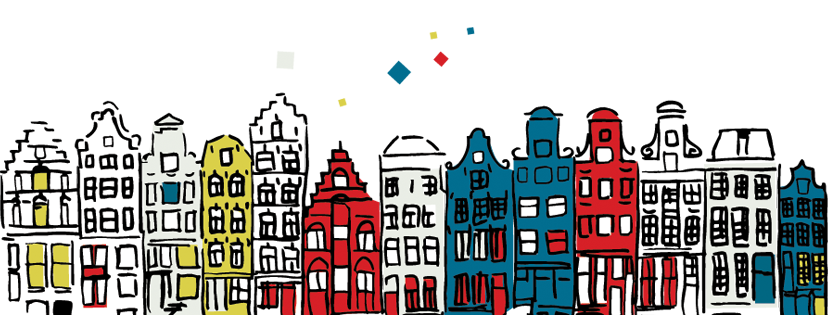

Après avoir constater la disparition du forum.nl je pourrais me lamenter que les blogs que je présentais ici il y a presque 10 ans sont presque tous aujourd'hui morts. J'ai d'ailleurs retiré la liste des liens amis sur le coté de mes pages parce que trop de ces liens disparaissaient. Ce n'est plus la grande époque des blogues où tout le monde faisait le sien et où l'on pouvait s'interpeller par posts interposés mais les blogs ne sont pas morts pour autant. C'est pourquoi je vais aujourd'hui vous un présenter un nouveau.

{.center}

**Découvrir Amsterdam** a l'intention de présenter Amsterdam principalement aux touristes ou aux gens de passage sous l'angle de la surprise. Les inévitables rubriques *où loger* et *où dormir* son complétés par des préoccupations hors des guides mais tellement parlantes pour un local. Ainsi, on peut choisir [où aller nager](http://www.decouvrir-amsterdam.com/petit-top-spots-plouf-preferes/) ou bien [où aller regarder la pluie](http://www.decouvrir-amsterdam.com/plus-belles-fenetres-regarder-tomber-pluie/). Le où [fumer un joint](http://www.decouvrir-amsterdam.com/meilleurs-coffee-shop-damsterdam/) est moins classique mais un vrai guide d'Amsterdam ne serait pas complet sans une petite liste de coffeeshops.

{.center}

Au début, découvrir Amsterdam alignait des maisons de canaux pour faire son logo. Il semble qu'aujourd'hui les maisons de [Marielle Loussot](http://www.marielleloussot.com/portfolio) ont laissé place à des jumelles seules. À l'origine donc, ce blog a été lancé par des professionnels du web et un loueur de vélos pour partager leur expérience tout en faisant la promotion de leurs services mais c'est aujourd'hui Anne qui assure la maintenance en partageant ses découvertes de française à Amsterdam.

Les découvertes sont parfois le lot quotidien que l'Amstelodamois oublie de remarquer par habitude. Pour moi qui ne vis plus en ville depuis quelques années déjà c'est parfois triste de voir que mon quotidien d'avant disparaît comme [les sous-marins](http://www.decouvrir-amsterdam.com/marin-de-ndsm-quitte-eaux/). 

Ces découvertes quotidiennes sont consignées dans **Amsterdag**, le blog du site mais la partie guide reste d'actualité avec [les suggestions de la semaine](http://www.decouvrir-amsterdam.com/category/visitessorties/suggestions-de-la-semaine/)[^1]. Si vous aussi, vous avez remarqué que les suggestions de la semaine n'ont plus été mises à jour depuis novembre dernier, vous devez comprendre pourquoi j'en parle aujourd'hui.  Alors ? c'est pour quand la suite ?
---
[^1]: auparavant suggestions du week-end mais les gens s'ennuyaient le vendredi…
<!-- post notes:
http://www.decouvrir-amsterdam.com/derriere-lecran/ 
http://www.decouvrir-amsterdam.com/derriere-lecran/ 
http://www.decouvrir-amsterdam.com/nos-suggestions-du-week-end/
--->
