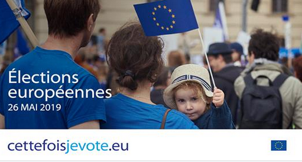
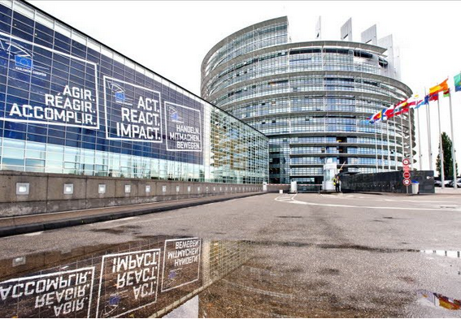

Les élections au parlement européen ont lieu dans tout juste deux mois et comme d'habitude la participation sera plus faible que pour les autres élections. 

C'est pour lutter contre cette abstention que le site **Cette fois je vote** (*Ik stem dese keer*) a lancée sa campagne, relayée dans toute l'Europe par des volontaires et sur les réseaux sociaux où vous avez peut-être vu cette petite fille au chapeau H&M qui vous rappelle la date de mon anniversaire.

{{}}{.center}

Qui se cache derrière cette campagne et comment fait-on pour réduire l'abstention sont des questions qui me taraudent et que je vais essayer d'aborder ici. Il faudra ensuite rappeler comment voter quand on est français résident aux Pays-Bas parce que l'embarras du choix peut parfois laisser dans l'embarras.

### Pourquoi tant d'abstention ?

Les élections européennes sont moins médiatiques que les élections où les enjeux seulement nationaux passent plus régulièrement à la télé. L'agenda des élus locaux est plus lisible pour les journalistes du même pays et du coup, cela passe sous silence des discussions qui nous affectent tous mais qui sont peut-être jugée moins médiatiques parce que les seuls rapporteurs sont un député bulgare ou un commissaire portugais (Je schématise mais vous voyez le problème). Les gouvernements de tous les pays s’arrangent bien de ce désert médiatique européen. Ils rendent rarement des comptes aux journalistes quand ils vont à Bruxelles marchander des mesures avec leurs collègues. Ils évoquent bien plus volontiers Bruxelles quand un projet de loi nationale s'avère impopulaire arguant qu'il faut bien *se plier aux directives de Bruxelles* en procédure d'urgence si possible. On ne s'étonnera donc pas que l'Europe devienne impopulaire…

Pourtant ce sont ces ministres qui rédigent les directives en allant à Bruxelles et pour éviter qu'ils fassent n'importe quoi comme souvent, les textes sont coécrits avec le Parlement Européen seul organe européen élu directement. Ce statut d'élu oblige les députés européens à être à l'écoute des citoyens ce qui est la porte ouverte à tous les lobbys mais avant toute une des meilleurs portes à pousser pour faire part de ses préoccupations. C'est en tout cas mon expérience.

J'ai toujours été étonné des files d'attentes interminables aux élections présidentielles où chacun veut faire l'effort de donner sa voix parce que c'est important mais dont la voix est diluée dans parmi celles de 35 millions d'autres électeurs[^1]. Par comparaison, le scrutin européen de 2014 a vu 19 millions de votants choisir 74 élus. Un vote à l'élection européenne a donc 136 fois plus de poids pour faire la différence. Néanmoins comme dans une sorte de [paradoxe d'Allais](https://fr.wikipedia.org/wiki/Paradoxe_d%27Allais) électoral les gens préfèrent faire la queue pour un élire président qu'ils n'approuveront pas dix mois plus tard.

Aux Pays-bas, la différence est encore plus prononcée avec une participation de 81% à l'élection législative de 2017, la participation chute même en dessous de la participation française avec seulement 37% d'électeurs prenant part au vote[^2].

### Une campagne sans candidat

Depuis plusieurs mandatures déjà le parlement européen dirige une campagne transfrontalière sur l'utilité de voter pour cette assemblée que tout le monde ne connaît pas. Une occasion d'expliquer son rôle et de légitimer son utilité. En 2014, le slogan de cette campagne était **AGIR. RÉAGIR. ACCOMPLIR** ou [ACT. REACT. IMPACT](https://alexsens.typepad.com/alexsens/2013/11/act-react-impact-trois-mots-pour-des-%C3%A9lections-europ%C3%A9ennes.html) en anglais et en majuscules. Ce qui sonne bien mieux que *handelen reageren volbrengen*. Campagne au succès mitigé vu la participation.

{.center}

Pour cette année, la campagne se met du coté de l'électeur, avec un message personnifié **Cette fois je vote**, pour l'inciter à se rendre aux urnes. Le logo est moins techno(crate) et le site support montre des photos de vrais gens pour toucher plus de monde. L'imagerie reste par contre résolument pro européenne avec plein de bleu et de petites étoiles jaunes et ce ne va pas aider convaincre les électeurs qui veulent moins (ou pas) d'Europe. C'est peut-être d'ailleurs un effet voulu. Les élus eurosceptiques ne font souvent rien d'autre au parlement que d'utiliser leur siège comme une tribune pour leur résonance nationale[^3] ou un bureau bon marché pour gérer leur parti. Je pense que personne derrière cette campagne ne souhaite travailler avec un nouveau Nigel Farage alors le coté pro européen peut même être assumé.

Le complotiste, lui, sera servi s'il jette un œil sur [les partenaires](https://www.cettefoisjevote.eu/partners) verra un ramassis hétéroclite de syndicats, des maisons de l'Europe, de mouvements fédéralistes les amis de la terre et le MEDEF,  des organisations étudiantes Erasmus -où l'on pense plus à boire qu'à étudier- des plate-forme de réfugiés qui nous envahissent et autres *merdias*. En fait les partenaires listés sont les interlocuteurs relais de la campagne. Les syndicats pour le monde professionnel, les associations d'étudiants pour le monde universitaire et ainsi de suite. On notera au passage la place logique des ''maisons de l'Europe'' dont la création en parfois antérieure à la création de la [CECA](https://fr.wikipedia.org/wiki/Communaut%C3%A9_europ%C3%A9enne_du_charbon_et_de_l%27acier) et qui en ont été le mouvement populaire précurseur de l'Union Européenne.

## Le programme de campagne

La nouveauté de cette campagne n'est pas dans l'iconographie mais plutôt dans l'approche. Les européens eux même,sont invités à s'approprier la campagne et à organiser des événements pour dire **cette fois ci je vote** autour d'eux.

> Le Parlement a lancé ce dispositif en juin en demandant aux Européens non seulement de voter, mais également de faire passer le message et de mobiliser leur famille, leurs amis, leurs voisins, leur communauté pour qu’ils le fassent également.

Pour participer, il y a quelques règles à respecter comme la neutralité partisane mais en gros la manière de faire cette campagne est libre. Les événements sont ensuite annoncés sur le site de l'opération qui témoigne de la diversité des initiatives. [Aux Pays-Bas](https://nederland.ikstemdezekeer.eu/), vous pouvez  aller au théâtre voir une pièce sur le Brexit, au cinéma ou faire un Pub Quizz. Tout cela est annoncé sur **Ik stem dese keer**. Si vous êtes français des Pays-Bas, vous pouvez donc dire cela autour de vous. Pour savoir comment voter ce sera dans le billet suivant.
---
[^1]: Selon les [chiffres de 2017](https://www.interieur.gouv.fr/Elections/Les-resultats/Presidentielles/elecresult__presidentielle-2017/(path)/presidentielle-2017/FE.html)
[^2]: Selon les [chiffres de 2014](https://www.verkiezingsuitslagen.nl/verkiezingen/detail/EP20140522)
[^3]: Il y a aussi des députés pro européens qui font la même chose mais il est quand même pour eux de cracher dans la soupe.