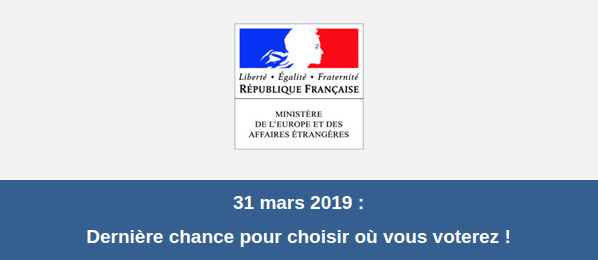
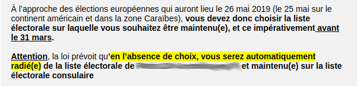

Les élections au parlement européen ont lieu dans tout juste deux mois et comme d'habitude la participation sera plus faible que pour les autres élections. 

C'est pour lutter contre cette abstention que le site **Cette fois je vote** (*Ik stem dese keer*) [lancée par le parlement européen](/Cette-fois-je-vote) incite les citoyens à se rendre aux urnes et à inviter leur voisins.

{.center}

<!--excerpt-->
Participer à l'élection au parlement européen est un droit garanti par les traités (depuis Maastricht) pour tout citoyen Européen où qu'il habite au sein de l'Union. Ce droit est maintenant connu mais **comment voter quand on n'habite pas dans son pays** est encore une question qui revient souvent. Voyons donc les possibilités qui sont offertes **aux français vivants aux Pays-Bas** et les démarches pour chaque option.

## Voter pour une liste française

Avant 2019, il était possible pour les français résident à l'étranger d'être inscrit à la fois en France dans son ancienne commune et à l'étranger dans son consulat de rattachement. Ce n'est plus le cas et il est maintenant obligatoire de faire le choix de où voter à l'inscription. Le consulat l'a d'ailleurs rappelé dans un récent mail.

{.center}

Concrètement ceux qui étaient inscrits à la fois en France et dans leur consulat devront choisir. Par défaut c'est l'inscription à l'étranger  sur les listes consulaires qui est conservée. La radiation sera donc prononcée automatiquement pour les inscriptions en France.

{.center}.

Puisque la France a une circonscription unique pour l'élection au parlement européen, les électeurs inscrits en France et ceux inscrits à l'étranger voteront pour les même personnes. Le choix va donc se faire sur des modalités pratiques mais il ne faut pas oublié qu'inscrit à l'étranger, un électeur ne pourra plus voter aux élections régionales, départementales et communales.

### Voter aux Pays-Bas

Pour voter aux Pays-Bas au bureau de vote qui sera vraisemblablement au nouveau [consulat d'Amsterdam](/fin-de-la-maison-Descartes), il suffit d'être inscrit sur la liste électorale consulaire au consulat. Si ce n'est pas le cas, il suffit de le faire avant le 31 mars soit en vous rendant sur place si vous n'êtes pas [inscrit sur le registre consulaire](/carte-inutile), soit en ligne [via service-public.fr](https://www.service-public.fr/particuliers/vosdroits/F33307) si vous êtes déjà inscrit sur le registre consulaire. Les globe-trotteurs peuvent même mettre leur inscription à jour à distance.

### Voter en France

Pour voter en France, il faut aussi agir vite. Si vous êtes inscrit à l'étranger il faut **demander votre radiation de la liste consulaire avant le 31 mars**. Si vous ne pouvez pas vous rendre en France pour voter vous pourrez mandater la personne de votre choix votant dans la même commune que là ou vous êtes inscrit·e. La procuration peut être établie au consulat ce qui allège le bilan carbone de votre vote.

## Voter pour une liste néerlandaise

Pous voter aux Pays-Bas la procédure est plus simple. Votre [inscription à la mairie](/mes-premiers-pas-comme-immigre) (Pour Amsterdam vous passerez par [INAmsterdam](https://www.iamsterdam.com/en/our-network/in-amsterdam) qui accueil les expats) suffit pour que vous receviez les informations nécessaires directement chez vous. Les néerlandais reçoivent directement leur carte d'électeur mais les étrangers doive avant cela remplir le formulaire Y-32. Ce dernier est envoyé chez vous et il faut le renvoyer au moins deux semaine avant le scrutin [nous rappelle le bureau des élections](https://www.kiesraad.nl/verkiezingen/europees-parlement/stemmen/niet-nederlandse-inwoners) *kiesraad*. 

Si vous avez rempli ce formulaire une fois, vous n'aurez plus à le faire et vous recevrez automatiquement votre carte d'électeur *Stempas*. J'ai [rempli ce formulaire en 2009](/bientot-les-elections), justement avant les élections européennes de cette époque ; je n'ai donc plus à le faire.

{.center}

## Voter dans les deux pays
Ce n'est évidement pas possible.

Les français qui auront voté aux Pays-bas le mercredi ne pourront pas se présenter au bureau de vote où ils sont inscrits en France le dimanche. Les administrations de chaque pays se communiquent les données des votants étrangers et dans le bureau de vote français, le cahier d'émargement sera marqué pour vous empêcher de voter. Si cet échange n'a pas lieu `a priori`, je vous déconseille de voter, la vérification a lieu `a posteriori` et il le contrevenant s'expose à une sanction pouvant aller jusqu'à 15.000 euros d'amende.

## Pour les non-français ?

Tous les étrangers résident (depuis plus de 5 ans) peuvent voter aux élections municipales aux Pays-Bas mais pour les élections européennes seuls les ressortissants européens peuvent voter. C'est un des acquis du traité de Maastricht. Seulement chaque pays gardant sa tradition pour l'organisation du scrutin, il est des différences qui ne sont pas abordées ici. Par exemple, les Belges et les Luxembourgeois ont le vote obligatoire et ce serait intéressant de savoir comment se passe leur participation à cette élection. Ce sera l'objet d'un troisième et dernier billet consacré à l'élection au parlement européen de 2019.
