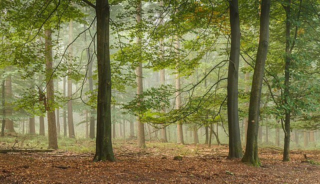

Il m'est arrivé aujourd'hui une anecdote rigolote en regardant la photo du [13 janvier de Wikimedia Commons](https://commons.wikimedia.org/wiki/File:Wandelen_over_de_Planken_Wambuis_vanuit_Mossel_069_A.jpg).  

J'avais légendé cette photo d'**Agnes Monkelbaan** :
{.center}
> Promenade dans le **Planken Wambuis** dans la région du **Veluwe**, province de **Gueldre**, **Pays bas**

Après que j'ai enregistré mon ajout sur Wikimedia Commons, un certain Vigneron a repris ma prose en changeant la légende qui donne maintenant :

{.center}
> Promenade dans le **Planken Wambuis** dans la région du **Veluwe**, province de **Gueldre**, **Pays-Bas**

Personne ne suit mon blog (d'assez près) pour savoir que j'ai changé ma façon d'écrire le nom de mon pays hôte depuis quelque temps. J'ai commencé en écrivant **Pays-Bas** avec des majuscules partout et un tiret au milieu mais depuis que je suis allé en **République tchèque**, pays dont le nom s'écrit sans tiret et avec une seule majuscule, je me devais d'être cohérent et écrire donc **Pays bas**, sans tiret et avec une seule majuscule. Persuadé que c'était la meilleure façon de l'écrire, je me suis mis à répandre cette graphie dans tous mes textes faisant économiser des majuscules à de nombreux imprimeurs. Même sur Wikipédia.

Après [les éditions de la princesse](/editions-de-la-princesse), étudions donc les éditions du Vigneron. Cet éditeur vigilent [a changé](https://commons.wikimedia.org/w/index.php?title=File:Wandelen_over_de_Planken_Wambuis_vanuit_Mossel_069_A.jpg&diff=334715183&oldid=334555068) tous mes « **Pays bas** » en « **Pays-Bas** ». Cette modification m'a donc rendu curieux et j'ai donc vérifié dans la [liste des états membres](http://www.un.org/fr/member-states/) des **Nations Unies**. Je pense que l'ONU est une autorité valable pour vérifier l'orthographe mais j'ai aussi consulté le **Conseil national de l’information géographique** qui dépend du gouvernement français et qui publie [sa liste des pays en PDF](http://cnig.gouv.fr/wp-content/uploads/2018/07/CNT-CNIG-Pays-et-villes-du-monde_r%C3%A9sum%C3%A9.pdf).

Les Pays-Bas ont donc un tiret et deux majuscules.

### Nouveau mot: Nederlanden

Le nom officiel local des Pays-Bas est *Koninkrijk der Nederlanden* qui se traduit évidement en **Royaume des Pays-Bas**. Ce le nom officiel et la traduction se fait donc au pluriel puisque ce royaume est composé de plusieurs pays. Il y a les pays qui formaient avant [les Antilles néerlandaises](/nouveaux-codes-iso-hollandais): Curaçao, Aruba et Saint-Martin ainsi que le pays qui constitue l'essentiel de la population et de la superficie du royaume, le Pays bas qu'on appellerait aussi la métropole si on osait une comparaison avec la France[^1] est un [pays constitutif](https://fr.wikipedia.org/wiki/Pays_constitutif).

### Nouveau mot: Nederland

Le nom officiel de ce pays constitutif, composante principale du royaume des Pays-Bas est Nederland qui devrait se traduire par *le* Pays-Bas puisque *Nederland* est un singulier. L'orthographe ne change guère puisque « pays » tout comme « bas » ont la même orthographe au singulier et au pluriel. Seulement le mot Pays-Bas est toujours pluriel en français. Ce pourrait être pour se rappeler l'histoire des Provinces Unies qui ont marqué ce pays mais je pense que c'est avant tout un amalgame pratique. Après tout quand on est dans le Veluwe on se trouve à là fois dans le Pays-Bas constitutif[^2] et dans le royaume des Pays-Bas, donc dans les deux Pays-Bas[^3].

## Quelles règles pour nommer les pays en français

Pour revenir à la **République tchèque** et aux **Pays-Bas** on constate qu'il y a deux règles différentes pour orthographier les noms de pays en français, notamment les noms de pays composés (les noms, pas les pays). Essayons de reprendre la liste des Nations Unies et d'en tirer des conclusions qui nous aiderons tous.

### Les républiques et les autres
Les républiques ne prennent pas de tiret ni de majuscules sur les mots suivants. Sauf la **République démocratique du Congo** mais là c'est parce que le dernier mot est un nom propre c'est le nom d'un fleuve. Les autres structures politiques prennent un tiret comme le **Royaume-Uni**, les **États-Unis** C'est sûrement le « Uni » qui impose son trait-d'union puisque le nom officiel de la Tanzanie est la **République-Unie** de Tanzanie. Mais puisqu'il faut une exception, Les Émirats arabes unis n'ont ni tiret ni majuscules.

### Union et trait d'union
Tout comme « uni », le « et » impose le trait-d'union comme pour **Antigua-et-Barbuda** Le « de » ou « d' » n'en prend pas. On écrira donc **Côte d'Ivoire** et **Etats-Unis d'Amérique**. C'est la même logique qui relie la Bosnie et l'Herzegovine dans **Bosnie-Herzégovine** et qualifie l'Arabie des Saoudiens **Arabie saoudite**.

### Nord et sud
Les pays du nord et du sud ne prennent pas de tirets mais des majuscules l'**Afrique du Sud** tout comme la **Corée du Sud** et plus au nord, **la Corée du Nord** et le **Soudan du Sud** ont tous les même règles. Facile.

### Les saints
Les saints prennent tous des tirets et des majuscules **Saint-Vincent-et-les Grenadines** comme **Sainte-Lucie** et les autres saints sauf **Sao Tomé-et-Principe** sans doute parce que ce n'est pas un saint français[^4]. Les noms composés étrangers n'ont d'ailleurs pas de tiret non plus. **Sierra Leone** tout comme le **Costa Rica** et le **Sri Lanka** sont là pour le prouver. Le **Timor-Leste** est l'exception qui confirme la règle. Par contre les noms traduits en français prennent des tirets comme dans les archipels du **Cap-Vert**, de **Nouvelle-Zélande**, **Nouvelle-Calédonie** , ou **Trinité-et-Tobago** sauf si ces archipels sont formés d'îles comme les **Îles Marshall** ou les **Îles Salomon**.

### Les Guinées
Pour les Guinées c'est comme pour les républiques, celles avec un adjectif ne prennent ni tiret ni majuscule alors que celle avec un nom propre prennent une majuscule avec tiret. On écrit **Guinée équatoriale** mais **Guinée-Bissau**. La **Guinée** tout court ne prend pas de tiret sauf si on écrit **Guinée-Conakry** comme parfois pour ne pas la confondre avec les autres Guinées. La **Papouasie-Nouvelle-Guinée** place ses tirets avant mais bon, ce n'est pas vraiment la Guinée.

Quand aux **Pays-Bas**, ils sont l'exception de la règle de l'adjectif qui ne prend pas de majuscule ni de tiret comme dans **Arabie saoudite**, **République dominicaine** et **Guinée équatoriale**. J'ai bien fait de me renseigner, les règles sont tellement simples que je ne referais plus de fautes.

## Une exception qui vient de loin
Suite au partage de cette histoire sur facebook, on m'a signalée [la page Wikipedia sur l'origine du mot Pays-Bas](https://fr.wikipedia.org/wiki/Pays-Bas_(toponymie)) qui explique un tant soit peu cette exception. Le terme **Pays-Bas** est aussi ancien que *Nederlanden* et date de l'époque ou la région était bourguignonne. *niederen [Rhein]lande* a été traduit en français par « les basses terres [rhénanes] » et donc les « Pays bas [rhénans] ».  Le tiret et la majuscule sont arrivés par la suite en considérant l'ensemble comme un nom propre, pour les distinguer des « États de par-delà » (la Bourgogne et la Franche-Comté). C'était au XVIᵉ siècle et même si depuis, la région connu de nombreux régimes, le nom du pays est resté le même.

---
[^1]: C'est d'ailleurs une mauvaise comparaison puisque trois communes (à statut spécial) ne sont pas situées en Europe. [Les communes BES pour Bonaire, Saint Eustache, Saba](/nouveaux-codes-iso-hollandais).
[^2]: Je parle ici de bassesse en altitude. Je ne voudrais pas qu'on me refasse le procès des Basses-Alpes et de la Loire-Inférieure.
[^3]: Ne jamais essayer cette cascade verbale avec la France.
[^4]: Le nom français de **Saint-Kriss-et-Nevis** serait en fait **Saint-Christophe-et-Néviès** mais comme les mots « saint » et « et » ne sont pas étrangers on accepte les tirets.

<!-- post notes:
Les tirets dans les toponymes aux Pays-Bas aussi ?
http://meinamsterdam.nl/admin/post.php?id=78
https://fr.wikipedia.org/wiki/Edam-Volendam
http://monsu.desiderio.free.fr/curiosites/villes.html
--->
