Nous avons déjà vu sur ce blog, à l'aide de jolies cartes, quels étaient [les endroits les plus photographiés à Amsterdam](/le-amsterdam-des-touristes-et-loacaux). Les statistiques de flickr permettent de voir qui prennent les photos à quels endroits mais nous n'avons pas vu les photos en question. Voici donc pour me rattraper une** liste des photos les plus clichées d'Amsterdam** que les touristes aiment à montrer dans les soirées diapos à leur retour ou bien sur leur réseau social préféré. Cette sélection pointilleuse a été faite en toute subjectivité.

<!--excerpt-->
## 1. Les maisons à galbe
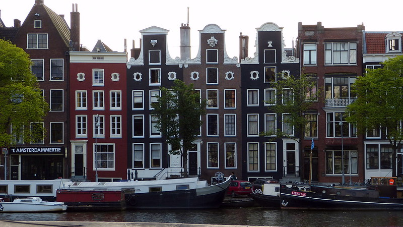{.center}
*Photo par [Mariano Mantel](https://www.flickr.com/photos/mariano-mantel/9688550071/)*

Le classique par excellence, la maison à galbe d'Amsterdam est photographiée sous toutes les coutures depuis la classique rangée vue de face avec si possible reflets dans le canal jusqu'à la contre plongée audacieuse. La rangée est possible pour les maisons au bord des canaux mais dans les petites ruelles comme [les 9 stratjes](/les-neuf-ruelles-9-straatjes) La contre plongée est en fait le seul moyen.

## 2. I amsterdam les lettres
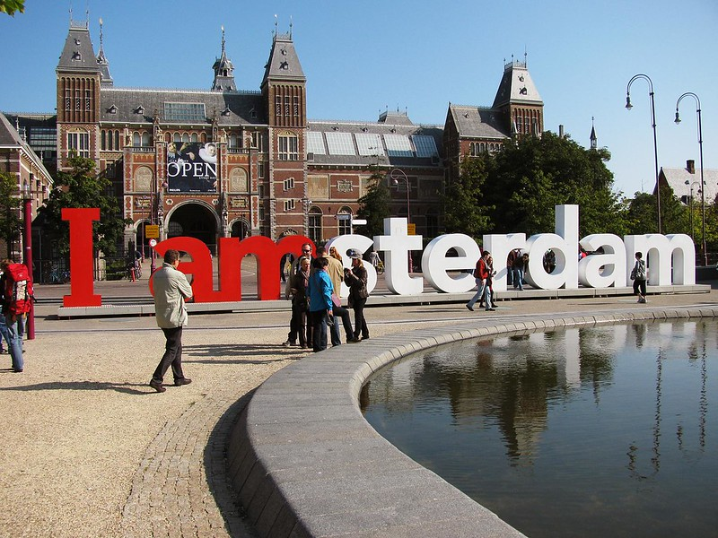{.center}
*Photo par [Evan Jackson](https://www.flickr.com/photos/huubzeeman/43078065235/)*

<!-- [{.center}](https://www.flickr.com/photos/huubzeeman/43078065235/in/photostream/)   Gone -->
L'outil marketing de l'office de tourisme pour la promotion de la ville est devenu une attraction touristique à elle toute seule. Je ne sais pas si le plus intéressant est la photo des lettres ou les poses que prennent tous les gens qui s'amusent autour. Certains me diront que ces lettres ont disparu mais rien n'est plus faux. Elles étaient avant exposées sur museumplein mais l'espace ayant été jugé top petit pour recevoir la foule de touristes qu'elles ont été déplacées ailleurs en ville. On en trouve d'ailleurs plusieurs exemplaires, devant le parc des expositions RAI, sur la rive sud du lac de Sloterplas et à l'aéroport de [Schiphol](/tag/schiphol) (qui du coup n'est pas  Amsterdam)

## 3. Le vélo sur un pont
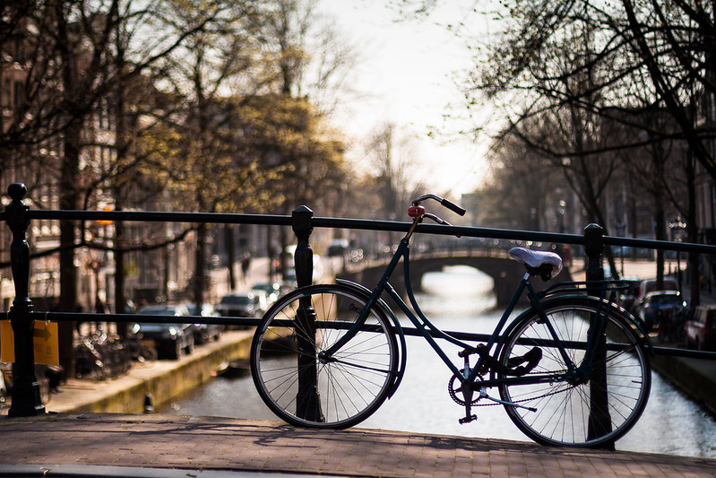{.center}
*Photo par [Roberto Polendo](https://www.flickr.com/photos/rpolendo/14238154798/)*

Il y a beaucoup de variante sur ce thème, tout dépend du vélo et du pont, plus ils sont vieux plus la photo est glamour, sauf si le vélo est abandonné, à moitié démonté ou s'il pendouille au bout de son antivol de l'autre coté de la barrière, ce qui est un autre genre de photo. Ce thème est aussi un classique de photo sous la neige (et [je m'y suis mis dès 2006](/la-temperature-ressentie)…).

## 4. Le red light district
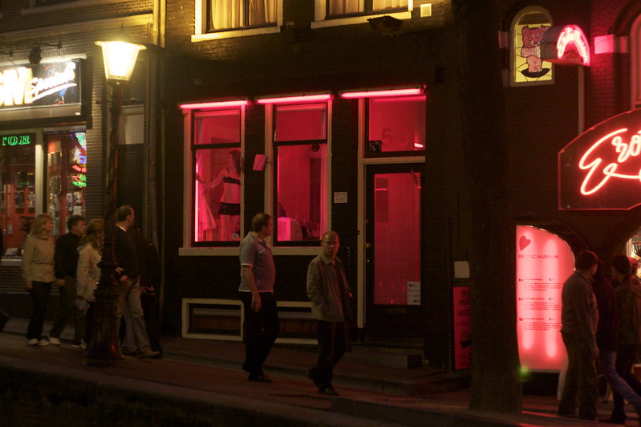{.center}
*Photo par [Gina Collecchia](https://www.flickr.com/photos/recphoto/3912613424/)*

Les lumières rouges des échoppes de passe ont renommé le quartier *de Wallen* en Quartier *rouge*. Même si les autocollants sur les vitrines interdisent les photos dans les rues du quartier rouge, les touristes qui passent en bateau sont à l'abri des remontrances et mitraillent à tout va.

## 5. La toile de maître
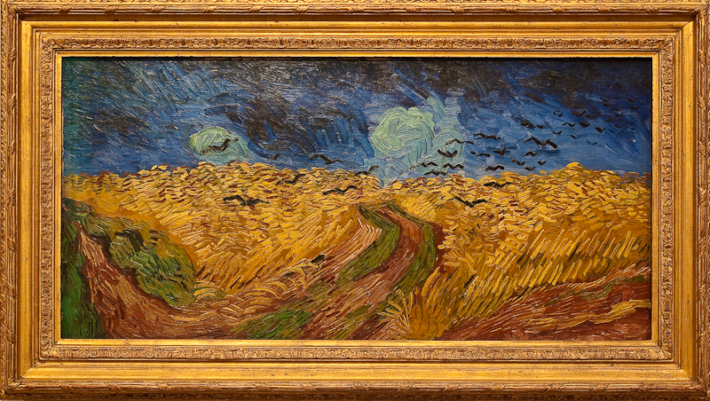{.center}
*Photo par [Michele Ahin](https://www.flickr.com/photos/michelelovesart/3675902629/)*

Avec le Rijksmuseum et le Van Gogh museum et le nouveau Stedelijkmuseum la place des musées regorgent d'occasion de faire des selfies avec des grand classiques flamands et hollandais ou bien regarder les visiteurs se tordre devant des installations modernes. Même si les prises de photos sont interdites dans certaines sales. Parmi les longues files de touristes à l'entrée de ces musées il y a toujours des contrevenants qui prendront <b>la photo cliché de la toile de maître</b>. Sinon vous pouvez préférer la maison de Rembrandt ou le passage des gardes civils derrière [le musée historique](/gratis-week-in-ahm) qui offrent un cadre plus intime et sans file d'attente pour shooter des toiles

## 6. Le grafitti
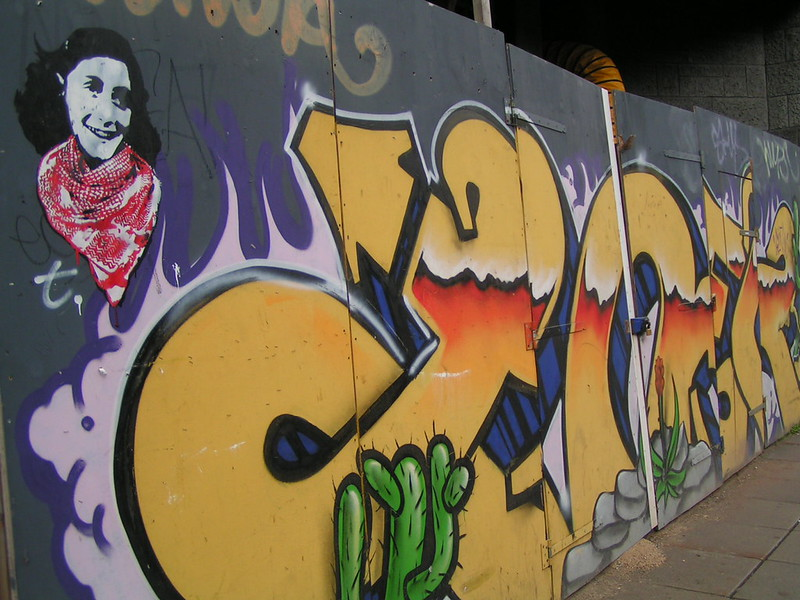{.center}
*Photo par [ceronne](https://www.flickr.com/photos/ceronne/403997791/)*

L'art de rue est un classique des grandes métropoles mais Amsterdam se distingue encore avec des production locales assez uniques et bien disséminés dans la ville comme [l'artiste t.](/anne-frank-en-keffieh) ou [laser 3.14](/laser-314). Mais souvent n'ayant pas le temps de fouiller les palissades de chantier, le touriste s'attardera sur Spui qui conserve par tradition quelques squats de la grande époque décoré comme il se doit de graffitis de pied au toit.

## 7. Le marché
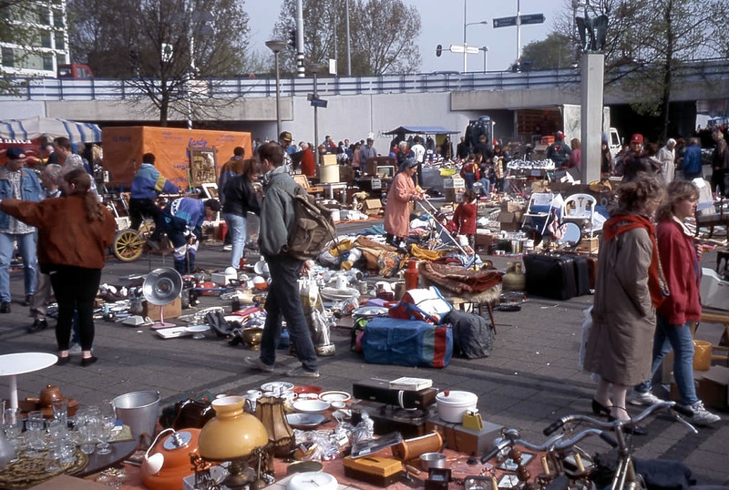{.center}
*Photo par [David Stanley](https://www.flickr.com/photos/davidstanleytravel/6474737685/)*

L'expérience de la vente et du marchandage est une des occupations principale de [la fête du roi](/nouveau-mot-bezet) mais les autres jours de l'année les chineurs peuvent s'adonner leur sport préféré en plusieurs point de la ville. Il y a d’abord le [Marché Albert Cuyp](/albert-cuyp-le-marche) en semaine mais surtout pour les touristes du week end, les marchés du Jordan sur Noordermarkt et Westerstraat et celui, un peu plus à l'est, de Waterlooplein qui valent le détour pour leurs tas de brics et de brocs. La photo ci-dessus est plus exotique, prise dans les quartiers nords sur Mosveld.

## 8. Le sabot
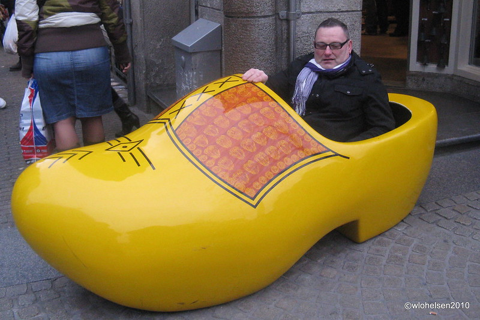{.center}
*Photo par [William](https://www.flickr.com/photos/benidormone/4435428051/)*

Les hollandais portent tous des sabots. Même si cette chaussure de bois est encore utilisée par les ouvriers paveurs cela reste quand même une tradition du siècle passé. Qu'importe, c'est une tradition qui se vend bien et même si les vrais sabots ne se vendent plus aussi bien qu'avant, il en reste en version grand format devant quelques échoppes pour touristes. Le sabot devant une boutique du Damrak est surement un des haut lieux photographiques de la ville. Alors n'hésitez pas, sautez dans le sabot vous aussi. 

## 9. Les bateaux
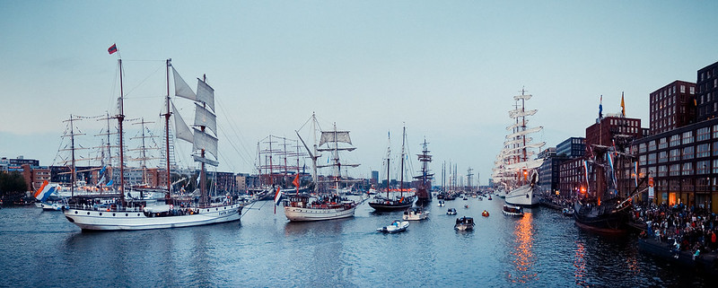{.center}
*Photo par [Jannes Glas](https://www.flickr.com/photos/januski83/20700912756/)*

Ave les kilomètres de canaux qui strillent la ville, le bateau est un des meilleur moyens pour découvrir Amsterdam. Forcément il y a plein de bâteaux mouches et de pédalos qui font la joie des touristes pour les promenades autant que pour les photos. Les péniches-d'habitation sont aussi une marque typique des vues aquatiques d'Amsterdam. Il y a divers modèles photogéniques depuis la maison peinte jusqu'à la maison sur le toit. Mon sujet bateau préféré est quand même **Sail**, [la rencontre des grands voiliers](/sail-2010) près de l'île de Java. Comme cette rencontre n'a lieu que tous les 5 ans, il reste possible de photographier Het Schip, le vieux gréement de la VOC amarré derrière le Musée de la marine.

## 10. Le moulin
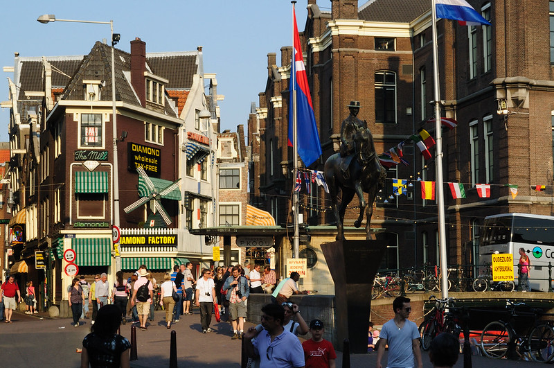{.center}
*Photo par [Toni Almodóvar Escuder ](https://flic.kr/p/9CiBKe)*

Cliché hollandais jusque dans les publicités des agences de voyage, le moulin est inévitable pourtant il n'y en a plus beaucoup à Amsterdam. Grâce à ce blog, vous savez qu'il y a [huit moulins à Amsterdam](/la-carte-des-moulins-d-amsterdam) et vous pouvez même les trouver sur la carte.  Ceux qui n'ont pas eu la chance de préparer leur voyage avec mon blog se rabattent parfois sur le petit moulin de la devanture du magasin de diamants « The Mill », un attrape touriste près de Rokin. D'autres iront en voyage à porté de bus à l'écomusée de Zaanse Schans.

## 11. La devanture de coffeeshop
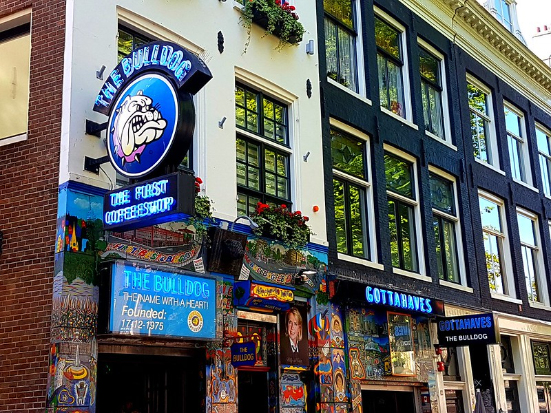{.center}
*Photo par [Ali Mannan](https://flic.kr/p/2emRxgT)*

Rares sont les voyages à Amsterdam sans anecdote liée à la drogue locale disponible légalement. Ce peut-être le copain absent le lendemain après avoir mangé trop de space cakes ou cet autre défoncé qu'il faut rafraîchir  sur les marche d'un coffeeshop parce que son essai de la bheue locale a plus que réussi. Bref le coffeeshop est le passage obligé de tout bon trip dans la ville de Rembrandt et certains de ces commerces se sont fait des noms qui dépassent les frontières. La devanture est donc immortalisée sur pellicule ou sur Instagram. Variante: une photo de l'intérieure en train de tirer sur un joint.

## 12. Les tulipes à Amsterdam ou autour de Keukenhof
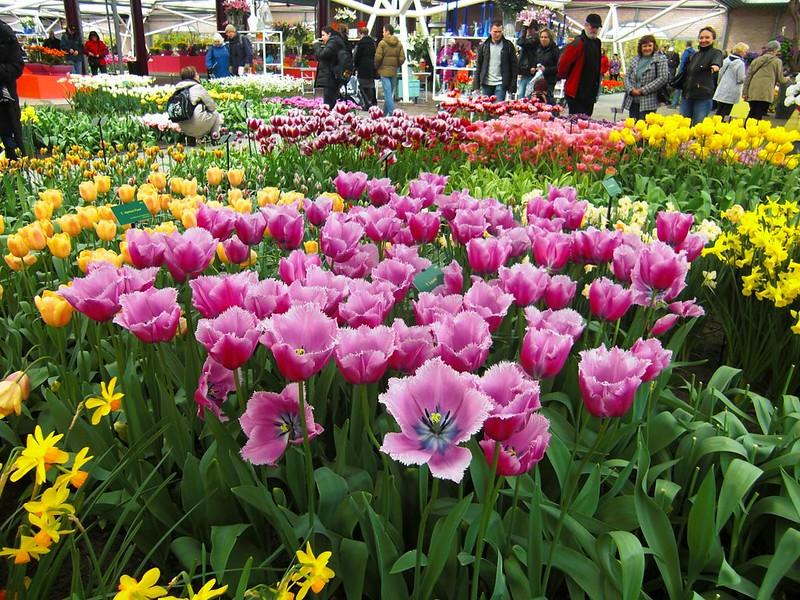{.center}
*Photo par [David Zellaby](https://flic.kr/p/bQnXvv)*

Le marché aux fleurs d'Amsterdan est un haut lieu de photographie même si ces dernières sont interdites dans les stands. Peut de stand d'ailleurs mettent en avant [les tulipes colorées à bon prix](/1637-krach-de-la-tulipe), Seulement une à chaque extrémité pour attirer le chalant. Cela peut donner de bonnes images mais, quand c'est la bonne saison, les champs de tulipes autour d'Amsterdam permettent des prises de vue bien plus clichées. Techniquement on peut retrouver des champs de fleurs tout autour d'Amsterdam même au nord vers Alkmaar mais la région la plus connue est au sud-ouest, celle autour de Lisse où se visite [le parc floral de Keukenhof](/les-derniers-jours-de-keukenhof). Quand c'est la saison, s'y [balader à vélo](/la-sortie-tulipes-2011) est un must pour qui veut collecter des photos clichés.

<!-- post notes:
VOIR AUSSI :
http://www.parool.nl/parool/nl/34261/PS/article/detail/3968728/2015/04/21/Dit-zijn-de-10-grootste-fotocliches-van-Amsterdam.dhtml
https://www.parool.nl/stadsgids/dit-zijn-de-10-grootste-fotocliches-van-amsterdam~a3968728/ 
la suite de http://meinamsterdam.nl/admin/post.php?id=602 
https://www.flickr.com/photos/gags9999/14168514772/
--->
