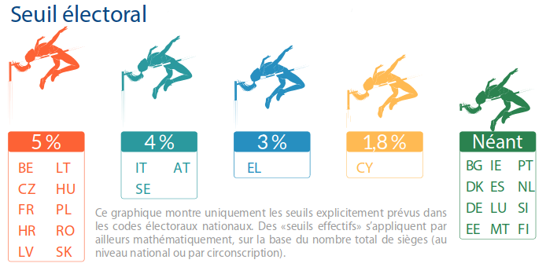
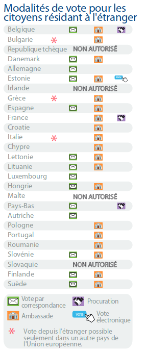

Les élections au parlement européen ont lieu dans tout juste deux mois et comme d'habitude la participation sera plus faible que pour les autres élections. 

C'est pour lutter contre cette abstention que le site **Cette fois je vote** (*Ik stem dese keer*) [lancée par le parlement européen](/Cette-fois-je-vote) incite les citoyens à se rendre aux urnes et à inviter leur voisins.

{.center}

Les traités européens (depuis Maastricht) garantissent à tout citoyen européen de voter où qu'il habite en Europe. Cette volonté de rendre tous les européens égaux devant le vote a ses limites puisque chaque pays a le droit d'organiser les élections comme il veut. Après avoir vu les [différentes possibilités offertes aux français des Pays-Bas](/Comment-les-francais-peuvent-voter-aux-Pays-Bas), **petite revue des différences par pays :**

Si les états doivent se conformer aux traités européens en faisant participer les « étrangers », les états membres gardent toute liberté pour l'organisation de cette élection. En règle générale chaque état garde les mêmes habitudes que pour ses élections habituelles. Ainsi, les Pays-Bas comme la France autorisent leurs ressortissants résidant à l'étranger à prendre part au scrutin (ce qui n'est pas le cas de Malte ou de la République tchèque). Cependant, les néerlandais utilisent le vote par correspondance postale tandis que les français vont mettre en place des bureau de vote physiques dans les ambassades ou même d'autres lieux hors du sol français.

Au sein du *think tank* du parlement Européen, Alina Dobreva, Giulio Sabbati et Gianluca Sgueo on pondu [une infographie](http://www.europarl.europa.eu/thinktank/en/document.html?reference=EPRS_ATA(2018)623556) qui aligne en une page les différences entre tous les pays membres. Cela met en évidence des différences culturelles comme le jour d'élection dans chaque pays mais aussi les inégalités devant le vote comme on l'a vu pour les citoyens qui ne vivent pas dans leur pays.

## Le nombre de députés passe de 751 à 705.

((/public/images/scans/stats/nombre-de-deputes.png|Le nombre de député au parlement européen 751 → 705|Nombre de députés au parlement européen|C))

Cette baisse s'explique par le retrait du Royaume Uni car même s'il n'est pas encore acté, il reste prévu tel que signé en mars 2017[^1]. Malgré cela, certain pays gagnent en nombre de sièges selon leur évolution démographique. Ainsi la France gagne 5 sièges et les Pays-Bas en gagnent 3 ce qui est plus proportionnellement. La palme de l'augmentation est celle de l'Estonie qui gagne 1 siège de plus et passe à 7 députés européens pour la prochaine mandature.

## Tout le monde ne vote pas le même jour

{.center}

On a vu que les traditions électorales étant différentes d'un pays à l'autre, les Néerlandais votent les premier le jeudi 23 tandis que les français votent le dimanche 26 mai avec le gros peloton des autres pays qui aiment voter le dimanche[^2]. La palme de l'originalité revient à la République tchèque dont le scrutin s'étale sur deux jours du vendredi 24 midi au samedi 25 à midi.

## Les modalités de scrutin diffèrent
Le scrutin est un de type proportionnel dans tous les pays parce que c'est imposé par le droit européen mais en dehors de cela de nombreux détails qui affectent les résultats diffèrent. La France a rejoint pour ce scrutin la majorité des pays qui n'ont qu'une circonscription unique pour tout le pays ce qui devrait offrir plus de pluralisme dans la représentation.

{.center}

Autre règle affectant le pluralisme est le seuil d'éligibilité d'une liste. En France comme dans de nombreux pays ce seuil est de 5% ce qui peut écarter de la représentation certaines petites listes dont le score est par ailleurs satisfaisant. En Allemagne qui n'a pas de seuil d'éligibilité, des petits partis comme le **Parti Pirate** ou **die Partei** ont obtenu chacun un siège avec moins de 3% des voix. On notera que ce certains petits pays n'ont pas de seuil d'éligibilité das le code électoral mais un seuil mathématiquement élevé vu le nombre de sièges disponible. Par exemple à Chypre ou au Luxembourg, il faut remporter plus de 14% des voix pour s'assurer un siège.

## Les expatriés

{.left} Là où les différences sont le plus marquées sont pour les citoyens européens ne résident pas dans le pays où ils votent. Les Irlandais par exemple perdent leurs droits civiques en quittant leur pays. Pour les tchèques il est possible de voter pour les élections présidentielles depuis l'étranger mais pas pour les élections au parlement européen. Il reste à ces derniers, avec les Maltais et les Slovaques, l'option de voter dans leur pays de résidence s'ils habitent en Europe, [comme expliqué dernièrement](/Comment-les-francais-peuvent-voter-aux-Pays-Bas).

Pour les européens restants, il est toujours possible de voter pour l'élection organisée dans leurs pays mais selon le pays, les options diffèrent entre vote par correspondance, à l'ambassade ou bien la procuration envoyée au pays. L'Estonie se démarque en étant le seul pays permettant le vote par Internet ce qui est une possibilité offerte aussi aux résidents à chaque scrutin depuis des années.

Il y a encore d'autres différences moins notables qui sont présentée dans cette infographie très européenne. D'un coup d'œil, elle montre la diversité des approches pour remplir un devoir commun.
---
[^1]: Le Brexit, l'article 50 du traité de Lisbonne et tout ça…
[^2]: Oui les noms des pays sur l'infographie sont classées par ordre alphabétique non français ce qui peut faire bizarre en français. D'autant que la base pour les calendriers est l'anglais mais la base pour les résidents à l'étranger est le nom local (endonyme comme on m'a dit que cela se disait).
<!-- post notes:
http://www.europarl.europa.eu/RegData/etudes/ATAG/2018/623556/EPRS_ATA(2018)623556_FR.pdf
--->
