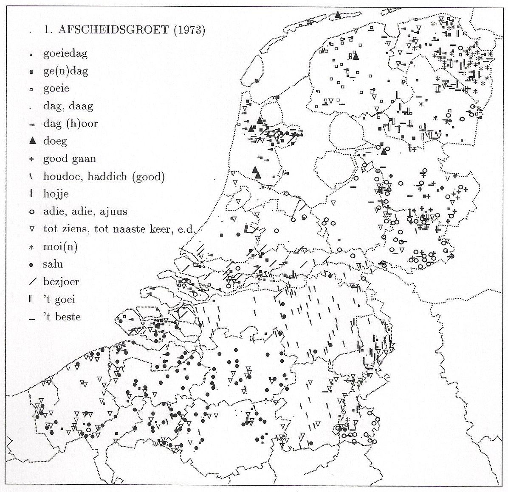
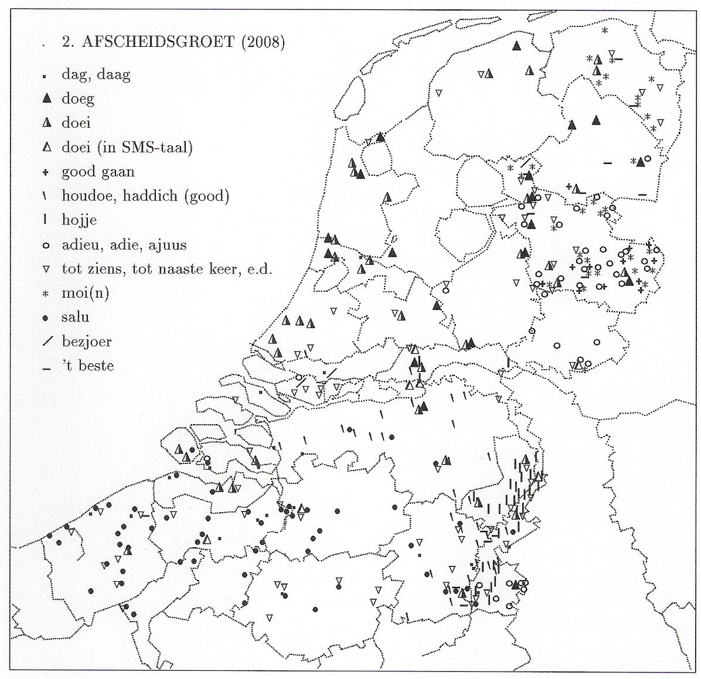

Je vous ai parlé de ce [curieux tic de langage](/doei) *Doei doei* que ce lançaient les amstelodamois pour se saluer avant de se quitter. Il semblerait que ce soit un phénomène local et que le "Salut" néerlandais se décline de nombreuses manières différentes selon la ~~région~~ province. 

Ailleurs, on se salue plutôt à base de *Moi*, *adieë*, *daag* ou même *salu*. Lisez plutôt:

**Jan Stroop**, est un liguiste du néerlandais, un *Neerlandicus* comme il aime s'appeler dans la langue de Willem Godschalck van Focquenbroch. Il enseigne à l'université d'Amsterdam et habite à Zaandam. Il rappelle souvent que *doei* est une salutation récente et qu'elle est devenue à la mode à Amsterdam après qu'il a écrit en 1974 à propos des salutations de départ et donné l'exemple du *doeg* de sa région d'origine: **le Zaanstreek**. À l'époque *doeg* était utilisé seulement à Zaandam et dans quelques coins de Frise. Il illustrait son propos d'une illustration plaçant sur une carte les réponses à la question suivante:

## « Quel est la salutation la plus courante dans votre dialecte quand vous vous quittez? »

La question a été posée en 1973 à des centaines de personnes par le très sérieux *Dialectenbureau* (qui est devenu plus tard le *Meertens Instituut*). Les réponses ont été très variées, de *Gooeiedag* à Dag' de Hondoe à Hojje en passant par adie, besjour ou salu qui peuvent rappeler des équivalents français ou bien moi(n) qui sonne luxembourgeois. Ceci indique le dynamisme des dialectes régionaux aux Pays-Bas ce qui peut surprendre quand on vient de France, pays bien plus grand mais avec peut de régionalismes dans la langue. Le linguiste Jan Stroop a donc placés toutes les expressions relevées sur une carte pour en constater leur homogénéité régionale.

{.center}

Le *Deog* cité plus haut est bien présent uniquement sur **Zaandan** où deux triangles sont bien visibles. D'autres triangles se sont aussi perdus en frise occidentale et sur **Terschelling**. C'est ce *Doeg* qui a donné ensuite le Doei bien connu. Outre cette salutation de départ, on entend des adie, adie ou ajuus en Drente et au sud du Limbourg. Le Limbourg, proche de Liège subit naturellement l'influence du français mais pour la province de Drente cette salutation, proche du adieu français est plutôt mystérieuse… Le *salu* se retrouve comme attendu en Belgique, près de la frontière linguistique même si son usage remonte jusqu'au Brabant septentrional.

Les langues évoluent et les régionalismes. Jan Stroop s'est donc demandé comment avait évolué les mœurs de salutations quand on se quite dans les différentes régions des Pays-bas. Il a donc repris les résultats d'un enquète de la *Stichting Nederlandse Dialecten*, la fondation des dialectes néerlandais qui a posé la même question à 325 personnes dans tout le pays en 2008.

{.center}

Comme prévu il y a des évolutions et la plus visible est l'apparition du [doei](/doei) si facile à attraper. Il est utilisé à Amsterdam et à Zaandam (aux cotés du *Doeg*) mais aussi du nord au sud de la Hollande, de Den Helder à Rotterdam en couvrant toute le [Randstadt](/le-randstad) ce qui devrait en faire la salutation la plus utilisée vu que cette région est la plus peuplée. Mais sont utilisation va plus loin et on retrouve des locuteurs de *doei* jusqu'en Zélande, en Frise ou même à Groningue.

Il est notable que l'utilisation du *doei* n'a pas encore atteint la Belgique. Ce néologisme y est sûrement jugé trop néerlandais pour être assimilé. Les flamands gardent donc leur *salu* et leur réputation d'être les locuteurs néerlandais les plus conservateurs.
---
<!-- post notes:
http://www.janstroop.nl/oudesite/artikelen/Groetenenwensen.shtml
--->
