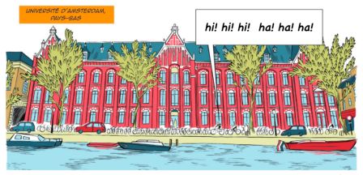
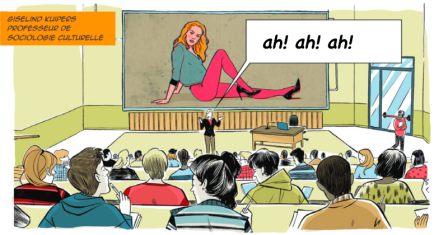

Alors que la France venait de décider son confinement et les Pays-Bas sa stratégie de la horde, l'Université d'Amsterdam UVA a ouvert [une page pour collecter les blagues sur le Covid-19](https://uvacommscience.eu.qualtrics.com/jfe/form/SV_eOGzCgEHtNW5PZX).  La page demande l'aide de chacun pour collecter les blagues, les *memes* et autre fichiers humoristiques sur le coronavirus.

C'est vrai que quand la maladie était à un stade d'épidémie régionale, les blagues commençaient déjà à circuler à propos d'un truc qu'on ne maîtrise pas bien dans un pays exotique facile d'accès grâce à Ali Express. Maintenant qu'on est en plein dedans et qu'on doit justement rester dedans, les blagues circulent tout autant sur ce truc qu'on ne maîtrise peut-être pas mieux. L'exotisme oriental a été remplacé par les tranches du quotidien, impliquant des attestations pour certains et du papier toilettes pour d'autres. Pas un jour sans blague depuis des mois. Ils doivent bien rire à l'Université d'Amsterdam.

[{.center}](/public/images/scans/bd/universite-amsterdam-pays-bas.png)

N'importe quel site de collection de blague aurait mis en ligne ce contenu social pour faire de l'audience et partager ces tranche de rigolade mais les universitaires sont des gens sérieux et même après avoir partagé une blague, impossible d'avoir accès à la collection de blagues, ''memes' et matériel humoristique. Pourquoi font-il cela alors ?

C'est une professeure de Sociologie, **Giselinde Kuipers** qui est à l'initiative de ce site et de cette collecte de blague. Ce n'est pas la première fois qu'elle s'intéresse aux blagues sur un événement tragique puisqu'au cours d'une interview elle avoue avoir déjà collecté des blagues après ce qu'elle appelle [le 9/11](https://fr.wikipedia.org/wiki/Attentats_du_11_septembre_2001) il y a 20 ans. Dans cet article *[Grappen en grollen over het coronavirus: waarom doen we dat?](https://www.scientias.nl/grappen-en-grollen-over-het-coronavirus-waarom-doen-we-dat/)* paru sur le site **scientias** la scientifique explique sa démarche.

[{.center}](/public/images/scans/bd/giselind-kuuipers-pr-sociologie.png)

### Nouveaux mots: Grappen en grollen 
Selon le Van Dale, *Grollen* veut dire **blague** alors que *Grappen* veut dire **blague**. Les deux mots sont donc synonymes. L'article pourrait donc être traduit par : **Blagues et plaisanteries sur le coronavirus: Pourquoi on fait ça ?** 

L'article n'explique pas pourquoi l'université d'Amsterdam collecte les blagues mais tente de répondre à l'envie de faire des blagues sur des sujets d'actualités graves et parfois tragiques. Il y a plusieurs raisons à ça selon la sociologue qui répond aux questions en oubliant de citer la première: parce que c'est drôle.

Les trois raisons exposées sont le besoin de communiquer sur un sujet qui nous occupe l'esprit, une manière de se sentir éloigné d'une actualité qui nous affecte mais finalement pas tant que ça et une manière d'introduire de la légèreté dans une actualité tragique. 

### Croudsourcing de blagues
Lors de son étude des blagues sur les Attentats du 11 septembre 2001 il y a  20 ans, Giselinde Kuipers n'a rassemblé qu'une centaine de blagues sur cet événement. Maintenant qu'elle est confinée dans sa maison des Pays bas alors qu'elle enseigne à l'université de Leuven en Belgique, elle a pensé que cette fois elle pourrait en rassembler plus avec l'aide du public. Elle a d'abord tweeté son appel avant de passer à l'étape supérieure avec l'aide de Mark Boukes
de l'université d'Amsterdam. La page est en ligne depuis le 24 mars et accepte les blagues dans 30 langues. C'est un véritable croudsourcing qui est maintenant en place pour aider la recherche. 

### L'humour et la beauté
Oui, oui en envoyant un blague, [vous pouvez aider la recherche|]. la Professeure Giselinde Kuipers se présente sur twitter comme étudiant l'humour et la beauté, et autres « choses futiles aux sérieuses conséquences ». Je ne peux me prononcer sur le sérieux des blagues qui seront étudiées dans le cadre de l'épidémie du coronavirus mais je veux partager une lecture sur l'autre sujet futile de la sociologue : **la beauté**. 

En effet, les illustrations de cet article sont tirés d'une bande dessinée mettant en scène Giselinde Kuipers ayant pour thème la sociologie de la beauté. Une très [très bonne lecture](https://www.erccomics.com/comics/the-sociology-of-beauty), mêlant fiction et les travaux de la professeure, pour une période où il n'est pas nécessaire de trop se montrer au monde. 

[{.center}](https://www.erccomics.com/comics/the-sociology-of-beauty)
---
<!-- post notes:
http://www.giselinde.nl/ 
https://www.sociologyofbeauty.nl/
--->
