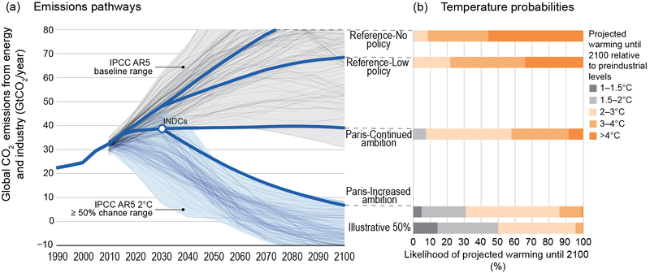

La France est le pays de **la COP21** conférence sur le climat qui a eu lieu à Paris en novembre et décembre 2015 et a débouché sur [l'accord de Paris sur le climat](https://fr.wikipedia.org/wiki/Accord_de_Paris_sur_le_climat) signé le 22 avril 2016, ratifié et entré en vigueur en novembre de la même année. C'est à ce jour l'accord international qui a été ratifié le plus rapidement vu l'urgence du changement climatique. Dans cet accord, **les états signataires s'engagent à réduire leurs émissions de gaz à effet de serre pour limiter le réchauffement de la planète à 1,5°c** d'ici la fin du siècle. Un premier point d'étape est prévu en 2020 pour revoir si possible les ambitions de l'accord à la hausse.

{.center}

Bon bien on est en 2020 et le compte n'y est pas. En fait c'est pire, l'agence météo des Nations Unies indique [qu'on pourrait atteindre le seuil de 1,5°C avant 2024](https://abcnews.go.com/Technology/wireStory/world-hit-15-degree-warming-threshold-years-71687896). La France qui a tant œuvré en 2015 pour aboutir à un accord et trouver un maximum de signataires ne semble pas du  tout montrer l'exemple pour atteindre les objectifs. Tout porte à croire que tout le monde s'en fout.

Tout le monde ? non # Une petite fondation dans un petit pays sans montagne, a pût contraindre son gouvernement de prendre des mesures réelles par voie de justice : l'affaire [Urgenda contre le gouvernement es Pays-Bas](/le-gouvernement-doit-proteger-les-gens). Un précédent. Et si ça se faisait en France aussi ?

## Ailleurs dans le monde 

L'exemple Néerlandais n'a pas attendu le verdict de la haute cour néerlandaise pour inspirer le monde entier. Les différentes marches pour le climat montrent depuis 2014 que des citoyens du monde entier tentent d'attirer l'attention des décisionnaires sur ce sujet. La veille de l'ouverture de la COP21 en novembre 2015, 600 000 personnes ont défilé à travers le monde. 

Les activistes climatiques ont déjà franchit l'étape juridique dans plusieurs pays et le plus souvent avec succès. Citons ici la Colombie, contrainte par cour suprême d'arrêter la déforestation de l'Amazonie suite à une plainte de 25 jeunes et le Pakistan contraint d'appliquer sa loi climat datant de 2012 par un agriculteur en colère[^1]. plus récemment la justice anglaise a [remis en cause l’extension de l'aéroport d'Heathrow](https://www.lemonde.fr/international/article/2020/02/27/la-justice-britannique-met-un-coup-d-arret-au-projet-d-agrandissement-de-l-aeroport-d-heathrow_6031038_3210.html) parce que le projet ne prenait pas en compte les accords de Paris.

## L’affaire du siècle

En France aussi la justice a été saisie. Sur le modèle d'Urgenda, un collectif de 4 associations françaises (la Fondation Nicolas Hulot pour la Nature et l’Homme, Greenpeace France, Notre affaire à tous, Oxfam France) lancent « **L’affaire du siècle** » qui devient en un peu plus d’une semaine, la pétition française la plus massivement signée. 600.000 signatures ont été récolté entre le 17 et le 19 décembre 2018, plus de deux millions le mois suivant. [La pétition](https://laffairedusiecle.net/petition/) accuse directement le gouvernement d'inaction dans la mise en œuvre des accords de Paris et autres traités sur le climat. La pétition finira au tribunal administratif de Paris, accompagné d'[un mémoire](https://laffairedusiecle.net/argumentaire-memoire-complementaire/) détaillant l'inaction de la France et les risques encourus par tous les administrés à cause du réchauffement climatique. 

Dans son mémoire en défense, le gouvernement français ne conteste pas le rôle de justice dans la crise climatique. —Le précédent néerlandais lui fait se concentrer sur les faits reprochés.— Il liste les mesures prises jusque là et explique que les objectifs de 2020, en fait c'est pour le 31 décembre donc on ne sait pas encore… Les associations on produit un mémoire en réplique pour expliquer que tout cela n'est que poudre de Perlin Pinpin™. Ils l'expliquent mieux que moi sur un site très bien fait. Je vous laisse donc lire directement [leur actualité](https://laffairedusiecle.net/actualites/) et tous leurs [pourquoi](https://laffairedusiecle.net/laffaire/pourquoi-attaquer-etat/) et leur [comment](https://laffairedusiecle.net/laffaire/affaire-du-siecle-au-tribunal/).

## Le procès de Grande-Synthe

### Nouveau mot: Groot-Sinten

Située en banlieue de Dunkerque (*Duinkerk*), sur la côte des Flandres françaises, cette ville au passé néerlandophone justifie que je parle d'actualité française sur ce blog batave. La commune de Grande-Synthe est connue des médias parce qu'elle accueille depuis 2006 sur son territoire le camps de réfugiés du même nom. Cette commune a, elle, aussi attaqué l'État en janvier 2019, en raison de la menace de la montée des eaux promise par le réchauffement climatique. Les associations de l'affaire du siècle se sont associés à cette plainte et ont déposé une [contribution volontaire](https://laffairedusiecle.net/2020-annee-cruciale-justice-climatique-france-grande-synthe-conseil-d-etat/). L'affaire est examiné par le Conseil d’État que le 19 novembre dernier, donne 3 mois au gouvernement pour prouver qu’il respecte ses engagements climatiques. C'est une décision inédite et une victoire pour les activistes.

### Explications

Quand le gouvernement avance qu'il est trop tôt pour prendre la mesure de l’efficacité de ses actions, il semble oublier les accords qui ont été signés sous son égide. Il suffit de regarder la courbe des scénarios d'émissions de CO2 de l'accord de Paris et les probabilités de températures pour comprendre qu'il est déjà possible de ce rendre compte dès maintenant si on est dans les clous (ou pas).

[{.center}](https://commons.wikimedia.org/wiki/File:Global_CO2_emissions_and_probabilistic_temperature_outcomes_of_Paris.png)

Pour avoir 2% de chances d'avoir des températures supérieures de 2°C en 2100 (en gris sur les diagrammes de droite), il faut suivre la courbe d'émission plate du milieu. Si on veut avoir 30% des chances de notre coté il faut suivre la courbe du bas ! 

Il ne reste plus qu'à attendre que le gouvernement nous dise où nous en sommes sur cette carte.

Le Conseil d'État a donc dit qu'il était temps que les bonnes déclarations d'intention politiques soient suivies de faits mesurables et que les élus et les ministres rendent des comptes. Mince alors, moi qui croyait que c'était le rôle des élections…

### La pétition

Pour les associations, le gouvernement ne sera pas capable de dire qu'on est dans les clous parce qu'on y est pas. Elles veulent donc accentuer la pression pour que l'exécutif prenne les mesures qu'elles jugent efficaces pour remplir les objectifs des traités. Ces mesures ne sortent pas d'un chapeau, ce sont [les 150 mesures que la convention citoyenne pour le climat ont définies|https://propositions.conventioncitoyennepourleclimat.fr/le-rapport-final/|fr|rapport final de la convention pour le climat] avec comme objectif de réduire 40% des émissions de gaz à effet de serre par rapport à 1990 d'ici 2030 (un objectif dans les clous de l'accord de Paris). 

{.center}

Cette commission a été mise en place par le Président de la République en octobre 2019, a travaillé sous l'égide du Conseil économique, social et environnemental et a rendu son rapport avec 150 propositions en juin 2020. Lors de sa création, le Président avait indique reprendre ces mesures **sans filtre**. Maintenant, même si le gouvernement indique que [certaines mesures sont déjà en place|https://www.ecologie.gouv.fr/sites/default/files/CCC_Tableau%20mise%20en%20oeuvre_Version%20du%2020%20octobre%202020.pdf|fr|TABLEAU DE SUIVI DE LA MISE EN ŒUVRE DES PROPOSITIONS DE LA CONVENTION CITOYENNE POUR LE CLIMAT] (PDF), la mise en œuvre des 150 propositions semble un peu hésiter. Le site «[Sans filtre|https://sansfiltre.les150.fr/||revue des 150 propositions de la convention citoyenne pour le climat]» recense à ce jour 0 proposition appliquée dans son intégralité, 21 en cours de discussion et déjà 3 rejetées.

En appelant à signer la pétition qui demande à *[reprendre “sans filtre” les propositions de la Convention Citoyenne pour le Climat|https://secure.avaaz.org/campaign/fr/france_convention_climat_rb3/||pétition]*, les associations derrière « L’affaire du siècle » espèrent que le gouvernement saura répondre efficacement au Conseil d'État.
---
[^1]: Lire ou écouter [Justice climatique : les précédents dans le monde](https://www.franceculture.fr/ecologie-et-environnement/justice-climatique-les-precedents-dans-le-monde) sur France Culture.
<!-- post notes:
https://secure.avaaz.org/campaign/fr/france_convention_climat_rb3/
--->
