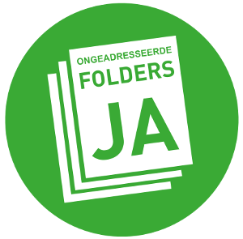

Depuis début Juillet,[ La Haye a introduit l'autocollant JA JA](https://www.denhaag.nl/fr/dans-la-cite/nature-et-environnement/tri-de-dechets-et-recyclage/ja-ja-sticker-a-la-haye.htm) pour recevoir de la publicité dans votre boîte aux lettres. Un changement radical puisque la publicité ne pourra plus être distribuée toute boite mais uniquement chez ceux qui en font la demande. Cette mesure est en fait une copiée sur Amsterdam qui en l'a mise en place il y a trois ans. Explications :

<!--excerpt-->
## Opt-in et Opt-out

Dans la collecte de donnée personnelle comme dans la distribution non ciblée de publicité les termes anglais de opt-in et opt-out reviennent souvent. Elle se réfère à l'action de l'utilisateur. Dans un cas, la collecte ou la distribution se fait sans demander autorisation mais les gens ont la possibilité de s'opposer à la collecte de leur données ou au spam. C'est l'**Opt-out**. Une pratique qui semble bienveillante mais laissent grande libertés aux opérateurs. En revanche, le principe d'**Opt-in** demande aux opérateurs. de s'assurer a priori que les utilisateurs ont bien consenti être l'objet des démarches des opérateurs. En Europe, le RGPD fixe l'Opt-in comme réglé pour la collecte de données personnelles non directement liées au service rendu. Cela pourrait être logique de fixer le même principe pour la distribution de publicité et de considérer que par défaut, elle n'est pas désirée.

Je ne compte plus les escaliers étroits dans lesquels j'ai dû escalader les montagnes de vieux tracts parce que personne n'en veut dans l'immeuble mais personne n'ose poser [un autocollant NEE NEE sur la porte](/Nee-nee-Stop-la-pub) pour éviter d'en recevoir. Je me dit que ce principe d'Opt-in dans la publicité aurait le mérite de rendre ces cages d'escalier plus propres.

C'est le **Parti des Animaux** (*Partij van de Dieren*) qui a commencé à faire campagne pour l'application de cette mesure et la mairie d'Amsterdam s'est mis en tête de l’appliquer pour faire chuter la production (et le retraitement) des déchets papiers. Cela n'a pas plût aux spécialistes du marché pour qui réduire les déchets signifie réduire leur gagne pain. Il y a donc eu un procès. Les distributeurs de papiers ont défendu leur cause en disant qu'ils avaient fait des investissements pour mettre en place leur métier et que la mairie n'avait pas le droit de retirer cette part de marché qui leur appartenait. En plus ce n'est pas sûr que cela réduira la production de déchets. Je ne sais pas s'ils ont été crédibles mais le juge ne les a pas suivit.

## Le jugement

Il estime la loi de 1979 sur la gestion de l’environnement (*De Wet Milieubeheer*) autorise la mairie de prendre cette décision et qu'en ayant annoncé cette décision en avril 2016, les distributeurs de prospectus ont eu assez de temps pour adapter leur métier. Le juge reconnaît une décision qui réduit le marché de ces entreprise mais il y voit là un risque entrepreneurial et non la perte d'un droit de propriété.

Alors que [je vous présentait l’autocollant stop-pub néerlandais](/Nee-nee-Stop-la-pub), je ne me doutais pas que ce dernier était en fin de vie. La cour d'Amsterdam venait d'[arrêter son jugement](https://www.recht.nl/proxycache.html?cid=236231) en novembre 2017 indiquant qu'il était légal pour la ville de demander de ne distribuer les publicités qu'aux personnes en faisant la demande. Vous pouvez recycler l’autocollant **NEE NEE** avec le vieux papier titre le communiqué de presse de la cour. 

Dans les fait, c'est un peu différent, L'autocollant **JA JA** est depuis disponible en mairie pour ceux qui veulent recevoir les tracts en tout genre pour protéger les meubles en repeignant le plafond mais en l'absence d’autocollant, les usagers continueront de recevoir les journaux gratuits qui ne sont pas visés par cette mesure. L'autocollant **NEE NEE** est donc toujours utile pour ceux qui ne veulent ni recevoir de pub ni recevoir de journaux. [Le site d'Amsterdam explique bien cela](https://www.amsterdam.nl/veelgevraagd/?caseid=%7B811E5F0F-84E1-4022-BFAF-F673DD0A8B11%7D) mais hélas pas en français. 

La mesure ne concerne d'ailleurs pas tous les arrondissements d'Amsterdam et votre mairie locale saura quel autocollant vous devez apposer selon vos besoins et désirs.

## Un autocollant rond

{.center}

Cet autocollant que tout le monde appelle **JA, JA** en référence à l'ancien autocollant **NEE, NEE** n'est en fait qu'un autocollant **JA** qui signifie « oui, vous pouvez me spammer » ou plutôt « OUI aux imprimés sans adresse » (*ongeadresseerde folders JA*). Autre différence, il est rond et plus discret mais le JA reste bien lisible pour que les distributeurs d'imprimés ne se trompent pas. Il est possible de le commander en mairie ou [directement en ligne](https://www.zetjebrievenbusopgroen.nl/bestellen/) sur un site qui explique que c'est bien de recevoir de la pub.

Si vous le posez sur votre boîte, s'il vous plaît, ne laissez pas traîner les tracts dans l'escalier.

