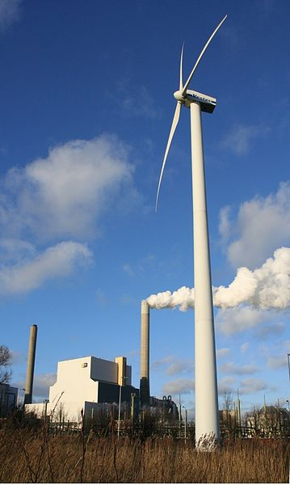

Le jugement que la cour suprême *de Hoge Raad* des Pays-Bas vient de rendre le 20 décembre dans l'affaire **Urgenda** est historique. C'est la première fois qu'un gouvernement est contraint par la justice de son pays à lutter contre le réchauffement climatique et à respecter ses engagements de réductions des émissions de gaz à effet de serre. Ceci peut paraître évident si comme dans le titre de ce post, la mission du gouvernement est de protéger son peuple mais il a fallut 7 ans pour que la décision soit confirmée par la justice… Résumé de 7 ans d'action de l'association Urgenda qui a déjà fait des petits dans le monde :

## Il y a urgence: Urgenda
L'association Urgenda dont je nom a l'avantage de ne pas avoir à être expliqué ni en français ni en néerlandais a été créé en 2010 par Marjan Minnesma et Jan Rotmanset son objectif est dès le début de rendre les Pays-Bas durables plus rapidement (*samen sneller duurzaam*). Elle s'est fait connaître en 2010 en achetant à bas prix de gros des milliers de panneaux solaires pour les revendre toujours à bas prix. Cette opération [Wij Willen Zon](https://www.urgenda.nl/themas/klimaat-en-energie/wij-willen-zon/) a durablement fait baisser le prix de cet accessoire énergétique durable. L'association a ainsi montré qu'il était possible de prendre des décisions permettant une adoption rapide et sans douleur des comportements de chacun. C'est donc naturellement qu'elle a proposé au gouvernement de faire de même.

## L'affaire du siècle
La fondation explique que les contacts avec le gouvernement ont eu lieu dès 2012 mais l'affaire a réellement commencé quand elle a assigné le gouvernement à prendre les mesures qu'il fallait que l'affaire a vraiment commencé. L'assignation est la première étape d'une procédure judiciaire. La défense du gouvernement a été soumise au tribunal en avril 2014 et l’association y a répondu par un mémoire en réplique en septembre 2014. Les arguments sont les suivants: Le gouvernement reconnait que ses actions ne sont pas suffisantes pour prévenir le changement climatique. Les conséquences de ce changement climatique néfaste pour les habitants de la terre et des Pays-Bas en particulier. Le gouvernement faillit donc à protéger son peuple et doit donc être contraint à prendre des mesures plus efficaces. Le gouvernement a encore envoyé un mémoire en réplique de défense en janvier 2015 puis la cour de la Haye a pu statuer.

Le jugement a été prononcé le 24 juin 2015 et demande au gouvernement de réduire les émissions de CO2 pour atteindre dès 2020  un niveau de 25% inférieur aux niveaux de 1990.

Ambitieux mais faisable…

Trop ambitieux peut-être cet objectif de 2020, alors le gouvernement décide de faire appel. 

{.left} 
  
  
> Éolienne et centrale thermique à Sloterdijk. 2MW avec du vent face à 1000MW avec des ordures et autres combustibles… mais aussi du CO2.
<!-- HTML -->

<!-- / HTML -->

Le gouvernement a argué que ce n’était pas à la justice de se saisir de sujets liés à l’environnement et à l’énergie mais à la politique, au gouvernement et du Parlement. La cour d'appel a rejeté cet argument en disant que la lutte contre le réchauffement climatique était avant tout une question de droits humains. Elle a rendu sa décision le 9 octobre 2018, qui confirme la première décision mais le gouvernement a déposé un recours devant la Haute Cour de justice du pays, l'équivalent d'un pourvoi en Cassation dans notre droit hexagonal. 

!!### Décision finale

La plus haute juridiction du pays a donc entendu les motifs du gouvernement puis la défense de l'association Urgenda puis le procureur général qui demandait à la cour de confirmer le jugement. C'est ce qui a été fait en ce 20 décembre 2019.

[{.center}](/public/images/contribs/2020/Klimaatzaak-credit-Chantal-Bekker-Urgenda-10-web-1024x683.jpg)
> Explosion de joie dans la salle des pas perdus du tribunal de la Haye. Le public était venu en masse pour suivre le procès et soutenir l'association. Photo: Chantal Bekker.

En gros il ne reste plus que 10 jours au gouvernement de Mark Rutte pour réduire les émissions de gaz à effet de serre et atteindre un objectif qu'il aurait mieux fallut préparer pendant 5 ans. C'est pas gagné…
---
<!-- post notes:
https://www.urgenda.nl/en/themas/climate-case/climate-case-explained/ 
https://laffairedusiecle.net/les-pays-bas-condamnes-a-agir-contre-le-rechauffement-climatique/ 
https://secure.avaaz.org/campaign/en/climate_march_reportback/ 
https://www.urgenda.nl/en/themas/peoples-climate-march-2/
--->
