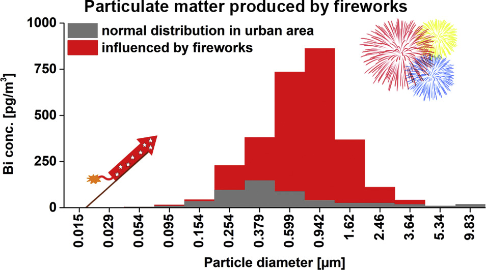

Les [festivités du jour de l'an](/les-bruits-du-nouvel-an) se suivent et se ressemblent à ceci près que pour la deuxième année consécutive, le gouvernement a interdit la vente de feux d'artifice tant prisés pour le passage de l'ancienne la nouvelle année (*[oud en nieuw](/preparatifs-petaradants)*). La raison de cette interdiction est liée à la pandémie de COVID-19 : Limiter les accidents liés à ces explosifs pour maintenir les capacités des hôpitaux. Pas encore de prise en compte donc, de l'impact néfaste de cette tradition sur l'environnement et la santé publique pourtant de plus en plus [évoqué](https://www.nrc.nl/nieuws/2018/12/28/oud-en-nieuw-feest-voor-fijnstof-gevaar-voor-de-longen-a3127297).

## L'interdiction néerlandaise

**L'interdiction est temporaire et exceptionnelle** mais elle est en place pour la deuxième année consécutive depuis le 19 novembre. Le gouvernement a spécifiquement interdit l'usage et le transport des feux d'artifice les plus dangereux (catégorie F4, F3 et F2) pour réduire le nombre d'accidents liés à leur usage. Dans la liste des matériels interdits, les pétards comme les « tapis chinois » arracheurs de doigts, les fusées et les [chandelles romaines](https://fr.wikipedia.org/wiki/Chandelle_romaine) bien trop souvent orientés dans une mauvaise direction[^1]. [Le communiqué de presse du gouvernement](https://www.rijksoverheid.nl/onderwerpen/vuurwerk/nieuws/2021/11/19/vuurwerkverbod-tijdens-aankomende-jaarwisseling) précise que les professionnels du secteur seront à nouveau indemnisés pour le manque gagner. Dans les faits, les ventes continuent mais les pétards et les fusées sont remplacés par des feux décoratifs qui sont autorisés et souvent plus chers. [NOS souligne](https://nos.nl/artikel/2077665-voor-het-knalvuurwerk-moet-je-naar-belgie) d'ailleurs que cette tendance a commencé avant l'interdiction.

Le gouvernement précise aussi que l'interdiction ne concerne pas les spectacles pyrotechniques lancé par des professionnels à l'initiative des municipalités, pratique peu répendue qu'il semble encourager.

## L'interdiction anglaise

Ailleurs, [en Belgique](https://kw.be/nieuws/samenleving/in-kaart-in-deze-gemeenten-mag-je-op-nieuwjaar-vuurwerk-afsteken/) ou en Grande-Bretagne, les autorités annulent les feux d'artifice lancées par les villes pour éviter les grands rassemblements vecteurs de transmission du virus. Ainsi, [Londres annule pour la deuxième année consécutive](https://www.nieuwsblad.be/cnt/dmf20211012_94829807) son lancé depuis les rives de la Tamise qui attirait les foules. Pour avoir des réjouissances pyrotechniques les Anglais lancent les feux d'artifice eux même, à la façon des Hollandais[^2]. Cette nouvelle pratique [n'est pas du goût](https://www.bbc.com/news/uk-england-wiltshire-59431572) des association s'occupant d'animaux qui se plaignent du stress qu'engendre tout ce bruit et ces odeurs durant la nuit du 31 décembre au premier janvier. Là bas aussi les pétards sont passés de mode et la tendance est aux [feux d'artifice silencieux](https://www.walesonline.co.uk/news/uk-news/pub-hold-silent-fireworks-upcoming-17237020) pour le « bien-être animal ».

## L'impact environnemental

Il reste que les animaux ne sont pas seulement gênés par le bruit mais aussi par la pollution de l'air générée par tous ces explosifs. Tout le monde peut voir l'air s'épaissir en ville dans les premières heures de l'année et il ne faut pas être devin pour en déduire que ces particules fines en suspension ne sont pas bonnes pour la santé. Les [dégâts du nouvel an](/il-y-a-eu-des-degats) ne sont pas que matériels. Seulement, ceux sur la santé et l’environnement sont difficiles à quantifier. [Une étude de 2019](https://www.sciencedirect.com/science/article/pii/S0160412019304921#f0020) a mis au jour la quantité et le type de particules fines causés par les feux d'artifices du nouvel an en effectuant des mesures a Graz en Autriche et Brno en Tchéquie. Cette étude parle de dépassement de seuil de polution, de **magnésium**, **aluminium**, **cuivre**, **potassium** ou de **strontium** et d'un effet sur la santé qui ne peut être ignoré.

{.center}

À Brno les réjouissances pétaradantes durent environ 40 minutes avant de se calmer.  Je n'ose pas imaginer quels auraient été les résultat des mesures si elles avaient eu lieu à Amsterdam, ville où les explosions ne  s’atténuent pas avant 2h du matin.

Le problème est connu aux Pays-Bas et c'est peut-être ce qui explique l'évolution de la consommation avant même les restrictions. Le site **Milieu Centraal**, explique [la marche  suivre quand on veut lancer un feu d'artifice](https://www.milieucentraal.nl/huis-en-tuin/gezonde-leefomgeving/vuurwerk/) en réduisant son impact sur la nature. Il rappelle que cette activité est régulée depuis longtemps et que son impact sur l’environnement est important. Ses recommandations sont:

- 01 Ne pas acheter de feux d'artifice illégaux (sans le marquage CE) qui contiennent des substances toxiques.
- 02 Réduire le nombre de lancés et se regrouper avec les voisins pour le faire ou bien juste regarder les autres.
- 03 Nettoyer les déchets dès que possible de manière à ce que les substances toxiques ne se retrouvent pas dans l’environnement.
- 04 Ne pas acheter de feux d'artifice contenant du plastique comme les balles explosives (*knetterballen*)[^3] Le plastique ne se dégrade pas dans la nature.
- 05 Si vous êtes allergiques à la pollution éviter de sortir les premières heures de l'année.

Des conseils de bon sens en fait. On pourrait préciser que les feux d'artifices décoratifs sont peut-être plus sympa pour le stress des animaux parce qu'ils ne font pas de bruit mais ils sont souvent plus polluant parce qu'à base de métaux comme [nous le rappelle scientias.nl](https://scientias.nl/hoe-vervuilend-is-vuurwerk-voor-het-milieu/) avant de conclure par un « faut-il interdire les feux d'artifice ? » Bien polémique. 

Il semble que cette interdiction soit possible en temps de COVID mais faut-il vraiment fêter l'année avec des interdictions ?

---
[^1]: comme dans le fameux [film du LAAF de 2007](/preparatifs-petaradants)
[^2]: et de nombreux autres pays d'Europe.
[^3]: Ces dernières sont d'ailleurs de moins en moins disponibles en magasin suite à [une campagne contre elles](https://litterati.org/operation-knetterbal).