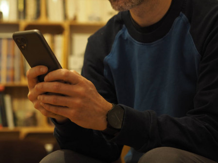

Juste après avoir dit que j'étais [très content de mon vieux téléphone](/Agnes-Crepet-mon-telephone-marche-mieux), je m'en suis acheté un nouveau. Je dois dire que je ne le regrette pas. C'est aussi un *fairphone* : **Le fairphone 4**.

{.center}

Que c'est-il passé ? Qu'est ce qu'il m'a fait changer d'avis ?

## Mon fairphone 2

Depuis 2016 je suis donc possesseur d'un [téléphone étique](/Fairphone-le-telephone-ethique), le **fairphone 2** qui m'accompagne partout. J'ai expliqué il y a peu que le téléphone ramait et que la dernière mise  jour du système a soulagé un petit peu sa lenteur. En fait, ce fut un soulagement de courte durée et les problèmes sont revenus assez-vite au point de me convaincre de faire quelque chose. Je pouvais essayer de voir si le problème ne venait pas d'un module endomagé qui a peut-être souffert des nombreuses chutes. J'aurais pu acheter [une pièce de rechange](https://shop.fairphone.com/en/spare-parts?phone_type=5) et aussi une batterie parce que la dernière qui me reste ne tient plus la journée ce qui peut devenir problématique si je décide de sortir le soir…

Mais voilà, Fairphone a annoncé le lancement de son nouvel appareil, le **fairphone 4** en grande pompe et en novembre avec la 5G et un appareil photo deux objectifs, deux nouveautés dont je n'ai pas besoin mais aussi plein de petits détails qui rendent le truc quand même bien attractif. Surtout, la société Fairphone montre qu'elle tient la route depuis 2012 et a montré qu'elle sait fournir des produits qui tiennent la route. Le fairphone 4 est d'ailleurs proposé avec une garantie de 5 ans. 

<!-- HTML -->

<iframe width="560" height="315" src="https://www.youtube.com/embed/fgtxGWX1QwI" title="YouTube video player" frameborder="0" allow="accelerometer; autoplay; clipboard-write; encrypted-media; gyroscope; picture-in-picture" allowfullscreen></iframe>

<!-- / HTML -->

Je me suis donc laissé tenter et j'ai donc déboursé les 579€.

## Mon fairphone 4

L'attente a été moins longue que pour le précédent et j'ai très vite reçu ma petite boite en carton estampillée « *change is in your hands* ». Livré sans chargeur, je l'ai branché sur le cordon de mon mac j'ai rapidement mis  jour ma poche avec le nouvel objet qui ne me quitte plus. Nouvel objet bien plus gros et plus lourd soit-dit en passant.

Après quelques jours d'utilisation, je peux déjà dire que je suis très content de mon achat et que j'espère qu'il me durera au moins aussi longtemps que le précédent. Le poids du téléphone me donne l'impression qu'il est vraiment solide. Je pense d'ailleurs que ce n'est pas qu'une impression, le boîtier est en métal ce qui est je pense un des choix qui permet au fabricant de proposer cette garantie de 5 ans.

Coté inconvénients, j'ai lu ça et là que l'on se plaignait de l'absence de prise jack pour casque. Il n'y a qu'une prise USB-C pour la recharge, le son et les données. Cela ne me dérange pas et je pense d'ailleurs qu'un adaptateur USB-C / Jack audio ne devrait pas être rébarbatif pour qui s'encombre d'un fil à son casque. L'absence de Wifi 6 sur un téléphone qui doit durer dans le temps et qui est près pour la 5G  me semble plus problématique. Peut-être sera-t-il activé dans une future mise  jour. Ce qui m'a le plus gêné, c'est l'absence de port pour la deuxième carte SIM. Il est possible d'avoir un deuxième abonnement sur ce téléphone mais uniquement avec une eSIM, une « puce » logicielle que mon opérateur actuel ne fourni pas (encore). Heureusement il est possible d'en commander une chez free. Ce sera donc mon numéro français qui n'aura pas de puce.

Le coût est aussi un inconvénient. À ce prix là j'aurais presque pût acheter un téléphone haut de gamme d'un fabricant connu (et moins étique) et je me retrouve avec un téléphone moyenne gamme. J'ai l'habitude de payer mes citrons bio plus cher que les citrons traités mais je sais que pour ce prix je peux utiliser le zest. Pour mon téléphone c'est un peu pareil, ce dernier est plus réparable et durable ce qui en fait un investissement plus rentable. Le fait que ni les matières premières, ni la fabrication ne s'appuie sur l'esclavage est aussi important pour moi. C'est quand même plutôt rare de pouvoir faire ce choix même si c'est aberrant qu'on ait le faire. Quand aux performances, ne jouant pas à des jeux très gourmands elle me conviennent parfaitement je l'espère pour longtemps. Un téléphone dernier cri ne reste pas dernier cri bien longtemps mais un téléphone étique et durable le reste pour toujours.
---