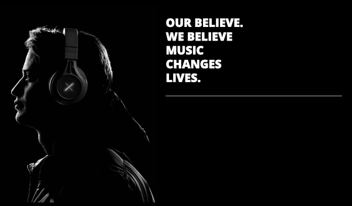

C'est ce qu'annonce le projet Our house sur son site, un **modern museum of electronic music culture** va ouvrir ses portes à Amsterdam à l'été 2021. C'est maintenant. Bien plus qu'un musée, la page annonce :

``Situé à Amsterdam, Our House est une expérience high-tech rendant hommage à la musique et à la culture  électronique. Loin d'être un musée qu'on visite, Our house vous emmène dans un voyage innvovant et futuriste. etc.``

Pour l'instant, il n'y a pas grand chose [sur le site|https://www.our-house.com/|en|Our House], juste un vaste programme et la vente de tickets propose juste aux visiteurs de s'abonner à une newsletter. Rien de plus.

Depuis l'[annonce](https://www.facebook.com/Our.House.Musea/videos/1330347567297421/) sybiline sur facebook, pas plus d'info pas d'expo temporaire annoncée ou de programme précis ni d'adresse ni de prix des billets, ; on attend la surprise comme le premier album des Daft Punks et on se contente de deux photos, Dance floor at Paradise Garage de Bill Bernstein (1978) et une photo du [Electric Daisy Carnival](https://en.wikipedia.org/wiki/Electric_Daisy_Carnival), le festival qui a inspiré [Amsterdam dance event|/quelques-nouvelles-en-vrac||ou je parles de ADE] ici ce qui nous préfigure peut-être la mise en avant de la house, garage et de la dance sous le terme de musiques électroniques.

Pendant tout ce temps, l'initiative Our House a aussi cherché --du capital-- [des membres|https://www.our-house-member.com/our-house-membership/||Our house members] en leur offrant des coupons à 5k€ offrant des espoirs de dividendes, des places gratuites et plus d'infos concrètes. Le lieu devrait offrir des formations et des ateliers des expos temporaires un magasin à la sortie du musée et aussi de la restauration. Le lieu devrait aussi organiser des événements autour de la musique électroniques en ses murs ou en dehors. En fait si ça marche Our House pourrait devenir une licence et coloniser le monde depuis Amsterdam. 

{.center}

Après tout, la musique électronique est passé de l'underground à phénomène de masse en moins de dix ans et continue depuis plus de 30 ans d'attirer les foules. Les Pays-Bas, avec leurs nombreuses fêtes et festivals sont un contributeur notable de ce succès. Le musée cible au moins trois générations de fans ce qui devrait aider à écouler les billets. Le *line up* (virtuel) et l'ambition d'offrir aux visiteurs une expérience unique grâce aux nouvelles technologies devraient convaincre les autres.

Un des fondateurs de Our House, Jeroen Jansen, est aussi un des fondateur de ID&T, la boite qui est derrière des événements dance mondialement connus tels que les Thunderdome, les Sensation (black or white) ou Tomorrowland. Il est associé a Dutch Experience Group qui est la boite derrière Heineken Experience ou FloriWorld à Aalsmeer. Bref c'est du sérieux, il n'y a plus qu'à attendre l'ouverture. cet été.
---
<!-- post notes:
https://themusicessentials.com/news/worlds-first-electronic-music-museum-experience-to-open-in-amsterdam/
--->
