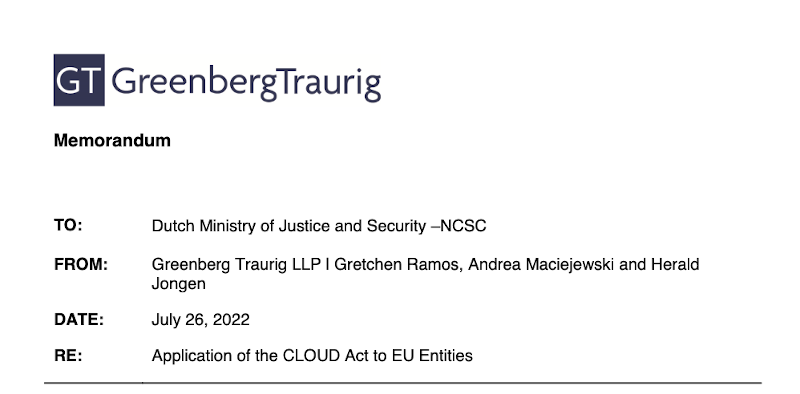

### Les lois extraterritoriales 

Le développement d'Internet a facilité depuis des années la collecte et la manipulation de données de toutes sortes partout dans le monde. Les frontières étatiques sont rarement un frein à cette collecte et au traitement des données et c'est une des raisons pour lesquelles les régulations imposées par les états dans ce cadre ont souvent une portée qui dépassent les frontières du pays elles s'appliquent. On parle alors de législation extraterritoriale. 

Un bon exemple de loi extraterritoriale est le RGPD (Règlement général sur la protection des données) qui concerne toutes les données personnelles collectées sur le territoire de l'Union Européenne, même si le sujet n'est pas citoyen européen et même si l'organisme collecteur des données n'est pas basé en Europe. 

La loi extraterritoriale d'un pays peu ainsi se retrouver en conflit avec la loi nationale d'un autre pays. 

Le Cloud Act (Clarifying Lawful Overseas Use of Data Act) aux États-Unis est une loi de 2018 permettant à la justice américaine de se procurer les données auprès d'entreprises américaines même si leur collecte et leur hébergement ont lieu dans un autre pays. Voilà donc un autre exemple de loi extraterritoriale et celle ci entre de manière évidente en conflit avec le RGPD européen. 

### Le rapport qui ne rassure pas 

{.center}

<!--excerpt-->
C'est pour évaluer la porté des lois extraterritoriales sur les sujets européens que le *Nationaal Cyber Security Centrum* (NCSC) [a demandé une étude sur le Cloud Act](https://www.ncsc.nl/actueel/weblog/weblog/2022/de-werking-van-de-cloud-act-bij-dataopslag-in-europa) au cabinet juridique **GreenbergTraurig**. Le NCSC indique que plusieurs pays ont des législations extraterritoriales comme l'Australie, l'Inde, l'Afrique du Sud ou la Chine mais le Cloud Act états-unien, le plus emblématique a été choisi comme exemple. 

[Le memo de 15 pages en anglais](https://www.ncsc.nl/documenten/publicaties/2022/augustus/16/cloud-act-memo) a été publié en août 2022. Si on peut le résumer en quelques mots, **il va y avoir du boulot**., Il est très compliqué pour un responsable de s'assurer que les données qui lui sont confiées ne tombent pas sous le coup d'une loi extraterritoriale. Toute la chaine de traitement des données peut être touchée et **l'hébergement par une entreprise européenne en Europe n'est pas une garantie suffisante**. Au regard du développement des lois extraterritoriales dans le monde, la tâche devrait même se complexifier et le rapport de conclure : **Les sociétés et les organisations devraient toujours vérifier si elles ne tombent pas sous le coup de lois extraterritoriales qui les empêcheraient de se conforter à la loi européenne**. 

Pour récapituler le problème qui se pose à toute organisation européenne c'est de respecter le RGDP. Cette obligation est facile à comprendre en principe et elle oblige chaque organisation à se pencher sur le traitement des données personnelles qu'elle traite. Si ces traitement impliquent des entreprises, des serveurs, des logiciels ou bien des employés d'un autre pays. Il est possible que le respect du RGDP ne puisse pas être garanti à cause d'une loi extraterritoriale qui obligerait cette entreprise, serveur, logiciel, employé à enfreindre le RGPD pour respecter cette loi extraterritoriale. 

Normalement les organisations maîtrisent les flux de données qu'elles génèrent et sont au courant de de que font les sous-traitants dont elles utilisent les services au moins dans les grandes lignes. Seulement cette responsabilité opérationnelle n'a pas l'habitude de prendre en compte en détail les considérations légales. 

Les conseils du NCSC sont plutôt difficiles à suivre puisque les opérateurs de cloud, eux même, ne connaissent généralement pas l'étendue légale de leurs solutions techniques. Et quand ils le savent il n'est pas rare de les voir mentir à leur clients qui espèrent le respect de la loi européenne. 

Ainsi, par exemple, l'offre de Thalès et de Google, baptisée S3ns est dans le collimateur du député Philippe Latombe qui accuse les entreprises de « communication trompeuse » faisant croire que l'offre est « de confiance » alors que des zones d'ombre subsistent. Ainsi l'offre indique que les données sont hébergées en France dans les datacentres de Google alors que Google ne dispose pas de ses propres datacentres en France… 

Il semblerait donc qu'en France, on a décidé de répondre à la complexité de la tâche par la méthode Coué. Seulement répéter à longueur de temps qu'une solution est compatible RGDP ne la rend pas forcément compatible. 

### La saga des données de santé 

# Acte 1 Le Conseil 

Le gouvernement de la (startup) nation a décidé en 2019 de moderniser le système national des données de santé (SNDS) en le transformant en *Health Data Hub* où toutes les données de sécu et de facturation hospitalières, pharmaceutiques sont rassemblées sur *le cloud*. La tâche a été confiée au **cloud computing Azure de Microsoft**, entreprise état-unienne donc[^1]. Bon, il y a eu des protestations (soupçon de favoritisme, une atteinte à la souveraineté numérique, protection des données personnelles…) mais le gouvernement a mission de moderniser la France alors le chantier a été lancé sans attendre. Le ministère de la santé a même élargit la plateforme en la mettant à contribution pour les données des enquêtes épidémiologiques dans le cadre de la lutte contre la COVID 19. 

C'est d'ailleurs sur cette décision que des associations [ont saisit](https://www.usine-digitale.fr/article/que-reproche-t-on-au-health-data-hub-attaque-devant-le-conseil-d-etat.N973541) le Conseil d'État pour s'opposer à l'arrêté qui permettait la collecte de ces données. Le 19 juin 2020, bien que relevant des lacunes dans les informations fournies à la CNIL, [le Conseil d'État autorise la collecte de ces données](https://www.conseil-etat.fr/actualites/plateforme-health-data-hub-decision-en-refere-du-19-juin) confirmant que l'entreprise Microsoft, hébergeant les données en Europe (*actuellement aux Pays-Bas et prochainement en France*) respecte le RGDP et le code de la santé publique français. De plus le Conseil d'État explique que les transferts de données à l'étranger *s’inscrivent dans le cadre autorisé par une décision de la Commission européenne de 2016, ainsi que le permet le RGPD*. 

# Acte 2 La Cour 

Voilà qui est envoyé dans la face de ceux qui voulaient freiner le progrès. 

Sauf que moins d'un mois plus tard la Cour de justice de l'Union européenne [fait voler en éclat](https://eur-lex.europa.eu/legal-content/FR/TXT/HTML/?uri=CELEX:62018CJ0311&from=meinamsterdam) le *cadre autorisé par une décision de la Commission européenne de 2016*. 

{.center}

Pour comprendre l’importance du problème il faut revenir en arrière, les lois extraterritoriales sont gênants pour les États-Unis comme pour l'Europe qui essayent de trouver un accord pour que ces lois n'affectent pas les échanges (commerciaux) entre les deux régions. Ils ont signé en 2016 le *Privacy Shield*, **bouclier de protection des données personnelles** des Européens aux États-Unis, où ces derniers promettent d'offrir de voies de recours légales aux citoyens européens dont les données circulent aux États-Unis. 

Comme avec les indiens, l'accord coté américain n'était que de belles promesses sans réelle protection. Un différent entre l'autrichien Maximillian Schrems et Facebook l'a mis au jour et la Cour de justice de l'Union européenne, a donc annulé la décision de la Commission européenne de reconnaitre le *Privacy Shield* comme une protection adéquate. Faute d'accord, toute organisation qui envoie des données personnelles européennes aux État-Unis enfreint le RGDP. 

# Acte 3 Le petit bleu 

Je pense que les industriels français n'ont pas attendu cette décision pour se préparer à répondre à des appels d'offre sérieux qui exigent un hébergement en France par des Français. Ils ont ainsi préparé des offres 100% françaises de cloud  dont l'offre **bleu** proposée par **Orange** et **Cap Gemini** offre les solutions cloud de … **Microsoft**. **Thalès** de son coté prépare une offre de cloud **Google** sous étiquette **S3ns** et on attend le grand spécialiste français qui sera à même de proposer une offre basée sur **AWS d'Amazon** pour avoir les plus grand acteurs de cloud mondial mais vendu par grand nom français. 

Pour le *Health Data Hub*, le gouvernement a annoncé avant les élections qu'ils se donnait deux ans pour [« faire disparaître » les risques juridiques](https://www.lemonde.fr/economie/article/2022/01/20/health-data-hub-l-hebergement-par-microsoft-ne-sera-pas-remis-en-jeu-avant-la-presidentielle_6110275_3234.html) liés à l’hébergement par Microsoft. C'est sans surprise l'offre *Blue* d'Orange et Cap Gemini avec toujours les outils Microsoft qui auraient [la faveur des pronostics de migration](https://www.ticpharma.com/story/2071/hebergement-du-health-data-hub-les-pouvoirs-publics-sur-la-piste-bleu.html). 

Donc là si vous suivez bien, nous avons un ministère français qui traite des données sensibles en les sous-traitant à une entreprise états-unienne mais comme c'est illégal de le faire, il envisage de le passer par une entreprise française qui utilisera les mêmes outils états-uniens en France. 

Puis un ministère néerlandais demande à un cabinet juridique si utiliser des solutions ou même juste des logiciels états-uniens pour traiter des données personnelles c'est pas un peu risqué et le cabinet répond que oui il y a un risque. 

> Et là, c'est le drame ?

En fait non, le gouvernement continue de construire son cloud, gratifiant nonchalamment les offres françaises d'un label « [cloud de confiance](https://www.numerique.gouv.fr/espace-presse/le-gouvernement-annonce-sa-strategie-nationale-pour-le-cloud/) » faisant croire en une compatibilité avec le RGDP. Jusqu'à présent [l'annonce de cette étude de la NCSC](https://www.latribune.fr/technos-medias/internet/bleu-s3ns-pourquoi-les-offres-cloud-de-confiance-seront-certainement-soumises-au-cloud-act-928831.html) dans la presse spécialisée ne semble pas l'avoir fait tomber de son petit nuage. Aucune annonce de changement, aucune réaction ni même questionnement des responsables. Les industriels aussi restent muets sur le sujet.

L'acte 4 du *Health Data Hub* n'est pas encore écrit mais il le sera. C'est bien la seule chose qui me fait garder confiance.

[^1]: Sans même passer par un appel d'offre cela dit en passant mais c'est une autre histoire.
<!-- post notes:
https://www.latribune.fr/technos-medias/internet/bleu-s3ns-pourquoi-les-offres-cloud-de-confiance-seront-certainement-soumises-au-cloud-act-928831.html 

https://www.ege.fr/infoguerre/souverainete-numerique-le-cas-du-health-data-hub-et-microsoft 
https://www.latribune.fr/technos-medias/internet/cloud-de-confiance-le-depute-philippe-latombe-attaque-le-projet-de-google-et-thales-s3ns-aupres-de-la-cnil-et-de-l-anssi-924750.html 
https://www.latribune.fr/opinions/tribunes/souverainete-energetique-et-numerique-mais-pour-qui-roule-ursula-von-der-leyen-936120.html 
why we do it 
https://english.ncsc.nl/latest/weblog/weblog/2022/how-the-cloud-act-works-in-data-storage-in-europe
NL https://www.ncsc.nl/actueel/weblog/weblog/2022/de-werking-van-de-cloud-act-bij-dataopslag-in-europa 
the memo
DL: https://www.ncsc.nl/documenten/publicaties/2022/augustus/16/cloud-act-memo
 copy conclusions 
 

https://fr.wikipedia.org/wiki/Bouclier_de_protection_des_donn%C3%A9es_UE-%C3%89tats-Unis#cite_note-13 
En l'absence de garantie légale valable, toute entreprise état-unienne collectant et manipulant des données de citoyens européens se trouve hors la loi parce qu'elle ne respecte pas le RGDP à cause du Cloud Act. Heureusement qu'il n'y a presque pas dans ce cas. 
La NCSC a pour rôle de préserver et de protéger l'infrastructure numérique critique de la nation Pays-Bas c'est à dire les réseaux et serveurs de l'état mais aussi de certain services critiques privés. Dans ce cadre l'agence doit identifier les faiblesses et les risques qui pesent sur cette infrastructure. Il y a là un risque juridique qui grace à ce questionnaire, est bien identifié. 

https://fr.wikipedia.org/wiki/Investissements_d%27avenir 
https://www.latribune.fr/technos-medias/informatique/20150113triba29598d73/le-cloud-a-la-francaise-histoire-d-un-flop.html 
https://english.ncsc.nl/latest/weblog/weblog/2022/how-the-cloud-act-works-in-data-storage-in-europe 
Le cloud de confiance mérite-t-il notre confiance ?
contexte 
https://www.usine-digitale.fr/article/le-depute-philippe-latombe-conteste-l-offre-de-cloud-de-confiance-de-thales-et-google-cloud.N2024082
https://www.nextinpact.com/article/69665/cloud-confiance-s3ns-depute-philippe-latombe-interpelle-lautorite-concurrence-et-dgccrf 
opérateur d'importance vitale (OIV)
--->
