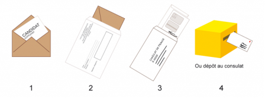

Les élections législatives 2022 auront lieu dans la foulée de la présidentielle. Elles sont prévues les 12 et 19 juin pour la France métropolitaine mais les français de l'étranger [ont un calendrier spécial](https://www.service-public.fr/particuliers/actualites/A15053) et des droits spéciaux. C'est parce que, contrairement à la présidentielle, chaque élection législative dans chaque circonscription est une élection différente et les rêgles peuvent changer d'une circonscription à l'autre. Je vais vous détailler ici les particularités de la 3ème circonscription hors de France (Belgique, Luxembourg, Pays-Bas) afin que vous puissiez voter autrement si vous le désirez.

Pour les français de l'étranger, le premier tour est avancé d'une semaine, pour permettre d'acheminer le matériel dans les chancellerie et auprès des électeurs. Les scrutins auront donc lieu les **6 et 19 juin 2022**. Il n'est pas trop tard pour s'inscrire sur les listes électorales, vous avez jusqu'au 29 avril pour cela.

{.center}

## Les modalités de vote

Les français des Pays-Bas inscrits sur les listes électorales consulaires pourront **se rendre aux urnes** à ces dates et pourront, comme pour la présidentielle, **voter par procuration** en désignant le mandataire de leur choix qui viendra  sa place dans le bureau de vote de l'électeur à Amsterdam ou la Haye. Les modalités sont les mêmes que [lors de l'élection présidentielle](/presidentielle-voter-autrement) et les français de métropole ont aussi ce droit.

Les français de l'étranger ont, en plus, la possibilité (d'aucuns diront le privilège) de **voter à distance**, soit par Internet, soit par correspondance.

### Le vote par Internet

Même si j'ai plusieurs fois expliqué [ma réticence pour ce moyen de voter](/Rencontre-vote-electronique), je dois admettre que c'est peut-être le moyen le plus pratique d'exprimer son vote et il est sain que l'administration se soucie de ceux qui vivent parois à des kilomettres de leur bureau de vote.

Néanmoins, [j'ai participé au test de ce système au mois de janvier](/teste-le-vote-Internet) et bien que tout ait fonctionné comme prévu, les nombreuses petites imperfections que j'ai vu sur la seule interface ne m'aide pas renforcer ma confiance en cette modalité de vote. J'ai été donc agréablement surpris d'apprendre que le vote par correspondance postale a été réintroduit pour cette élection législative.

### Le vote par correspondance

Pour pouvoir participer au vote par correspondance, **il faut le signaler à son consulat avant le 31 mars** qui aura ainsi le temps de préparer et d'envoyer le matériel de vote. Le système est le même que celui éprouvé par de nombreux pays comme l'Allemagne qui l'utilise à chaque élection : le **système de la double enveloppe**. Une enveloppe de vote qui est la même que celle qu'on dépose dans l'urne et une enveloppe d'émargement dans laquelle on glisse la première enveloppe, que l'on cachette et où l'on appose sa signature avec la preuve de son identité. Dans le système mis en place pour les législatives, il y a même une troisième enveloppe, une enveloppe d'éxpédition à affranchir et envoyer comme quand on participe aux concours des 3 suisses. C'est plutôt simple, [tout est expliqué en ligne](https://www.diplomatie.gouv.fr/fr/services-aux-francais/voter-a-l-etranger/modalites-de-vote/vote-par-correspondance/).

{.center}

Les enveloppes reçues au consulat sont ensuite ouvertes le jour du scrutin par les membres du bureau de vote dont un membre déposera les enveloppes de vote dans l'urne. Là, elles se mèleront aux enveloppes des électeurs venant voter en personne. Le risque de fraude est donc limité, comme pour le vote l'urne, par la présence des ascesseurs et des délégués des candidats dans les bureaux de vote.

Cette modalité a l'avantage de ne pas s'appuyer sur un mandataire difficile trouver ou bien pas forcément digne de confiance ni sur un prestataire informatique dont on ignore la qualité du travail. Elle ne repose que sur le travail efficace d'un facteur ce qui est plutôt raisonnable (du moins aux Pays-Bas). Donc si vous voulez utiliser cette modalité de vote, n'oubliez pas de le demander au consulat avant le 31 mars. D'ailleurs, pourquoi ne pas [le faire maintenant](https://amsterdam.consulfrance.org/Nous-contacter) ?
---