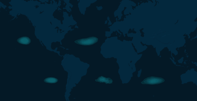
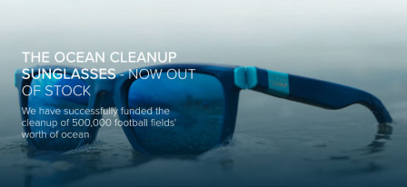
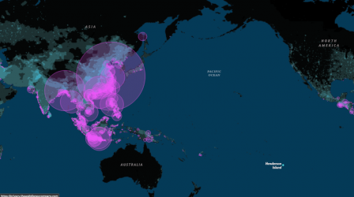

En 2012, un adolescent néerlandais fait une présentation TEDx en expliquant qu'il est possible de nettoyer les océans de tout le plastique qui le pollue depuis des années. La vidéo de sa présentation devient virale et fait le tour de la presse mondiale avant de retomber plus ou moins dans l'oubli. Pourtant l'étudiant a levé des fonds pour son projet et dix ans plus tard, il est aujourd'hui le nettoyeur des océans, avec pour objectif de liquider 90% du plastique des océans d'ici 2040.

Le [sixième continent de plastique](https://fr.wikipedia.org/wiki/Vortex_de_d%C3%A9chets_du_Pacifique_nord#cite_note-8) comme on aime l’appeler en français est cette zone de l'Océan Pacifique nord entre la Californie et Hawaï ou se regroupent des tonnes de déchets (principalement du plastique), poussés par le tourbillon des courants marins. Les américains l'appellent le *Great Pacific Garbage Patch* et plusieurs expéditions en fin des années 00 ont rendu le triste endroit populaire. Ces regroupements de déchets sont hélas présents dans tous les océans du monde.

{.center}

<!--excerpt-->
Le plastique est une invention récente datant des années 30 et 40 et son usage est allé grandissant générant de plus en plus de déchets. Le **sixième continent de plastique** comme on l'appelle parfois est un phénomène bien plus récent dont les scientifiques ont découvert la présence dans les années 90 par l'étude les courants marins en suivants des déchets. L'épisode énigmatique de [la perte](https://en.wikipedia.org/wiki/Hansa_Carrier) en mer de dizaine de milliers de chaussures Nike venant de Corée en 1990 dont une partie ont été [retrouvées sur de nombreuses plages du monde](https://archive.seattletimes.com/archive/?date=19921122&slug=1526004) a sûrement aidé à en faire connaitre l'existance.

L'idée de nettoyer ces vortex de plastique n'est pas nouvelle et déjà le congrès américain votait une loi en 2006 pour nettoyer ce Great Pacific Garbage Patch qui venait lécher les côtes du parc naturel nouvellement créé au nord ouest de l'archipel d'Hawaï (le *Northwestern Hawaiian Islands Marine National Monument*). On disait a l'époque que ce *garabage patch* avait [la taille du Texas](https://edition.cnn.com/2003/TECH/science/05/26/coolsc.oceansecrets/index.html) ce qui est bien [plus grand que la France](https://meinamsterdam.nl/un-thalys-peut-en-cacher-un-autre).

## Le grand projet de nettoyage

Ému comme tout le monde par ces découvertes, le jeune néerlandais Boyan Slat, jeune étudiant à l'université de Delft, la faculté de technologie la plus prestigieuse des Pays-Bas, a l'idée de capturer ces bouts de plastique en suspension avec une solution technologique de son invention : un éorme filet dérivant avec les courants. Il présente son projet lors d'une conférence TEDx à Delft en 2012 et la vidéo de son intervention devient virale.

<!-- HTML -->
<iframe width="560" height="315" src="https://www.youtube.com/embed/ROW9F-c0kIQ" title="YouTube video player" frameborder="0" allow="accelerometer; autoplay; clipboard-write; encrypted-media; gyroscope; picture-in-picture" allowfullscreen class="my-auto" title="video"></iframe>
<!-- / HTML -->

Les gens sont très vite emballés par cette promesse de « nettoyer les océans » alors que ce n'est qu'un projet qui comme l'explique Boyan, a encore besoin d'être étudié. Le projet se trouve aussi des détracteurs qui critiquent le solutionnisme technologique d'un problème sans en combatre la cause. Pire, disent certains idiots, le nettoyage va inciter à polluer d'avantage. C'est vrai que Paris est bien plus sale depuis que [le Préfet Poubelle a organisé la collecte des déchets](https://meinamsterdam.nl/eugene-poubelle-prefet-amsterdam)…

Bref le projet fait parler de lui et son attrait visible se concrétise dans une souscription publique (*crowdfounding*) dans le but de créer une fondation qui achèvera les études de faisabilité et commencera le nettoyage. [Cette collecte est un succès](https://etudiant.lefigaro.fr/les-news/actu/detail/article/l-etudiant-qui-veut-nettoyer-les-oceans-a-recolte-deux-millions-de-dollars-8806/) et l'étudiant se retrouve avec 2 milliards de dollars pour réaliser son projet. Du coup, il arrête ses études et il annonce ensuite qu'il commencera [les opérations en 2016](https://etudiant.lefigaro.fr/les-news/actu/detail/article/boyan-slat-le-petit-genie-qui-veut-nettoyer-les-oceans-commencera-en-2016-15667/) avec une fondation qu'il appelle simplement **The Ocean Cleanup**.

## Le grand nettoyage

En fait même après 2016, le jeune nettoyeur a donné beaucoup moins de nouvelles. Serait-il parti avec la caisse ? Non il a lancé son idée dans le Pacifique ouest mais la première solution de barrière portée par les courants s'est soldée par un échec. Les déchets, eux aussi portés par les courants arrivaient  sortir de la barrière. Une deuxième solutions a donc été mise en place mais elle nécessite de tirer la barrière avec deux cargos bleus ce qui rend l'opération plus gourmande en personnel et énergie. C'est n'est donc qu'en 2019 que Boyan Slat revient sur la scène médiatique pour… vendre des lunettes de soleil.

{.center}

Le produit de cette vente permettra de financer les opérations de nettoyage  venir mais surtout elles sont une démonstration de ce qu'on peut faire avec le plastique retrouvé dans la mer. Pour rendre le produit hype, le plastique utilisé est celui de la première campagne de nettoyage qui avait foiré mais qui avait quand même permis de ramener suffisamment de matière. La conception et fabrication en Italie a fait l'objet d'un petit film pour soutenir ce qui est aussi une campagne de financement.

<!-- HTML -->
<iframe width="560" height="315" src="https://www.youtube.com/embed/t44PpkpGJHA" title="YouTube video player" frameborder="0" allow="accelerometer; autoplay; clipboard-write; encrypted-media; gyroscope; picture-in-picture" allowfullscreen></iframe>
<!-- / HTML -->

Aujourd’hui le stock de lunettes est épuisé et le nouveau **System 002** a déjà récolté [40 tonnes de plastique](https://theoceancleanup.com/updates/system-002-mid-term-evaluation/) au rythme d'une tonne par jour. On ne sait pas si cela s'approche des 500.000 terrains de foot nettoyés ou pas mais on sait que la fondation pense déjà lancer un  **System 003** qui ne sera rien d'autre qu'un filet trois fois plus gros que le précédent toujours tiré par deux bateaux.

Ocean Cleanup annonce toujours vouloir nettoyer les océans de 90% des déchets plastiques flottants à l’horizon 2040.

## Est-ce bien sérieux ?

Depuis sa première présentation d'étudiant utopiste, le projet a aussi essuyé [des critiques](https://korii.slate.fr/et-caetera/environnement-ocean-cleanup-promet-nettoyer-oceans-plastique-dechets-pollution-completement-con) plus ou moins sérieuses. Celle que j'ai le plus entendue est que si on nettoie les océans ça va inciter les gens à polluer encore plus de même que si on donne des sous à des chômeurs, ils vont être encouragés à ne pas travailler. Heureusement, je constate que sur terre, cette idée n'est pas considérée comme sérieuse la plupart des villes organisent la collecte des déchets à la façon du [préfet Poubelle](/eugene-poubelle-prefet-amsterdam).

Le bilan carbone est aussi évoqué puisque les bateaux qui tirent le filet ne sont pas à voile. d'autant que ces bateaux n'étaient pas dans le projet initial présenté lors du premier croudfunding. La fondation assure qu'elle travaille actuellement a compenser cet impact carbone mais la critique reste fondée.

Un autre reproche qui est souvent fait est sur l'efficacité de la solution de nettoyage des océans. Le grand vortex de poubelle est très médiatique et cela a permis de lever plein de fonds mais selon certains, il serait plus efficace de dépenser cet argent pour éviter que le plastique se retrouve dans les océans. Je n'ai pas vérifié cette affirmation mais Boyan Slat semble la prendre au sérieux puisqu'il a aussi lancé une flotte de bateaux *Interceptor* capables de collecter les déchets dans les rivières avant qu'ils n'atteignent la mer. 

La première motivation tait que ce devait être facile puisqu’une étude affirmait que seulement [10 rivières contribuaient à fornir 95% des déchets plastiques en mer](https://www.weforum.org/agenda/2018/06/90-of-plastic-polluting-our-oceans-comes-from-just-10-rivers/). En fait, encore une fois, le projet s'est avéré plus compliqué que prévu. Une nouvelle étude montrait que maintenant [20 rivières contribuaient à 67% de la pollution plastique des océans](https://www.nature.com/articles/ncomms15611). Enfin, une nouvelle étude financée par Ocean Cleanup, prétend que ce sont plutôt [1000 rivières qui contribuent à cette pollution plastique||https://www.nationalgeographic.com/magazine/graphics/the-journey-of-plastic-around-the-globe].

{.center}

Les 5 *interceptors* d'Ocean Cleanup parcourent les eaux du Cengkareng Drain en Indonésie, de la rivière Klang en Malaisie, du Can Tho au Vietnam, du Rio Ozama en République dominicaine et du port de Kingston en Jamaïque. Ce qui fait loin de 1000 mais il faut bien commencer quelque part. Ce n'est heureusement [pas la seul fondation à nettoyer les rivières](https://www.weforum.org/agenda/2021/06/rivers-plastic-waste-clean-up-projects-trash/).

Une autre critique que j'ai moins rencontrée est que le nettoyage des seuls gros morceaux de plastiques flottant en surface est forcément lacunaire. Elle oublie les déchets qui vont par le fond et passe sous silence les plus petit morceaux que les filets n’attrapent jamais. Ces microparticules de plastique sont les plus dangereuses, elles sont digérées par des micro-organismes générant des substances toxiques ou absorbées par les mangeurs de plancton et toute la chaîne alimentaire marine diffuse ainsi le plastique jusque dans nos assiettes. Certes, le nettoyage d'Ocean Cleanup devait contribuer à limiter la production de ces microparticules mais ça devrait rendre la fondation humble. L'objectif de retirer 90% du plastique de l'océan d'ici 2040 laisse tout simplement ce problème de coté.

## Boyan Slat n'est pas seul

Les critiques virulentes dont Boyan Slat fait l'objet sont à placer au crédit de son succès médiatique. D'autres projets de nettoyages des océans, moins médiatiques ramassent le plastique des océans sans pour autant faire les grands titres. On peut citer l'un des plus vieux d'entre eux, attaché à nettoyer les plages du parc national marin de Hawaï ([Northwestern Hawaiian Islands Marine National Monument](https://www.coris.noaa.gov/activities/resourceCD/resources/nwhi_guide_g.pdf)), créé en 2006 alors que Georges W. Bush était président des États-Unis et qui borde le grand vortex de plastique.

Une autre initiative américaine a pris forme en 2009 sous l'égide de la fondation *Ocean Voyages Institute* (OVI) dont le but est de recenser et faire découvrir les richesses des océans. Le projet Kaisei porte [le nom du voilier école](https://www.oceanvoyagesinstitute.org/about-ovi/) de la fondation, d'origine japonaise (le voilier, pas la fondation). Ce projet consiste à affretter des bateaux (quatre à ce jour) pour aller ramasser les filets fantômes. Ces filets abandonnés par les chalutiers de pêche qui dans cette la région du grand vortex de plastique, voyagent souvent plein de débris et aussi hélas d'animaux pris au piège. Leur objectifs se chiffrent en milliers de tonnes ramassés ce qui laisse assez de travail pour Boyan et ses 500.000 terrains de foot. Bien que OVI communique bien moins que Ocean Cleanup, leur but analogue tout comme leurs [appels aux dons](https://www.wintogether.org/articles/27-ocean-voyages-institute-wintogether-enter-donation-clean-oceans-campaign).

Il y a sûrement d'autres initiatives que je ne listerais pas ici. Elles semblent toutes bien petites au regard de la taille continentale du problème. On sait que ce n'est pas en interdisant les pailles en plastiques qu'on résoudra le problème du grand vortex de plastique mais on le fait quand même parce qu'on a envie de faire quelque chose et on pense que ça peut contribuer à ce qu'il ne s'étende pas. Le différentes initiatives de nettoyages des plages et des océans partent de la même logique il me semble. Leur conjonction pourra peut-être même avoir un impact notable l’état de la planète bleue.

<!-- post notes:
https://trends.google.com/trends/explore?date=all&geo=US&q=Great%20Pacific%20garbage%20patch,Pacific%20trash%20vortex 
https://www.oceanvoyagesinstitute.org/about-ovi-2/
https://www.wintogether.org/articles/27-ocean-voyages-institute-wintogether-enter-donation-clean-oceans-campaign 

https://www.csmonitor.com/2006/1011/p02s01-usgn.html 
https://en.wikipedia.org/wiki/Great_Pacific_garbage_patch 
http://www.acffa.org/classes/Articles/Environmental_Science/Pacific_Garbage_Patch.htm 
https://www.coris.noaa.gov/activities/resourceCD/resources/nwhi_guide_g.pdf 

etude rivieres
https://www.nationalgeographic.com/environment/article/plastic-gets-to-oceans-through-over-1000-rivers
contestée|https://www.cnnphilippines.com/news/2021/6/28/DENR-belies-study-claiming-Pasig-River-as-most-polluting-river-in-the-world-.html] 
 

==============
https://www.youtube.com/watch?v=FebtaGFNooU
https://blog.surf-prevention.com/2013/04/02/boyan-slat-ocean-cleanup/ 
https://www.sciencesetavenir.fr/nature-environnement/l-ado-qui-voulait-nettoyer-les-oceans_14771 
https://etudiant.lefigaro.fr/les-news/actu/detail/article/boyan-slat-le-petit-genie-qui-veut-nettoyer-les-oceans-commencera-en-2016-15667/
--->
