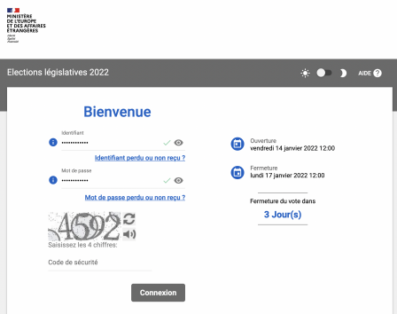
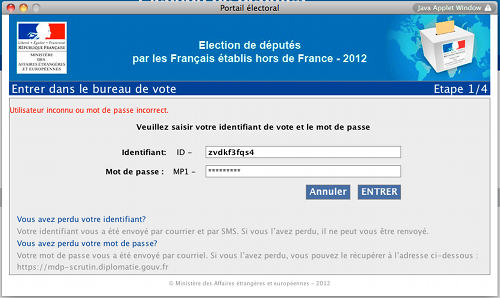

Cette année encore, les français de l'étranger iront voter pour les élections présidentielles ainsi que pour les législatives. Comme il y a dix ans, le ministre des affaires étrangères qui organise le scrutin, va faire appel à un système de vote par Internet pour les élections législatives. Cela devrait aider nos compatriotes qui habitent loin d'un bureau de vote mais garantir le secret du vote et la sincérité du scrutin n'est pas un défi évident.

{.center}

### En 2012
En 2012, j'avais participé [au test grandeur nature](/voter-par-internet) du vote par Internet et j'avais relevé l'absence du contrôle citoyen habituel. Un électeur vivant en Belgique avait d'ailleurs montré comment manipuler l'applet Java qui s'installait sur l'ordinateur pour permettre de voter.

{.center}
  *fenêtre de login en 2012*

### En 2017
En 2017, le système avait été revu mais celui-ci [n'a pas été jugé suffisamment sûr par l'Agence nationale de la sécurité des systèmes d'information](https://www.nextinpact.com/article/26009/103816-legislatives-2017-cest-officiel-francais-letranger-ne-pourront-pas-voter-par-internet) (ANSSI). Il faut dire qu'on était dans une période où les élections dans d'autres pays étaient entachées de soupçons de manipulation depuis l'étranger. L'ANSSI soulignait à juste titre un problème d'image.

### En 2020 et 2021
Pour l'élection des conseillers consulaires en 2021, un nouveau système avait été choisit testé et approuvé par le ministère. Le prestataire retenu, l'espagnol **Scytl** a hélas déposé son bilan en 2020 ce qui a soulevé [plusieurs](https://www.senat.fr/basile/visio.do?id=qSEQ200516388&idtable=q378336|q373244&_c=scytl&rch=gs&de=20190531&au=20200531&dp=1+an&radio=dp&aff=sep&tri=p&off=0&afd=ppr&afd=ppl&afd=pjl&afd=cvn) [inquiétudes](https://www.senat.fr/questions/base/2020/qSEQ201118958.html|fr|Question écrite au Sénat). Heureusement le repreneur irlandais **Paragon** a su assurer le service pour l'élection consulaire qui a finalement eu lieu en mai 2021. Il y a eu un test grandeur nature mais je n'y ai pas participé.

### Et maintenant
En 2022 c'est un prestataire français **Voxaly** (filiale de Docaposte, filiale de la Poste) qui a été retenu pour l'organisation du vote par Internet durant les élections législatives. Un nouveau test grandeur nature a été organisé pour tester le système. Comme il y a dix ans, le contrôle citoyen des opérations de vote reste inexistant mais l'organisateur du scrutin semble plus conscient des risques et limites de cette méthode. La décision de l'ANSSI de 2017 ou la [délibération de la CNIL de 2019](https://www.legifrance.gouv.fr/jorf/id/JORFTEXT000038661239) sur le vote par correspondance électronique et les différents niveau de risque ont sûrement aidé. De plus, cette année reste encore incertaine consternant la continuation de la pandémie et il n'est pas possible de prévoir la liberté de mouvement dans le monde entier. Pour certains le vote par Internet pourrait être la seule façon de s'exprimer et le ministère travaille donc pour s'assurer que l'électeur puisse accorder sa confiance en ce moyen d'expression.

C'est donc dans ce contexte que j'ai passé quelques minutes de ma vie à cliquer sur des pages web en faisant semblent de voter pour des élections législatives fictives. Le test avait lui aussi deux tours et voici mon compte rendu :

<!--excerpt-->
## Retour d'expérience

### Ce qui a changé
Comme lors du test en 2012 le vote s'est bien déroulé. Je n'ai pas eu de problème avec mon ordinateur et j'ai pu aller skier après. Le système est effectivement différent et ne nécessite pas l'installation d'un logiciel spécifique comme l'applet Java d'avant. Aussi, le courrier postal a été remplacé par un SMS ce qui est plus moderne mais doit déjà être un défi pour le prestataire qui doit en envoyer des tonnes dans le monde entier. 

### Ce qui ne change pas
À part cela, peu de changement à signaler et pas de problème majeur non plus, j'ai pu facilement arriver jusqu'à la dernière étape et l'impression de mon reçu de participation au test. 

### Et ce qui ne va pas
Tout s'est donc bien passé mais le diable se cache dans les détails et j'ai relevé quand même pas mal de coquilles qui me font douter avoir participé au test d'un produit fini. Ça va de l'incohérence de l'expéditeur des mails de confirmation aux mauvais affichage de la page de login sur petit écran, des textes tronqués sur les bulletins à la page FAQ en construction… Je n'ai pu voir que la façade du système et j'ose espérer que ceux qui en ont audité la sécurité lors de ce test grandeur nature auront un meilleur impression que moi.

Je me suis quand même permis de noter mes observations pour en faire part aux élus membres de ce bureau de vote de test. Ces élus sont les équivalents des assesseurs dans un vrai bureau de vote. Dans le cas du vote par Internet, ils ne peuvent pas observer les électrons dans les câbles pour voir que tout se passe bien mais peuvent quand même noter les améliorations qui peuvent être apportées sur la façade. J’espère donc qu'ils sauront assurer le suivi avec le prestataire Voxaly.

Pour les curieux voici le document que j'ai envoyé :

<!-- HTML -->

    <iframe src="/files/2022/Test-Vote-Internet.pdf" width="100%" height="800px" title = "document Test-Vote-Internet">
    </iframe>

<!-- / HTML -->

Bonne lecture to *the happy few*

<!-- post notes:
https://www.w3docs.com/snippets/html/how-to-embed-pdf-in-html.html
--->
