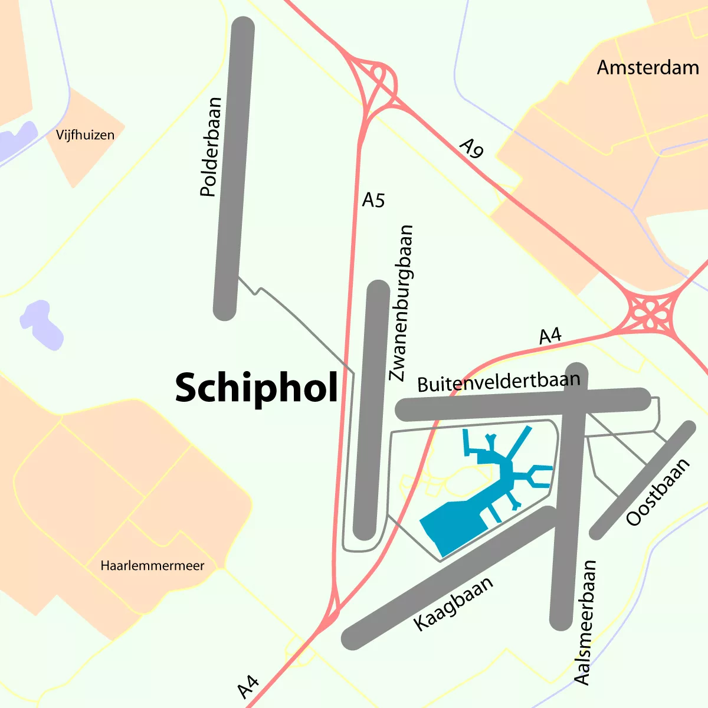
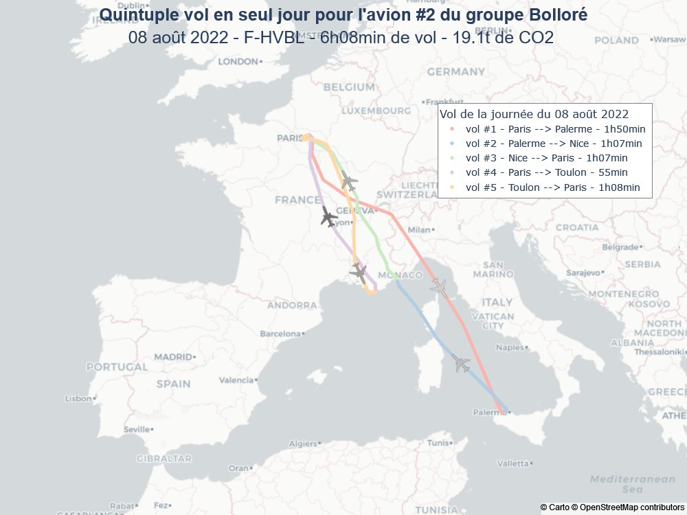

Interdiction des vols de nuit, réduction du nombre de passagers, annulation d\un projet de nouvelle piste et interdiction des jets privés. [L’annonce de l’aéroport de Schiphol ce mardi](https://news.schiphol.com/schiphol-to-be-quieter-cleaner-and-better-night-closure-ban-on-private-jets-and-people-first/) ne fait pas dans la demi-mesure. 

Une seule de ces mesures, l’interdiction des jets privés était discutée en France deux jours plus tard. [Proposition de loi simple](https://www.assemblee-nationale.fr/dyn/16/dossiers/interdire_jets_prives) discutée et balayée rapidement par les députés. C’est l’occasion de passer en revue les motivations des uns et des autres…
<!--excerpt-->

## Mardi l’annonce de Schiphol

Après [le procès du siècle](/le-gouvernement-doit-proteger-les-gens), le gouvernement néerlandais multiplie les mesures pour changer les habitudes néerlandaises de productivisme agricole ou de développement commercial au-delà de leur petit territoire. La dernière annonce de l'**aéroport de Schiphol** va dans ce sens et indique poursuivre les objectifs des [accords de Paris](/affaire-du-siecle-copie) en rendant ses activités plus efficaces.

Après avoir inventé le concept de hub et s’être étendu sur des hectares pendant des années, l’aéroport annonce maintenant qu’il va se réorganiser pour transporter le même nombre de passagers en réduisants son impact sur l’environnement. Pour cela, l’aéroport compte réduire les vols tôt le matin et tard le soir et interdire complètement les vols de nuit (décollage entre minuit et 6:00). Pour les vols en journée, les normes d’appareils autorisés seront petit à petit adaptés pour réduire les nuisances et l’impact carbone par passager. Dans ce cadre aussi, les jets privés, émettant environ 20 fois plus de CO2 qu’un vol commercial, seront supprimés.

L’aéroport de Schiphol a aussi annoncé abandonner la construction d’une nouvelle piste, parallèle à Kaagbaan au sud est du terminal. Personnellement, je pensais que 6 pistes d’atterrissage pour un aéroport transportant moins de passagers que l’aéroport Charles de Gaulle c’est largement suffisant. La suppression de la piste Polderbaan située à 30 minutes de roulage du terminal permettrait j'en suis sûr de pas mal réduire les nuisances et les émissions.

{.center}

La RTBF a remarqué que des compagnies ont attaqué ces initiatives et que [le tribunal de la Haye a annoncé mercredi](https://www.rtbf.be/article/la-justice-n-autorise-pas-la-haye-a-reduire-le-nombre-de-vols-a-schiphol-des-cette-annee-11178835) que l’aéroport ne pourra pas réduire le nombre de vols cette année parce que le gouvernement n’a pas consulté toutes les parties avant de prendre ses décisions.

## Jeudi, le débat à l’assemblée (en France)

C’est dans la même semaine que le [texte de Julien Bayou et des députés écologistes](https://www.assemblee-nationale.fr/dyn/16/textes/l16b0885_proposition-loi) a été examiné lors de la journée de niche parlementaire du groupe EELV. Le ministre des transports Clément Beaune s'est déclaré défavorable, préférant taxer ces vols que les interdire et soulignant la difficulté de définir et de contrôler les dérogations (pour les vols sanitaires ou de police par exemple).

On peut résumer les avis de la majorité avec l’interview d’un autre ministre Christophe Bechu, interrogé sur LCP à ce sujet :

<blockquote class="twitter-tweet my-auto">
.<a href="https://twitter.com/ChristopheBechu?ref_src=twsrc%5Etfw">@ChristopheBechu</a> n&#39;est pas favorable à l&#39;interdiction des jets privés en France. &quot;Nous émettons 400 millions de tonnes de gaz à effet de serre. Les jets privés, c&#39;est 400 000 tonnes, soit 0,1 % des émissions nationales&quot;, note-t-il.<a href="https://twitter.com/hashtag/AuditionPublique?src=hash&amp;ref_src=twsrc%5Etfw">#AuditionPublique</a> <a href="https://twitter.com/hashtag/JetsPriv%C3%A9s?src=hash&amp;ref_src=twsrc%5Etfw">#JetsPrivés</a> <a href="https://t.co/BgIOLT29Pd">pic.twitter.com/BgIOLT29Pd</a>
&mdash; Public Sénat (@publicsenat) <a href="https://twitter.com/publicsenat/status/1642953268052598798?ref_src=twsrc%5Etfw">April 3, 2023</a></blockquote>  

Lui aussi y est défavorable parce que ceci ne concerne qu’un tout petit pourcentage des émissions de gaz à effet de serre et que les mesures fiscales sont suffisamment efficaces. Il ajoute, ignorant l’annonce de Schiphol deux jours plus tôt, qu’en cas d’interdiction, les riches iraient à l’étranger pour pouvoir prendre le jet et qu’il faudrait discuter cette mesure au niveau européen. 

{.center}

Alors je ne sais pas si Vincent Boloré effectuerait ses Paris-Nice depuis l'étranger mais plutôt que de [suivre quelques milliardaires en jet](https://twitter.com/i_fly_bernard) pour savoir si tout cela serait efficace, on peut lire l’analyse de Schiphol les poussant a bannir les jets privés de cet aéroport :

*[…] causent des nuisances et des émissions de CO2 disproportionnées par passagers […] 30 % a 50 % de ces vols en jets privés sont à destination de lieux de vacances comme Ibiza, Cannes ou Innsbruck. Il y a suffisamment de créneaux horaires ouverts par ailleurs pour ces destinations populaires pour les jets privés.*

L’aéroport ne se prononce pas sur l’efficacité des mesures fiscales en France mais on peut imaginer par leur choix de reporter le trafic des jets sur des vols commerciaux existant sera plus efficace.

Il reste un point pour lequel Schiphol semble donner raison à Christophe Bechu. Nulle part l’aéroport annonce vouloir éteindre les enseignes ou couper le wifi la nuit. Ces mesures ne concernent qu’un tout petit pourcentage des émissions de gaz à effet de serre et l’aéroport préfère se concentrer sur les émissions de son métier qui sont le transport aérien. Le reste, c’est une goutte d’eau et c’est pour ça que ça ne sert à rien (ou pas) d’essayer de réduire leurs émissions.
