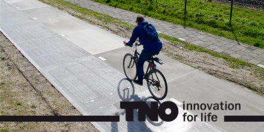
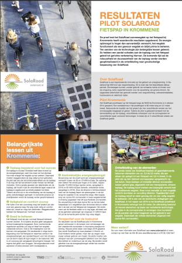

J'ai annoncé en grande pompe la [première route solaire du monde](/La-premiere-route-solaire-du-monde) il y a presque 8 ans de cela. 

{.center}

Depuis de nouvelles routes du même genre ont été construites mais le concept reste encore peu développé. Il serait peut-être temps de revenir sur cette route qui était un projet pilote et d'en voir les résultats.
<!--excerpt-->

C'est en lisant un article sur la constriction d'une [troisième piste cyclable solaire qui démarre](https://www.pv-magazine.fr/2023/05/10/la-construction-dune-troisieme-piste-cyclable-solaire-demarre-aux-pays-bas/) aux Pays-Bas que je me suis souvenu qu'il y avait eu une première piste cyclable aux Pays-Bas et que cette dernière était la première route solaire du monde.

La nouvelle route est dans le Brabant septentrional et sera déployée le long de la route provinciale N285 à proximité de Wagenberg. Elle devrait être composée de 600 panneaux solaires solide avec un revêtement spécial et mesurer 500 m de long et permettra d'effectuer des relevés sur l'usure, le rendement et la résistance de ce système pensant 5 ans.

La piste que j'avais appelé *première route solaire du monde* ([que j'aurais pu utiliser](https://alix.guillard.fr/velotraces/#?f=2010-08-01_drooderfiets.nl.gpx)) avait été mise en place par l'institut de recherche TNO (Toegepast Natuurwetenschappelijk Onderzoek) près de Krommenie en Hollande septentrionale  et ne mesurait que 90 m de long. En outre les études sur cette route n'ont duré que trois ans. Fidèle à mon habitude, je vous ai donnée rendez-vous pour dans 3 ans et je n'en ai plus parlé.

## Les résultat de la première route solaire du monde

Voici donc avec 5 ans de retard les résultats de cette expérimentation encore unique au monde. L'équipe espérait un rendement entre 50 et 70 kWh par m² par an. et cette espérance a même été dépassée la première année avec 73 kWh par m². Une deuxième version de panneaux dont le revêtement faisait mieux passer la lumière a même produit 93 kWh/m² en 2016.

{.center}

Les résultats sont qualifiés de prometteurs et [la fiche de résultats](https://www.solaroad.nl/wp-content/uploads/2018/07/Factsheet_Resultaten_SolaRoad_Krommenie.pdf) dresse une perspective très reluisante avec des matériaux amenés à être de plus en plus efficaces dans les années à venir.

Pourtant, après cette expérience, l'équipe de Solaroad a démantelé la route de Krommenie et a distribué ses plaques de chaussées-panneaux solaires jusqu'en France ou quelques tronçons se sont retrouvés à Nantes et Étampes où une section de piste cyclable permet d'éclairer la route mai à La Clarté ou deux panneaux permettent d’alimenter la lumière d'un rond-point.

La construction de petits tronçons analogues ont aussi été déployés à Groningue ou à Haaksbergen histoire de ne pas recaser tous les panneaux de l'expérience hors du pays. Par contre, pas de développement de nouvelle route solaire définitive en projet.

## Place aux gros volumes

Après cette expérience réussie de panneaux photovoltaïque sur circulation douce, Solaroad s'attaque aux poids lourds. [Deux tronçons de route à gros trafic](https://www.solaroad.nl/eerste-inzichten-uit-de-pilot-projecten-in-provincies-noord-en-zuid-holland/) ont été construit en 2019, l'un de 100 m à Spijkenisse à Hollande septentrionale et un autre tronçon de 50 m à Haarlemmermeer.

## Et la troisième piste cyclable alors ?

La troisième piste cyclable n'est pas un projet de Solaroad mais in *Zon op Infra* qui est [un consortium](https://zonopinfra.nl/over-zon-op-infra) beacoup plus large aux projets plus ambitieux. Les partenaires sont l'agence royale de l'eau ('Rijkswaterstaat'), agence d'État, *TKI Urban Energy* une agence de coordination des projets durables innovants et le centre de recherche  pour les applications solaires *Solar Energy Application Centre* (SEAC) où l'on retrouve TNO comme partenaire.

L'ajout de partenaires, auxquels ont peut ajouter la province du Brabant septentrional, permet d'avoir un projet d'étude plus long (5 ans) sur un ouvrage cinq fois plus grand (500 m) avec sûrement la mise  l’essai de plusieurs systèmes photovoltaïques et de plusieurs revêtements. Le but de ce projet est une montée en compétence de tous les acteurs dans le domaine des routes solaires. Après les résultats prometteurs de Solaroad il y a cinq ans, il faudra attendre encore 5 nouvelles années pour savoir si cette idée vaut vraiment le coup.

Nous sommes encore loin des projets industriels qui permettraient de produire des plaques de routes solaires pour construire les centaines de kilomètres de nouvelles voies cyclables du pays et pour produire les mégawatts d'électricité décarbonée dont les Pays-Bas ont besoin d'ici 2050. Si l'offre industrielle de ce type de panneaux n'existe pas encore c'est sûrement que la rentabilité de ce genre de produit reste encore à démontrer. C'est je pense la raison d'être de cette troisième route solaire du monde.

<!-- post notes:
TODO:
https://en.rollingsolar.nl/work-packages 
ressources:
https://resources.solarbusinesshub.com/solar-energy-research-centers/item/solar-energy-application-centre-seac
https://www.rijkswaterstaat.nl/en/environment/projects/solar-highways
https://www.utwente.nl/en/eemcs/energy/projects/current/TKI-urban-energy-slimpark/
--->
