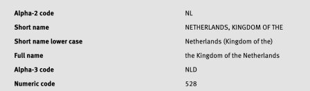

C’est une petite nouvelle anodine que j'ai découvert hier en lisant une note de l’ISO du 4 avril et qui provoque ce gros titre : **Les Pays-Bas changent de nom**.

L'ISO est l'organisme de standard international, qui définit plein de normes dans autant de domaines que l'électronique, la comptabilité, les transports, etc.  **La norme ISO 3166** définit des codes pour presque tous les pays et territoires du monde. 

La liste ISO 3166-1 contient cette liste des pays et territoires ainsi que des codes uniques à deux et à trois lettres pour les identifier. On retrouve ces codes à deux lettres par exemple sur les plaques d'immatriculation et ceux à trois lettres sur les tableaux des médailles aux jeux olympiques.
<!--excerpt-->

À chaque fois qu’un pays apparait, change de nom ou de statut, cette liste est mise à jour. Ainsi, quand les [Antilles néerlandaises ont changé de statut](/nouveaux-codes-iso-hollandais) en 2011, le code AN a disparu pour laisser place au BQ, CW,  et SX de Bonaire, Saint-Eustache et Saba pour le premier, Curaçao et Sint Marteen pour les suivants. Plus récemment la Macédoine du Nord a changé de nom en 2019. [La fiche du MK](https://www.iso.org/obp/ui/#iso:code:3166:MK) a ensuite été mise à jour en 2020 pour ajouter « the » devant le nom complet de « Republic of North Macedonia ». 

## Les Pays-Bas changent de nom

En ce 4 avril 2023, c'est la [fiche du NL](https://www.iso.org/obp/ui/#iso:code:3166:NL) qui est mise à jour, il y est précisé que cette modification porte sur la version courte du nom.

En effet chaque pays de la liste ISO 3166 est représenté par un nom court qui est généralement celui qu’on voit sur les cartes et dans les rencontres sportives tandis que la forme longue est le nom complet officiel du pays que l’on retrouve souvent sur les passeports ou les traités bilatéraux. Par exemple la fiche FR renseigne « République française » comme nom complet et « France » comme forme courte.

Depuis le 4 avril donc la forme courte des Pays-Bas n’est plus « Pays-Bas » mais « Pays-Bas (Royaume des) » ce qui le rapproche du nom officiel « Royaume des Pays-Bas »

{.center}

Il est fort probable que cette nouvelle forme courte ne soit pas utilisée sur les cartes ou dans les rencontres internationales mais elle est maintenant enregistrée comme telle dans la norme ISO 3166 et c’est comme ça.

Ce petit changement anodin amène deux questions. La première est pourquoi je parle d’un truc aussi anodin dont personne ne fait ni ne fera attention. La seconde est pourquoi tout court. Pourquoi un tel changement a été expressément demandé à l'ISO par les représentants du gouvernement néerlandais.

Je peux répondre à la première question puisque c'est moi qui décide de parler de ces [endonymes et exonymes](/le-nom-des-villes) bataviens. Je suis même capable de faire un long article pour expliquer pourquoi [Pays-Bas a un tiret](/Le-tiret-des-Pays-Bas) alors qu’en fait il ne devrait pas en avoir.

Quant à savoir pourquoi le gouvernement néerlandais a demandé à avoir une forme courte du nom de leur pays, aussi longue que le nom officiel, je n’en ai aucune idée. Si vous savez, n’hésitez pas à l’écrire ci-dessous.
