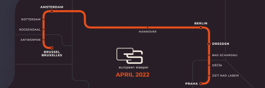
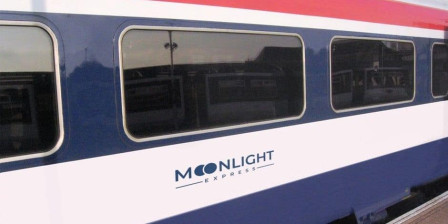

Il y a neuf ans, à l'occasion d'un voyage entre [Amsterdam et Prague par le CNL457](/Train-de-nuit--c-est-fini), je vous annonçais la fin des liaisons de trains de nuit entre Amsterdam et Prague, Varsovie, Berlin et Copenhague. Beaucoup comme moi ont regretté la fin de ce service unique qui nous permettait d'arriver frais et dispo le matin à l'autre bout de l'Europe.

Seulement depuis neuf ans, l'importance du bilan carbone dans nos vies prend de plus en plus d'importance et depuis les commissaires européens jusqu'au simple voyageur, nombreux sont ceux qui estiment que [l'Europe a besoin de trains de nuit](https://ouiautraindenuit.wordpress.com/). Une ligne entre (Bruxelles, Rotterdam) Amsterdam et Berlin, va donc rouvrir le 25 mai prochain. Les billets sont disponibles dès ce lundi.

## La fin de la City Night Line
J'ai déjà rendu compte de la très mauvaise qualité du service rendu par cette ligne donc la DB n'entretenait pas le matériel et qui accusait des retards chroniques à cause des pannes. La DB a abandonné sa filiale de ses trains de nuit en 2016 avec l'excuse que la clientèle n'était pas au rendez-vous et préférait voyager en ICE.

Les rames ont été cédées au rabais à plusieurs compagnies, dont l'ÖBB autrichienne qui s'est empressée de les rafraîchir pour remettre en service les lignes qui desservaient Vienne. En fin de compte, la compagnie autrichienne a repris la City Night Line fin 2016 et a créé NightJet dont les premières liaisons sont ouvertes en 2016 Dont Vienne - Düsseldorf qui sera prolongée jusqu'à Amsterdam.

{.center}
*NightJet avec locomotive NS allant vers Amsterdam*

Très vite, le succès est au rendez-vous. La compagne annonce une augmentation du nombre de passagers dès février 2017 et prépare en 2019 l'ouverture de nouvelles lignes en partenariat avec les pays voisins pour faire face à l'augmentation de la demande. La ligne Paris est ouverte en 2021 tout comme le prolongement de la ligne de Düsseldorf vers Amsterdam, un retard dû au ralentissement de l'activité pendant la pandémie.

## Création d'European Sleeper

L'idée de répondre à une demande croissante motive les entrepreneurs. Février 2021, aux Pays-Bas **Elmer van Buuren** qui a organisé une conférence sur le sujet, annonce s'associer avec **Chris Engelsman** du site [Noord West Express](http://noordwestexpress.nl/over/) en créant la compagnie **European Sleeper** pour relier Buxelles, Rotterdam et Amsterdam à Berlin et Prague en train de nuit.

[{.center}](https://meinamsterdam.nl/public/images/contribs/2023/trace_-european-sleeper.jpg)
''Proposition d'origine de European Sleeper''

Mars 2021, en Belgique, **Louis Lammertyn** et **Louis De Jaeger** annoncent la création de Moonlight Express pour relier Bruxelles et Liège à Berlin.

{.center}

Très vite, les startupeurs découvrent que mettre en place une ligne de train de nuit quand il faut obtenir les homologations dans 4 pays différents, que le matériel roulant est peu disponible et que les compagnies nationales comme la DB ne vous aideront pas, est plus compliqué que d'annoncer ses intentions en un tweet. Ils décident donc de faire équipe plutôt que de lancer deux fois le même service. La coopérative de droit néerlandais est créée en 2021 et est l'occasion de lancer une souscription et l'ouverture du service est prévue pour avril 2022. Après plusieurs rebondissements, la rame de nuit s'apprête à partir le 25 mai 2023.

Le service inaugural partira de Berlin à 22 h 56 le jeudi 25 mai, desservant Amsterdam, Rotterdam pour une arrivée à Bruxelles à 9 h 27 le lendemain (jour de mon anniversaire). Le trajet du retour aura lieu le soir même. Départ de Bruxelles à 19 h 22 (ce qui permettra d'embarquer à Amsterdam un peu avant 23h) pour une arrivée à Berlin à 6 h 48. 

Le service est annoncé comme opérant un jour sur deux (ou plutôt une nuit sur deux) allant vers l'ouest les jours impairs et retournant à l'est les jours pairs. Les places couteront entre 49€ et 179€ selon le niveau de confort et la gare de départ. Les trois niveaux de confort sont : assis en compartiment de 6, couchette en compartiment de 6 ou coupé privé avec 2 ou 3 lits. C'est plus cher qu'un vol low cost entre Schiphol et Schönefeld mais devient compétitif si on compte une nuit de plus dans la ville de destination.

## Les incidents de parcours

À l'annonce de la création d'European Sleeper j'étais très emballé à l'idée de retrouver un service de nuit digne de ce nom entre Prague et Amsterdam et je suis quelque peu déçu de devoir attendre l'année prochaine pour le prolongement de la ligne annoncé en 2024. D'autant qu'initialement ce service complet était annoncé pour 2022.

La principale raison du retard de plus d'un an avant le lancement du service est lié à l'absence de liaison tchèque. C'est aussi la conséquence du manque de matériel roulant pour les trains de nuit constatés dans toute l'Europe. La SNCF se retrouve aujourd'hui à réadapter de vieux wagons corail destinés à la casse parce qu'aucun industriel ne peut leur fournir de rame de nuit. En 2018, la compagnie Nightjet a signé un contrat avec Siemens Mobility pour la fourniture de 13 trains de nuit nouvelle génération Viaggio qui n'ont commencé à être livrés qu'en 2022. Le contrat porte aujourd'hui sur 33 trains, ce qui limite fortement les capacités du constructeur. Pour le reste, l'offre n'est tout simplement pas là parce que les compagnies historiques ont prouvé leur désintérêt pour les trains de nuit et les nouveaux arrivants ne sont pas assez solides pour supporter d'attendre 4 ans avant de pouvoir rentabiliser leur investissement.

Tous les nouveaux acteurs comme European Sleeper en sont réduits à rénover d'anciennes rames comme celles de la City Night Line. Même d'occasion, le matériel est rare. Ceci rend l'investissement plus conséquent alors même qu'il est évident qu'il est voué à durer moins longtemps.

Avant de faire sa première annonce, European Sleeper avait scellé un partenariat intéressant avec **Regio Jet**, la compagnie de Radim Jančura trublion tchèque du transport de passagers. Avant la création des cars Macron ou de FlixBus en Allemagne, sa compagnie, Student Agency, desservait déjà toutes les bourgades des Tchéquie et de Slovaquie en car, reliant les grandes villes Européennes. Renommée Regio Jet, cette compagie opère plusieurs lignes de trains dont une liaison de nuit entre Prague et Košice et un service saisonnier vers les plages de Croatie.

[{.center}](https://meinamsterdam.nl/public/images/contribs/2023/HZ__1141-Rijeka-Regiojet.jpg)
*Le train de nuit RegioJet à Rijeka, Croatie*

Comme la compagnie opère déjà une ligne de nuit, elle a le savoir-faire pour trouver un train, le rénover et l'opérer, laissant plus de temps aux autres partenaires pour se concentrer sur le marketing et la billetterie. C'était un partenariat en or # Sauf que Radim Jančura a aussi l'expérience d'un Tycoon à la Patrick Draghi, trouvant judicieux de dégager plus tôt des bénéfices en ne payant pas ses fournisseurs. La société qui avait aménagé leur premier train de nuit, n'ayant toujours pas été payée, a refusé de travailler à rénover la rame pour ce nouveau train European Sleeper. Personne dans le partenariat n'ayant d'argent à mettre sur la table, il a fallu se débrouiller autrement.

À la date prévue de l'ouverture de la ligne en 2022, les sociétaires d'European Sleeper ont reçu un appel à participation à un crowdfounding pour l'équivalent du prix d'un wagon. La déception passée, l'argent a été rapidement rassemblé et je suppose qu'un accord a été trouvé pour louer du matériel à [RDC Deutschland](https://www.rdc-deutschland.de).

Tous ces rebondissements ont maintenant une fin qui est le début de la véritable aventure. Le premier train partira de Berlin le 25 mai et les billets sont en vente dès ce lundi sur [European Sleeper](https://www.europeansleeper.eu/). J'espère vraiment que ce train aura du succès et que la ligne se prolongera pour Prague rapidement.
---
<!-- post notes:
https://en.wikipedia.org/wiki/File:Haldern_NSI_193_766_Nightjet_420_Amsterdam_C_(51235387391).jpg 
https://twitter.com/Moonlight_Expr/status/1374258537698713600/photo/1 
https://pbs.twimg.com/profile_banners/1372485235364016128/1626439005/1500x500
--->
