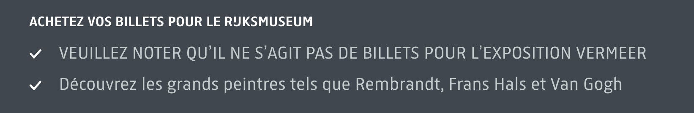
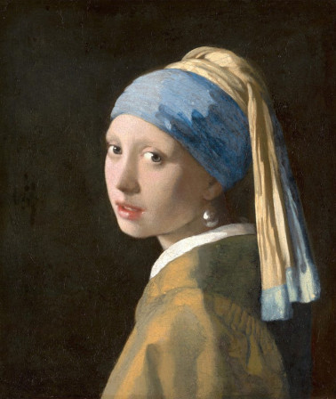
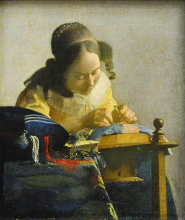
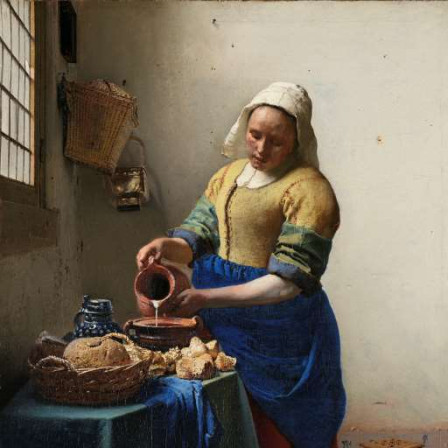

Ce printemps le Rijksmuseum ouvre sa [rétrospective Johannes Vermeer](https://www.rijksmuseum.nl/fr/presse/2023-pr-sentiert-das-rijksmuseum-die-bislang-gr-te-vermeer-ausstellung) et rassemble pour la première fois en un seul lieu, 28 tableaux du maître du XVIIᵉ siècle sur les 37 qui lui sont attribués. Ils sont observables au Rijksmuseum jusqu’au 23 juin par tous les chanceux qui ont put avoir des billets. L’expo, annoncée en décembre est déjà complète depuis des lustres.

{.center}

Pour réaliser une telle rétrospective, le Rijksmuseum s’est fait prêter 24 toiles de 14 institutions de par le monde dont la plupart sont des grands musées nationaux mais il y a aussi des fondations et d'autres musées comme la Mauritshuis de la Haye qui a bien entendu prêté trois tableaux dont la star **la jeune fille à la perle** qui fait l'affiche de l'expo.

{.center}

La France participe à cette exposition avec seulement un tableau prêté par le Louvre et qui a fait l'objet d'un timbre en France en 1982 : La dentelière. 

{.center}

La différence entre les deux reproductions que j'affiche sur mon blog ci-dessous c'est que dans la première elle est **autorisée par le musée Mauritshuis** et dans la seconde elle est **interdite par le Louvre** utilise le régime du droit d'auteur pour justifier de cette interdiction comme le rappelle l’ami Thierry Noisette dans [un article de ZD Net](https://www.zdnet.fr/blogs/l-esprit-libre/l-exposition-vermeer-les-copyrights-abusifs-et-le-domaine-public-39956074.htm).

``Sur les 14 musées qui ont prêté des œuvres à l’exposition d’Amsterdam, 9, dont le Louvre, prétendent à un copyright sur la reproduction numérique des œuvres du peintre… mort il y a 3 siècles et demi.``

Thierry Noisette souligne le [travail effectué par Douglas McCarthy](https://douglasmccarthy.com/2023/03/28-vermeers/), spécialiste de l’open access dans la culture sur les toiles prêtées dans le cadre de cette exposition. Sur les 28 tableaux de l'exposition la moité en fait l'objet d'une revendication de droits d'auteurs par leurs institutions propriétaires. Et Douglas McCarthy de rappeler que dans l'ensemble des pays ayant prêté des tableaux, les droits d'auteurs expirent 70 ans après la mort de l'auteur. Ce qui pour le cas de Johannes Vermeer, mort le 15 décembre 1675 est passé depuis bien longtemps.

Le louvre comme les deux tiers des musées prêteurs, imposent donc des restrictions à la reproduction qu’ils ne sont pas en droit de demander. C’est une pratique contestable qu'on appelle *copyfraud* et qui est hélas courante. Le Louvre est d’ailleurs dans la récidive puisqu’en 2017, le musée interdisait les photos lors d’une exposition dédiée à ce même Vermeer ce qui a, à l'époque, [fait réagir le juriste Calimaq](https://scinfolex.com/2017/02/26/vermeer-au-louvre-une-exposition-qui-bafoue-vos-droits/). Le comble de cette exposition est l'interdiction de photographier le tableau de **la laitière** prêté par le Rijksmuseum dont le musée amstellodamois offre une copie numérique haute définition sur son [Rijkstudio](https://www.rijksmuseum.nl/nl/rijksstudio).

{.center}

On notera que les deux musées néerlandais font un sans-faute pour respecter le droit des œuvres dans le domaine public. La Mauritshuis mentionne que l’œuvre est dans le **domaine public** tandis que le Rijksmuseum a placé ces tableaux sous [licence CC0](https://creativecommons.org/publicdomain/zero/1.0/legalcode.fr) qui est la licence *créative commons* équivalente du domaine public.

Encore un exemple néerlandais à suivre.
---
<!-- post notes:
opendata https://docs.google.com/spreadsheets/d/177ZRz_mfwjdJmFwF-b5gBv5oPtNmuvH2-3rfHlu-uxY/edit#gid=0
--->
