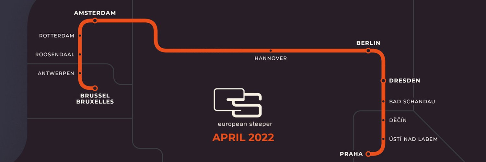
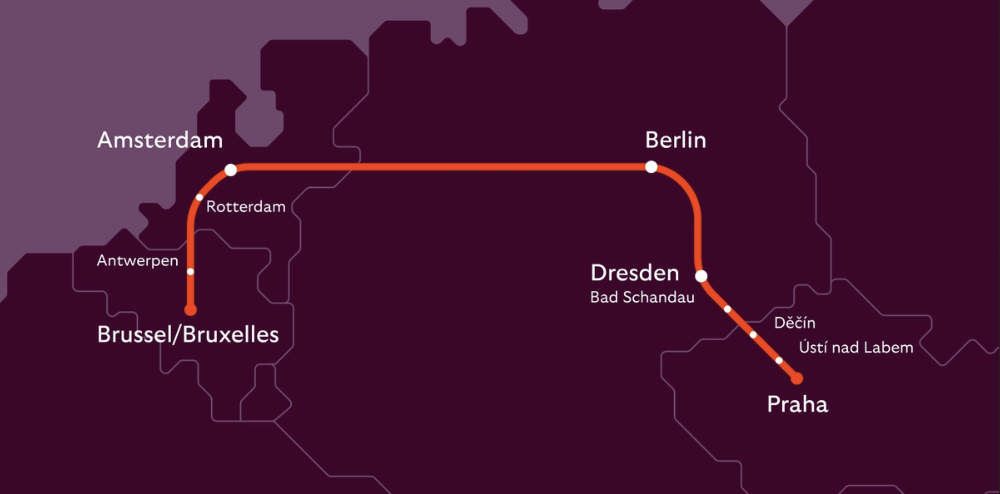

Depuis hier (lundi 25 mars 2024), un train de nuit relie **Bruxelles** à **Prague**. C'est le train **European Sleeper** que j'avais annoncé en 2023. Le service a été prolongé depuis Berlin jusqu'à Prague . European Sleeper a enfin réalisé son projet initial qui est de relier quatre capitales sur un seul trajet.

le projet initial :
{.center}

<!--excerpt-->
est devenu ceci :
{.center}

ce qui est la même chose mais en mieux dessiné.

J'ai déjà parlé ici de l'historique de cette liaison ferroviaire depuis [la City Night Line 457](/Train-de-nuit--c-est-fini) jusqu'aux [déboires du début de European Sleeper](/retour-du-train-de-nuit) mais maintenant qu'Amsterdam et Prague sont à nouveau reliés par le train sans changement. il n'y a plus rien à ajouter. Je n'ai plus qu'à vous montrer ce train dans la campagne batave.

<!-- HTML -->

<iframe width="560" height="315" src="https://www.youtube.com/embed/MRP7RPy1g5M?si=zFixSwBXoIvGjVF9" title="YouTube video player" frameborder="0" allow="accelerometer; autoplay; clipboard-write; encrypted-media; gyroscope; picture-in-picture; web-share" referrerpolicy="strict-origin-when-cross-origin" allowfullscreen></iframe>

<!-- / HTML -->

European Sleeper relie Bruxelles à Anvers, Rosendaal, Rotterdam, la Haye, Schiphol, Amsterdam, Amersfoort, Deventer, Bad bentheim, Berlin, Dresde, Bad Schandau, Děčin, Usti nad Labem et Prague.  [trois fois par semaine](https://www.europeansleeper.eu/travel-info).
