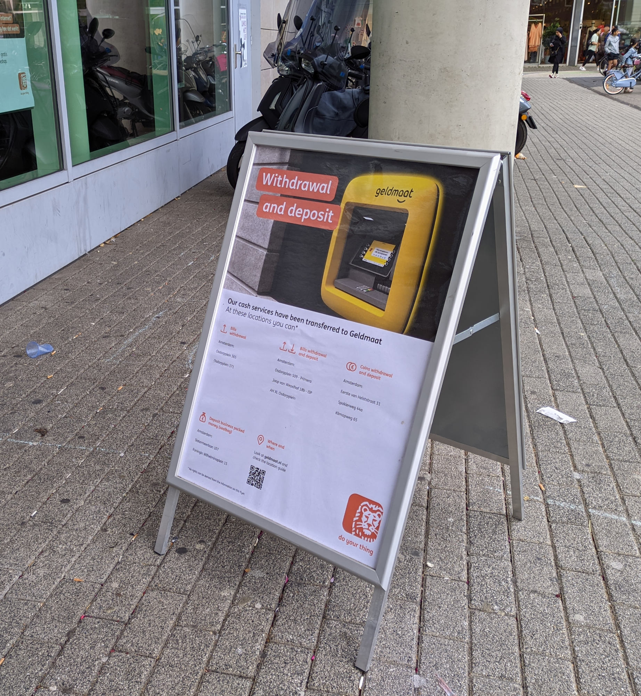
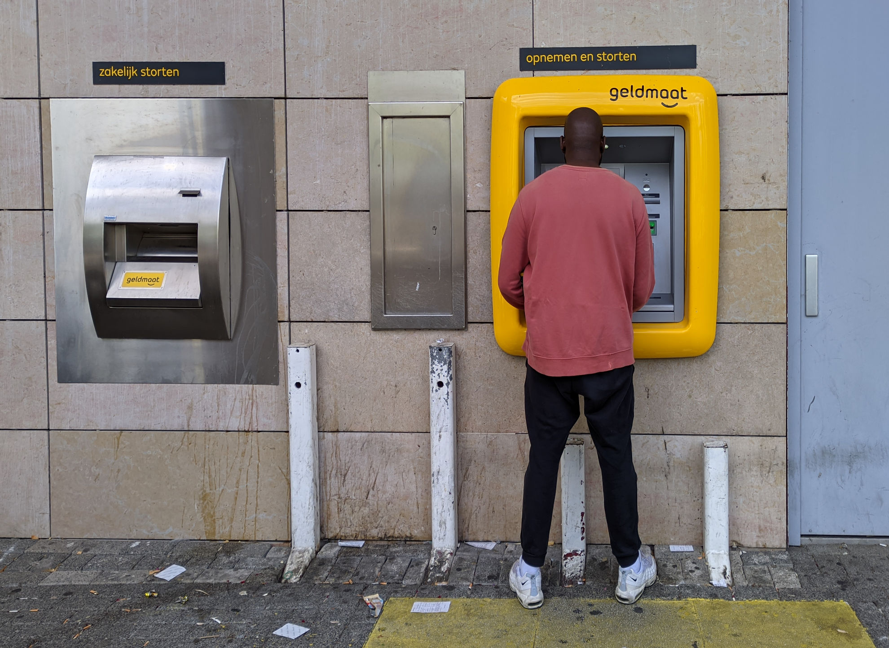

En 2006, quand je suis arrivé à Amsterdam, j'ai choisi ma banque [en fonction de la couleur de ses distributeurs de billets](/choisir-une-banque). Maintenant ce n'est plus possible. Tous les distributeurs se ressemblent et aucun ne porte la marque d'une banque. Ils ont tous le même nom (**Geldmaat**) et la même tête (jaune). 

Depuis 2020, tous les distributeurs de billets du pays sont opérés par la même entreprise, Geldmaat, au service de toutes les banques et de leurs clients. Ce n'est pas tout, l'ensemble des automates de services bancaires sont, eux aussi, opérés par Geldmaat. Les banques l'expliquent parfois devant leurs agences pour réorienter les clients perdus.

{.center}
<!--excerpt-->
> Affiche devant une agence ING expliquant en anglais comment et où retirer et déposer de l'argent avec Geldmaat

Le changement a été annoncé en 2018. Constatant la diminution des transactions en espèces, les trois grandes banques du pays (ABN-AMRO, ING et Rabobank) ont décidé d'optimiser leurs services en lançant [des distributeurs en marque blanche](https://forum.eurobilltracker.com/viewtopic.php?t=57129&hilit=Geldmaat). En fait de marque blanche, c'est plutôt une marque jaune: **Geldmaat**. Le jaune (*geel*) est une couleur qui n'est présente dans aucune ligne graphique des banques à l'origine du service et c'est aussi la couleur dont le nom sonne le plus comme l'argent (*geld*)

### Nouveau mot: geldautomaten

**Distributeur de billets** se dit *geldautomaten* en néerlandais, *Geld* pour argent et *Automaten* pour automate. Le nom de la nouvelle société Geldmaat est donc suffisamment explicite sur son activité pour n'avoir besoin que de son nom écrit sur les nouveaux appareils.

## Une idée belge

En fait, les trois banques néerlandaises n'ont fait que copier les banques belges. En 2017, la fédération du secteur, [Febelfin](https://fr.wikipedia.org/wiki/Febelfin) a commandé une étude sur les coûts grandissants des distributeurs, pourtant de moins en moins utilisés. Une des solutions proposée par le cabinet Deloitte est la mutualisation des automates en marque blanche. En 2018, des petites banques belges suivent ce conseil et créent avec BPost, **Jofico** (pour *Joint Financial Company*). Les quatre grandes banques du pays (KBC, Belfius, ING België en BNP Paribas Fortis) suivent le mouvement en 2019 et créent **Batopin** (pour *Belgian ATM Optimisation Initiative*).

Le paysage bancaire néerlandais étant moins varié qu'en Belgique, il leur a suffi que les trois plus grandes banques du pays s'accordent pour créer Geldmaat. Les négociations ont été rapides et le déploiement des nouveaux appareils encore plus rapide. Six mois en 2019, ont suffit pour installer 7000 distributeurs dans 2300 lieux, changeant le paysage de tous les usagers des banques. Même les autres banques se servent du réseau Geldmaat comme SNS qui le [promeut sur son site](https://www.snsbank.nl/particulier/service/meer-mogelijk-bij-geldautomaten.html).

## Pour déposer de l'argent aussi

Aprěs les distributeurs de billets, Geldmat s'est occupé des appareils de dépôt d'espèces que les banques peinent toujours à maintenir en état (bien souvent parce qu'elles ne veulent pas s'en donner les moyens). Aujourd'hui les distributeurs de billets offrent souvent la fonction de dépôt d'espèces, mais Geldmaat prend aussi en charge les appareils de dépôt spéciaux comme celui ci-dessous.

{.center}

## Ce n'est pas toujours gratuit

Ce n'est pas parce que les banques ont optimisé ensemble ce service pour qu'il coûte moins cher que les clients finaux peuvent utiliser ce service gratuitement. Dans de nombreux cas les services sont facturés aux clients. Le retrait d'espèces est dans la plupart des cas gratuit, mais parfois, il reste limité. Quant au dépôt d'espèces, il n'y a plus de banque offrant ce service gratuitement à part le compte jeune de Rabobank.

Les tarifs de ces services sont exposés dans le dossier de [financer.com](https://financer.com/nl/finance-academy/geld-storten-en-opnemen/#Hoeveel_kost_het)  *Contant geld storten en opnemen: wat kost het?* qui signifie **Retrait et dépôt d'espèces : combien il en coûte ?** On y découvre le coût de chaque opération selon sa banque. On y apprend aussi que le dépôt de pièces de monnaie peuvent s'effectuer dans les *muntautomaat* disponible dans les magasins de bricolage Gamma et Karwei. Enfin, les banques en ligne comme Revolut, N26 ou Wise ou les banques étrangères n'offre pas du tout la possibilité de déposer des espèces aux Pays-Bas.

