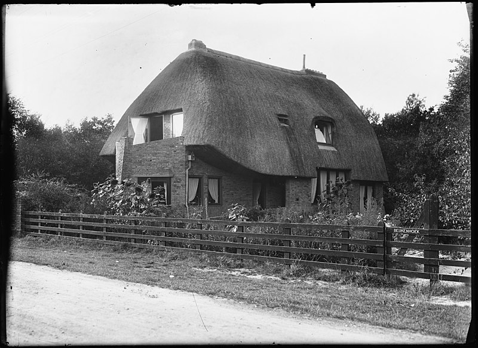
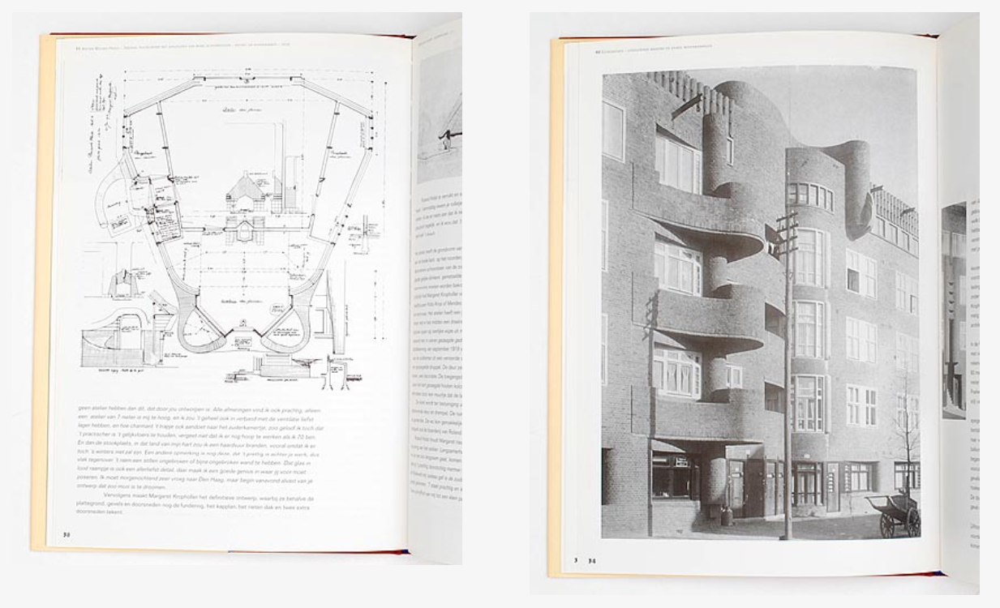

Une fois n'est pas coutume, c'est [pizzaroquette](https://piaille.fr/@pizza_roquette "compte mastodon de pizzaroquette") qui est à l'origine d'un nouveau post ici. Il y a deux semaines il a lancé un défi sur mastodon:

> Choisissez 20 bâtiments en brique qui sont restés avec vous ou vous ont influencé(e). Un par jour pendant 20 jours, sans ordre particulier. #mastobriques #20Briques20Jours #20Bricks20Days

Pour ce défi, le fan de briques a partagé cet immeuble Amstelodamois (Bon comme son compte a été effacé, je suis obligé de partager un autre message avec cette même photo): 

<!-- HTML -->
<blockquote class="mastodon-embed" data-embed-url="https://piaille.fr/@pizza_roquette/114248054747663473/embed" style="background: #FCF8FF; border-radius: 8px; border: 1px solid #C9C4DA; margin: 0; max-width: 540px; min-width: 270px; overflow: hidden; padding: 0;"> <a href="https://piaille.fr/@pizza_roquette/114248054747663473" target="_blank" style="align-items: center; color: #1C1A25; display: flex; flex-direction: column; font-family: system-ui, -apple-system, BlinkMacSystemFont, 'Segoe UI', Oxygen, Ubuntu, Cantarell, 'Fira Sans', 'Droid Sans', 'Helvetica Neue', Roboto, sans-serif; font-size: 14px; justify-content: center; letter-spacing: 0.25px; line-height: 20px; padding: 24px; text-decoration: none;"> <svg xmlns="http://www.w3.org/2000/svg" xmlns:xlink="http://www.w3.org/1999/xlink" width="32" height="32" viewBox="0 0 79 75"><path d="M74.7135 16.6043C73.6199 8.54587 66.5351 2.19527 58.1366 0.964691C56.7196 0.756754 51.351 0 38.9148 0H38.822C26.3824 0 23.7135 0.756754 22.2966 0.964691C14.1319 2.16118 6.67571 7.86752 4.86669 16.0214C3.99657 20.0369 3.90371 24.4888 4.06535 28.5726C4.29578 34.4289 4.34049 40.275 4.877 46.1075C5.24791 49.9817 5.89495 53.8251 6.81328 57.6088C8.53288 64.5968 15.4938 70.4122 22.3138 72.7848C29.6155 75.259 37.468 75.6697 44.9919 73.971C45.8196 73.7801 46.6381 73.5586 47.4475 73.3063C49.2737 72.7302 51.4164 72.086 52.9915 70.9542C53.0131 70.9384 53.0308 70.9178 53.0433 70.8942C53.0558 70.8706 53.0628 70.8445 53.0637 70.8179V65.1661C53.0634 65.1412 53.0574 65.1167 53.0462 65.0944C53.035 65.0721 53.0189 65.0525 52.9992 65.0371C52.9794 65.0218 52.9564 65.011 52.9318 65.0056C52.9073 65.0002 52.8819 65.0003 52.8574 65.0059C48.0369 66.1472 43.0971 66.7193 38.141 66.7103C29.6118 66.7103 27.3178 62.6981 26.6609 61.0278C26.1329 59.5842 25.7976 58.0784 25.6636 56.5486C25.6622 56.5229 25.667 56.4973 25.6775 56.4738C25.688 56.4502 25.7039 56.4295 25.724 56.4132C25.7441 56.397 25.7678 56.3856 25.7931 56.3801C25.8185 56.3746 25.8448 56.3751 25.8699 56.3816C30.6101 57.5151 35.4693 58.0873 40.3455 58.086C41.5183 58.086 42.6876 58.086 43.8604 58.0553C48.7647 57.919 53.9339 57.6701 58.7591 56.7361C58.8794 56.7123 58.9998 56.6918 59.103 56.6611C66.7139 55.2124 73.9569 50.665 74.6929 39.1501C74.7204 38.6967 74.7892 34.4016 74.7892 33.9312C74.7926 32.3325 75.3085 22.5901 74.7135 16.6043ZM62.9996 45.3371H54.9966V25.9069C54.9966 21.8163 53.277 19.7302 49.7793 19.7302C45.9343 19.7302 44.0083 22.1981 44.0083 27.0727V37.7082H36.0534V27.0727C36.0534 22.1981 34.124 19.7302 30.279 19.7302C26.8019 19.7302 25.0651 21.8163 25.0617 25.9069V45.3371H17.0656V25.3172C17.0656 21.2266 18.1191 17.9769 20.2262 15.568C22.3998 13.1648 25.2509 11.9308 28.7898 11.9308C32.8859 11.9308 35.9812 13.492 38.0447 16.6111L40.036 19.9245L42.0308 16.6111C44.0943 13.492 47.1896 11.9308 51.2788 11.9308C54.8143 11.9308 57.6654 13.1648 59.8459 15.568C61.9529 17.9746 63.0065 21.2243 63.0065 25.3172L62.9996 45.3371Z" fill="currentColor"/></svg> 
Post by @pizza_roquette@piaille.fr
 
View on Mastodon
 </a> </blockquote> 
<!-- / HTML -->

Mon sang n'a fait qu'un tour, c'est un immeuble de [l'école d'Amsterdam](/l-ecole-d-amsterdam) me dis-je, j'en suis sûr ça se voit trop. J'ai dû passer devant plein de fois en faisant des tours de [drooderfiets](/photos-drooderfiets-balade) dans le quartier.

En fait nan, je découvre ce bâtiment pour la première fois.

Cet immeuble situé sur la Holendrechtstraat à Amsterdam est une œuvre de l'architecte **Margaret Staal-Kropholler**, une figure pionnière de l'architecture néerlandaise dont j'apprends le nom aujourd’hui. Effectivement conçu dans le style distinctif de l'École d'Amsterdam, cet immeuble se distingue par sa façade en brique qui semble parcourue de vagues, grâce à des balcons et des avancées arrondis. 

Ces arrondis ne sont pas sans rappeler l'immeuble De Dageraad (par Michel de Klerk et Piet Kramer) à quelques centaines de mètres de là dans le Pijp, dont j'utilisais la photo sur mon article présentant [l'école d'Amsterdam](/l-ecole-d-amsterdam). À l'époque je passais sous silence le nom de Margaret Staal-Kropholler, persuadé que l'école d'Amsterdam était un repaire d'hommes comme beaucoup de cercles dans ces années 20. J'avais tort et pizzaroquette me le rappelle en m'encourageant à écrire sur elle (si si !).

## Margaret Staal-Kropholler

Margaret Staal-Kropholler (1891-1966) était donc la première femme à exercer la profession d'architecte aux Pays-Bas C'était une architecte  pionnière. Elle est connue pour  ses contributions significatives à l'architecture moderne et pas seulement ses constructions influencées par l'École d'Amsterdam qu'elle a rejointe. Ses projets, comme la Villa Zonnestraal à Hilversum, témoignent de son engagement envers des designs qui combinent esthétique et fonctionnalité. Son héritage continue d'inspirer les architectes contemporains et de célébrer l'importance des femmes dans le domaine de l'architecture.

Elle est particulièrement célèbre pour ses conceptions innovantes et fonctionnelles, qui ont marqué l'architecture résidentielle et institutionnelle de son époque. Staal-Kropholler a été l'une des , et son travail a été influencé par des mouvements tels que l'École d'Amsterdam et le modernisme. Ses projets, comme la Villa Zonnestraal à Hilversum, témoignent de son engagement envers des designs qui combinent esthétique et fonctionnalité. Son héritage continue d'inspirer les architectes contemporains et de célébrer l'importance des femmes dans le domaine de l'architecture.

### Promenade architecturale dans Amsterdam

[Une promenade de quartier](https://www.maandvandegeschiedenis.nl/page/17303/margaret-staal-kropholler-een-moderne-pionier) organisée par Het Schip, le musée de l'école d'Amsterdam nous apprend comment la contribution de Margaret Kropholler à l'architecture de son époque est loin d'être anecdotique et ce, justement parce qu'elle est une femme. Elle se considérait architecte de métier mais aussi femme au foyer comme toutes les femmes de son époque. Grâce à cela elle travaillait plus souvent sur des maisons ou des immeubles résidentiels et portait plus d'attention à l'aménagement des intérieurs au point de devenir une pionnière du fonctionnalisme et du modernisme.

Lors de cette promenade, l'architecte Marloes van Haaren, qui a restauré la maison préférée de pizzaroquette, précise que cette maison a été sauvée de la destruction il y a 30 ans. Ce n'est que dans les années 90 qu'a commencé à apparaitre un intérêt pour l'école d'Amsterdam. Marloes van Haaren explique que durant la rénovation, elle a eu l'idée de regrouper deux cages d'escalier mais qu'elle a appris plus tard que cette idée avait déjà été proposée par l'architecte d'origine. « Il ne peut y avoir qu'une femme pour voir ce qui est pratique » ajoute-t-elle avant un « haha ».

### La condition féminine

En fait la condition de la femme d'intérieur du début du XXe siècle est la motivation première de son travail d'architecte, elle a commencé a dessiner des lampes et du mobilier (dont cette [chaise aujourd'hui exposée au Rijksmuseum](https://commons.wikimedia.org/wiki/File:Stoel_van_eikenhout,_bekleed_met_bruin_leer_met_in_het_midden_van_de_zitting_een_bloem_en_op_de_rug_een_tak,_BK-1989-3-B.jpg)) avant de dessiner des intérieurs et de se soucier d'architecture, motivée par l'envie de réduire les efforts déployés par les femmes dans le travail domestique. Elle se disait qu'en concevant des maisons confortables et bien équipées basées sur des plans fonctionnels, elle pourrait faciliter la gestion de leur maison par les femmes. En 1918, elle fait une présentation « La femme et sa maison » devant l'Association néerlandaise des femmes au foyer. Elle aborde les besoins fonctionnels de la femme au foyer, thème qu'elle continuera dès lors, à promouvoir pendant des années par des articles dans les revues ou lors de conférences.

### L'école d'Amsterdam

En 1917 elle a été l'une des 5 architectes qui ont été commissionnés pour construire 16 villas au toit de chaume dans le [Park Meerwijk](https://nl.wikipedia.org/wiki/Park_Meerwijk) à Bergen (Hollande du Nord). Pour certains ce travail est l'acte fondateur de l'école d'Amsterdam. 

{.center}

Elle embrassera complètement le style de l'école quand elle participera à la construction d'immeuble résidentiels dans le cadre du projet urbain  du *Plan Zuid* dirigé par l'architecte H.P. Berlage. C'est dans ce cadre que sortira de terre la maison préférée de pizzaroquette en 1921.

{.center}

### Pour la postérité

Margaret Staal-Kropholler a fait l'objet d'une monographie **Margaret Staal-Kropholler 1891-1966** par les auteurs Ellen van Kessel & Marga Kuperusles publié chez Uitgeverij 010 en 1991, contribuant à la découverte de cette architecte tout comme la redécouverte de l'école d'Amsterdam. Les deux pages ci-dessus sont extraites de ce livre.

Margaret Staal-Kropholler a aussi été l'héroine d'[un film éponyme](https://www.lantarenvenster.nl/programma/margaret-staal-kropholler/) par Magda Augusteijn et Wilma Kuijvenhoven sorti en 2013 et que je n'ai pas vu.
---
<!-- post notes:
https://piaille.fr/@pizzaroquette/113196746441421332 
https://resources.huygens.knaw.nl/vrouwenlexicon/lemmata/data/Kropholler 
https://www.botterweg.com/Auction/Bid/tabid/234/lotid/16284/language/en-US/Default.aspx?language=nl-NL
--->
